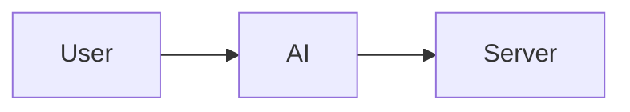

# Blog Writer

Creates technical blog posts for CloudRumble. Focus: explain don't sell, specific context, reference over inline code, no AI-smell.

## When to Use

- User requests writing a new blog post
- User asks to create blog titles or headlines
- User wants to update or refine existing blog content
- User mentions blog diagrams, mermaid, or visual workflow
- User asks about blog writing process or best practices

## Core Principles

1. **Simple & Direct**: Short sentences, active voice
2. **Problem-First**: Start with audience's problem
3. **Explain, Don't Sell**: Describe what things ARE, not why they're great
4. **Specific Context**: Always say FOR WHAT (homelab? enterprise? learning?)
5. **Reference Over Inline**: Link to repo files, only show novel/interesting code
6. **No AI-Smell**: If a phrase sounds like marketing copy, delete it
7. **Second Person**: Address the reader as "you" throughout. Open by naming their situation ("If you run two or more X..."). Avoid first-person narration ("I run...", "my setup"); recast as the reader's problem or as impersonal statements ("It is natural to assume..."). First person is allowed only for a genuine, brief personal anecdote, never as the default voice.

## Anti-Patterns (NEVER DO THESE)

### Marketing Language (Delete on Sight)
- "killer feature" → just describe what it does
- "First-class support" → "Built-in"
- "No bloat, no slow loading screens" → cut entirely
- "loads instantly" → cut entirely
- "does exactly what you need" → cut entirely
- "perfect for" → specify the actual use case

### Vague Statements (Always Add Context)
- "X matters" → NO. Human lives matter. This is a setting.
- "practical guide" → practical guide TO WHAT? "how I set up Garage"
- "better choice" → better choice FOR WHAT? "for a homelab"
- "saw it coming" → cliché, just state the facts

### Selling vs Explaining
- BAD: "Add it as a sidecar:" (telling reader what to do)
- GOOD: "It runs as a sidecar that connects to the admin API:" (explaining what it is)

### Redundancy
- If you explained WHY, don't add "no point doing X" - it's implied
- Don't repeat the same point in different words

### Irrelevant Points
- Only mention things DIRECTLY related to the topic
- "Secrets properly managed" in a Garage blog? That's ESO, not Garage. Remove.

### Code Dumps
- Don't show full YAML/config if it's standard boilerplate
- Link to repo file instead: "See my [deployment manifest](link)"
- Only inline code that's: novel, has gotchas, or teaches something

### Unnecessary CTAs
- No "Try it. Let me know what breaks."
- No social media links at the end
- No emojis in links

### Factual Accuracy
- Read your own sentences: "homelab running on single node" - is that TRUE?
- If describing YOUR setup, be precise about what YOU chose vs what the tool supports

### Inverted Verbosity (CRITICAL)
You tend to write TOO LITTLE on important technical details and TOO MUCH on fluff.

**Be VERBOSE when:**
- Explaining security practices (ESO, secrets, permissions)
- Describing WHY something works a certain way
- Gotchas that will bite readers (file permissions, config quirks)
- Flow/process explanations (step 1, 2, 3...)

**Be TERSE when:**
- Marketing-adjacent content (why X is good)
- CTAs and closings
- Obvious things (don't explain what S3 is)

Example of WRONG balance:
- "Never commit secrets to Git. Use ESO with Bitwarden:" (one line for critical security!)
- "Garage is minimal, fast, and does exactly what you need. No bloat..." (paragraph of fluff)

Example of RIGHT balance:
- Security section: explain the flow, why each step matters, what breaks if skipped
- Tool praise: skip entirely or one factual sentence

## Quick Workflow

### Step 1: Understand Audience Problem

Discuss with user:
- Who is target audience? (DevOps engineers, platform teams, developers)
- What problem are they solving?
- What search terms would they use?
- What's the main takeaway?

### Step 2: Craft Title

**First, generate options with the `headline-matrix` skill.** Invoke the `headline-matrix`
skill (installed in the CloudRumble repo at `.Codex/skills/headline-matrix/`) to produce
title variations across its angles (Specificity, Proof, Mechanism, etc.). Use it as a
divergent idea generator, not as the final source.

**Then filter against CloudRumble style.** `headline-matrix` leans ad-copy, so discard any
option that trips the house anti-patterns before shortlisting:
- No clickbait teasers ("The one X that changes everything", "what nobody tells you")
- No Curiosity/Urgency angle that hides the topic; the title must say what the post is about
- No marketing words (killer, ultimate, effortless)
- Prefer the Specificity, Proof, and Mechanism angles; these match the explain-don't-sell voice

**Format**: `[CTA/Hook] + [Core Topic] + [Teaser/Resolution]`

**Examples:**
- "Stop AI from Hallucinating Your Kubernetes YAML"
- "5 Must-Have Command Line AI Tools"
- "From Silos to Synergy: Cloud Infrastructure Management"

See `references/blog-titles.md` for 35+ proven patterns to score the shortlist against.

### Step 3: Set Up File Structure

```mdx
---
title: "Your Catchy Title"
date: YYYY-MM-DD
tags: ["tag1", "tag2", "tag3"]
image: _media/hero-image.png
description: "SEO-friendly description under 160 characters"
---

import InfoCards from '@site/src/components/InfoCards';
import DataGrid from '@site/src/components/DataGrid';


<style>{`article img:not(:first-of-type) { max-width: 700px; }`}</style>

**Subtitle**: One-sentence problem statement.

Opening paragraph. 2-3 sentences max.

<!--truncate-->
```

### Step 4: Write Content

**Standard structure** (adapt as needed):
- **Opening**: Hook, problem, promise (before truncate)
- **Problem Section**: Pain point with data/stats
- **Solution Overview**: Introduce concept, explain why
- **Deep Dive**: Break into parts, code examples, diagrams
- **Practical Application**: Concrete examples, step-by-step
- **Closing**: Takeaways, resources, CTAs

See `references/content-patterns.md` for detailed guidance.

### Step 5: Apply Style Guidelines

- Active voice: "AI generates" not "is generated"
- Simple words: "use" not "utilize"
- Specific: "30 minutes" not "a while"
- Second person throughout: "you" to the reader, not "I"/"my" (see Core Principle 7)
- 15-20 words per sentence average

See `references/style-guide.md` for complete guidelines.

### Step 6: Add Technical Elements

**Code Blocks**: Always specify language
```yaml
apiVersion: v1
kind: Service
```

**Components**: DataGrid for tables, InfoCards for features

See `references/technical-elements.md` for component usage.

### Step 7: Create and Process Diagrams

**Write mermaid directly in markdown:**
````markdown

````

**Process to PNG:**
```bash
just blog-diagrams
python3 scripts/__process_blog_mermaid.py blog/my-post.mdx
```

See `references/diagram-workflow.md` for detailed diagram guide.

### Step 8: Handle Images

- **Hero**: `blog/_media/hero-name.png` (full width)
- **Diagrams**: `blog/_media/diagrams/NN-name.png` (700px)
- **Screenshots**: `blog/_media/screenshot.webp`

See `references/image-guide.md` for format and sizing guidelines.

### Step 9: Final Checklist

**Structure:**
- [ ] Title follows proven pattern
- [ ] Hero image + CSS styling present
- [ ] Truncate marker after opening
- [ ] Code blocks have language specified (bash, yaml, toml)

**Content Quality:**
- [ ] Every statement has SPECIFIC CONTEXT (for what? where? when?)
- [ ] No marketing language (grep for: killer, first-class, perfect, amazing)
- [ ] EXPLAIN what things are, don't SELL why they're good
- [ ] Only show code that's novel/interesting - link to repo for boilerplate
- [ ] Facts are accurate (re-read: did you describe YOUR setup correctly?)

**Anti-Pattern Check:**
- [ ] No "X matters" statements
- [ ] No "Try it" or social link CTAs
- [ ] No redundant explanations
- [ ] No irrelevant points (everything relates to the topic)
- [ ] Closing has Resources only, no fluff

## Common Patterns

### Problem-Solution Structure
Problem → Cost → Solution → How It Works → Try It → Resources

### Opening Hooks
- "You ask an AI to generate... Nothing works."
- "Ever spent hours... only to discover..."

### Closing
End with **Resources** section linking to:
- Your repo with working code
- Official documentation
- Related tools mentioned

No social links. No "try it" CTAs. Just useful references.

## Development Commands

```bash
npm run start           # Start dev server
just blog-diagrams      # Process diagrams
just blog-serve         # With ngrok preview
just diagrams-regen     # Regenerate from .mmd
npm run build           # Production build
```

See `references/commands.md` for complete command reference.

## Resources

### references/
- `blog-titles.md` - 35+ proven title patterns
- `style-guide.md` - Detailed CloudRumble writing style
- `content-patterns.md` - Structure and content guidance
- `technical-elements.md` - Code blocks, components, links
- `diagram-workflow.md` - Complete mermaid diagram guide
- `image-guide.md` - Image formats, sizing, locations
- `commands.md` - Development commands and scripts

### Project Scripts
Diagram processing handled by existing project scripts:
- `scripts/__process_blog_mermaid.py`
- `scripts/__regenerate_diagrams.py`
