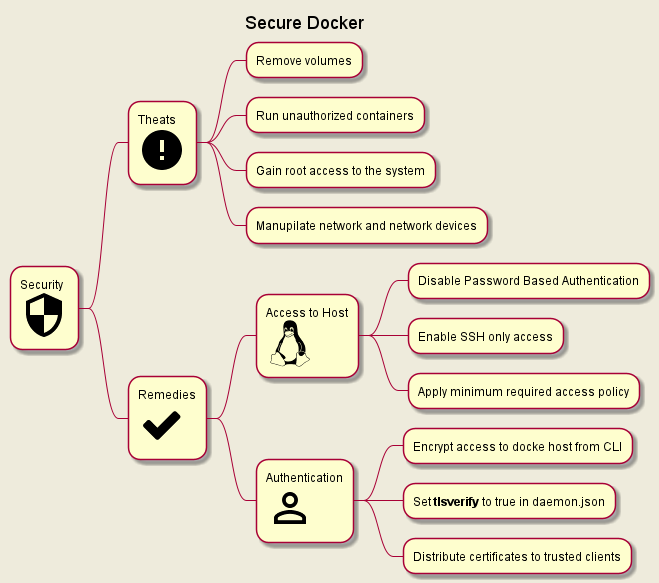

# Docker Certified Associate (DCA) exam prep

Preparation notes and tips & tricks for DCA (Docker Certified Associate) exam.

Table of Contents

- [Docker Certified Associate (DCA) exam prep](#docker-certified-associate-dca-exam-prep)
  - [Exam and certification info](#exam-and-certification-info)
    - [Certification](#certification)
    - [Exam](#exam)
  - [Docker Architecture](#docker-architecture)
    - [Components Diagram](#components-diagram)
    - [Docker Networking](#docker-networking)
    - [Docker CLI syntax](#docker-cli-syntax)
  - [Tips & Tricks](#tips--tricks)
    - [Where is everything stored](#where-is-everything-stored)
    - [Container Layer](#container-layer)
    - [Mounting volumes syntax](#mounting-volumes-syntax)
    - [How to copy files](#how-to-copy-files)
    - [Check logs to troubleshoot docker service](#check-logs-to-troubleshoot-docker-service)
    - [Logging in docker](#logging-in-docker)
    - [Docker Compose](#docker-compose)
    - [Docker daemon stop behavior](#docker-daemon-stop-behavior)
    - [Change docker daemon host configuration](#change-docker-daemon-host-configuration)
    - [Building Images](#building-images)
    - [Ports mapping](#ports-mapping)
    - [Expose docker host to enable running docker CLI commands from outside](#expose-docker-host-to-enable-running-docker-cli-commands-from-outside)
    - [Use docker CLI as non root user](#use-docker-cli-as-non-root-user)
    - [Docker Security](#docker-security)
    - [How to control how resources a container can consume](#how-to-control-how-resources-a-container-can-consume)
      - [CPU](#cpu)
      - [Memory](#memory)
  - [Useful Commands](#useful-commands)
    - [Check Docker Status](#check-docker-status)
    - [Stop all running containers](#stop-all-running-containers)
    - [Setup container hostname](#setup-container-hostname)
    - [Automatically remove the container when it exits](#automatically-remove-the-container-when-it-exits)
    - [Add or remove capabilities for the user running a container](#add-or-remove-capabilities-for-the-user-running-a-container)
  - [Links and resources](#links-and-resources)
  - [Definitions](#definitions)

## Exam and certification info

### Certification

- Certification is provided by Mirantis
- > [Mirantis acquired Docker Enterprise in November 2019](https://techcrunch.com/2019/11/13/mirantis-acquires-docker-enterprise/?guccounter=1&guce_referrer=aHR0cHM6Ly93d3cuZ29vZ2xlLmNvbS8&guce_referrer_sig=AQAAAChqDhj765aUpAQfg-rkCWE0kB-4eAJn0VdTGsf35u6hGrL6scvqoLar-_xYPJazylmp15VqXquNq69HWpYx3cepSnXSSUTirYLSMJEbPuBhQOfS4blsGLwsULwWzxK8iaH3zb2KplXRwnpdfMu9iz5Azc2czZr9T5bFwq0AIeN3)

### Exam

- Exam can be taken remotely
- **90** minutes to answer **55** questions
- All questions are multiple choice
  - 13 questions are *normal* multiple choice
  - 52 questions are *Discrete Option Multiple Choice (DOMC)* where
  - > Options are randomly presented, one at a time.
      For each presented option, the examinee chooses YES or NO to indicate if the option is correct.

## Docker Architecture

### Components Diagram


### Docker Networking


> <font color=yellow>**Important: Containers can only communicate on a user defined bridge/host network**</font>

### Docker CLI syntax

Docker CLI has following syntax:

**Syntax:** `docker <docker-object> <sub-command> <-options> <arguments/commands>`

**Example**: `docker container run -it ubuntu`

## Tips & Tricks

### Where is everything stored

Once installed, docker creates a folder under `/var/lib/docker/` where all the containers, images, volumes and configurations are stored.

### Container Layer

By default all docker image layers are immutable (read-only). When container is created using `docker run` command, an additional mutable (read-write) layer is created. **This layer is only there for the duration of container lifetime and will be removed once container exits**. When modifying any files in a running container, docker creates a copy of the file and moves it to container layer (COPY-ON-WRITE) before changes are saved. Original files as part of the image are never changed.

### Mounting volumes syntax

List of common storage drivers:

- AUFS - Ubuntu default
- ZFS
- BTRFS
- Device Mapper
- Overlay
- Overlay2

<u>Wit volume mount</u>

Template old syntax: `docker run -v volume_name:<path to store in container> container_name`

Template new syntax: `docker run --mount source=volume_name,target=<path to store in container> container_name`

Example old syntax: `docker run -v data_vol:/var/lib/nginx_data nginx`

<u>Wit bind mount</u>

Template old syntax: `docker run -v <full path to folder in docker host>:<full path to folder in container> container_name`

Template new syntax:
`docker run --mount type=bind,source=<full path to folder in docker host>,target=<path to store in container> container_name`

Example old syntax: `docker run -v /data/nginx_data:/var/lib/nginx_data nginx`

### How to copy files

Copying files is very easy, first parameter after cp command is source and second destination.

1. Copy file from host to continuer: `docker container cp /tmp/file.txt container_name:/tmp/file.txt`
2. Copy file from container tp host: `docker container cp container_name:/tmp/file.txt /tmp/file.txt`

### Check logs to troubleshoot docker service

- Check system logs: `journalctl -u docker.service`
- Check free space on the host: `df -h`, use `docker container prune` or `docker image prune` to get rid of stale containers/images

### Logging in docker

Default logging drive for docker is __json-file__.

### Docker Compose

By default docker compose will pull images from configured images repository (Docker Hub by default), but it's possible to specify `build` directive instead of `image` with a path to `Dockerfile`

### Docker daemon stop behavior

By default once docker deamon is stopped or crashes all containers will be stopped as well.

To change this behavior set `"live-restore: true"` in `/etc/docker/deamon.json` config file.

### Change docker daemon host configuration

Configuration file is located at `/etc/docker/daemon.json` and is by default in `json` format.
This file is not present by default.

### Building Images

Docker images can be build directly from a git repository. So for example

### Ports mapping

> Hint: Prefer using "-p" option with static port when running containers in production.

### Expose docker host to enable running docker CLI commands from outside

On machine form where you want to access docker host, setup variable:

``` bash
export DOCKER_HOST="tcp://<docker-host-ip>:2375"
```

> Docker default ports:
>
> - **2375** - unencrypted traffic
>
> - **2376** - encrypted traffic.

**IMPORTANT**: This setting is only for testing/playground purposes. It will make docker host available on the network and by default there is no authentication.

### Use docker CLI as non root user

1. Create Docker group: `sudo groupadd docker`
2. Create a non-root user you want to use with docker: `sudo useradd -G docker <user-name>`
3. Change this user primary group: `sudo usermod -aG docker <non-root user>`
4. Logoff and login with the docker user.
5. Optional - restart docker service: `sudo systemctl restart docker`

### Docker Security



### How to control how resources a container can consume

#### CPU

Default CPU share per container is 1024

**Option 1:**
If host has multiple CPUs, it is possible to assign each container a specific CPU.

**Option 2:**
If host has multiple CPUs, it is possible to restrict how many CPUs can given container use.

It's worth noting that container orchestrators (like Kubernetes) provide declarative methods to restrict resources usage per run-time unit (pod in case of Kubernetes).

#### Memory

**Option 1:**
Run container with `--memory=limit` flag to restrict use of memory.
If a container tries to consume more memory than its limit, system will kill it exiting the process with Out Of Memory Exception (OOM). By default container will be allowed to consume same amount of SWAP space as the memory limit, effectively doubling the memory limit. Providing of course that SWAP space is not disabled on the host.

## Useful Commands

This section describes useful docker CLI commands in following format:
> **Command:** - docker command syntax
>
> **When is it useful:** - common usecases when command should be used
>
> **Result:** - what is the expected behavior or

### Check Docker Status

>**Command:** `docker system info`
>
>**When is it useful:** quickly see how many containers are running and what is the status of host OS
>
>**Result:** information about docker host environment and containers

### Stop all running containers

>**Command:** `docker container stop $(docker container ls -q)`
>
>**When is it useful:** quickly stop all running containers at once.
>
>**Result:** all containers are stopped.

### Setup container hostname

>**Command:** `docker container run -it --name=ingress --hostname=nginx nginx`
>
>**When is it useful:** default hostname is container id, setting up recognizable hostname can help with logging etc.
>
>**Result:** container hostname is set to custom one.

### Automatically remove the container when it exits

>**Command:** `docker container run -d --name=ingress --rm nginx`
>
>**When is it useful:** run a container and automatically remove it once stopped. This is very usefully when running CI/CD containers.
>
>**Result:** container starts and is removed once it's stopped.

### Add or remove capabilities for the user running a container

>**Command:** `docker run --cap-add/--cap-drop KILL nginx` or `docker run --privileged nginx`
>
>**When is it useful:** This command is useful when elevating or dropping privileges on the user running container. By default containers run with limited root privileges. Second command runs container with full user privileges.
>
>**Result:** container is run with expected privileges.

## Links and resources

1. [Docker Certified Associate Study Guide](https://docker.cdn.prismic.io/docker/4a619747-6889-48cd-8420-60f24a6a13ac_DCA_study+Guide_v1.3.pdf)
2. [DCA Prep Guide from DevOps-Academy](https://github.com/DevOps-Academy-Org/dca-prep-guide)
3. [Interactive online docker environments on demand](https://labs.play-with-docker.com/)
4. [Medium blog - 250 Practice Questions for the DCA Exam](https://medium.com/bb-tutorials-and-thoughts/250-practice-questions-for-the-dca-exam-84f3b9e8f5ce)

## Definitions

|  <div style="min-width:200px">Term</div> |  Definition | Link |
|----------------|----------------|----------------|
|  OCI |  Open Container Initiative | https://opencontainers.org/|
| Unix Socket  | Intra-process communication between linux processes/services  | https://beej.us/guide/bgipc/html/multi/unixsock.html |
| Containers Namespaces  | Dedicated Linux namespace per container ensures process isolation | |
| CGroups (Control Groups)  | Linux feature allowing control over CPU and memory resources per process | |
| SWAP space  | Space on a hard drive that can be used in case server runs out of RAM capacity. SWAP space can also be disabled  | |