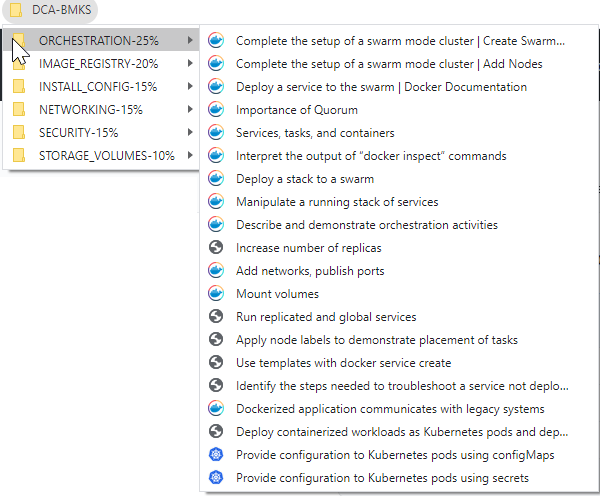

# Docker Certified Associate (DCA)

Preparation notes for DCA (Docker Certified Associate) exam.

Table of Contents

- [Docker Certified Associate (DCA)](#docker-certified-associate-dca)
- [Introduction](#introduction)
  - [Certification](#certification)
  - [Exam](#exam)
    - [Exam topics](#exam-topics)
    - [Exam Info](#exam-info)
- [Learning Plan](#learning-plan)
  - [1. Find a good online training](#1-find-a-good-online-training)
  - [2. Go though mock questions and exams](#2-go-though-mock-questions-and-exams)
  - [3. Practice with Docker](#3-practice-with-docker)
  - [4. Know Docker/Mirantis documentation well](#4-know-dockermirantis-documentation-well)
  - [5. Make notes](#5-make-notes)
- [Basic Concepts](#basic-concepts)
  - [Docker CLI syntax](#docker-cli-syntax)
  - [Docker Components](#docker-components)
    - [Container Layer](#container-layer)
    - [Access remote Docker host from CLI](#access-remote-docker-host-from-cli)
    - [Use docker CLI as non root user](#use-docker-cli-as-non-root-user)
- [Orchestration 25%](#orchestration-25)
  - [Orchestration Areas](#orchestration-areas)
  - [Kubernetes Architecture](#kubernetes-architecture)
  - [Docker Swarm Architecture](#docker-swarm-architecture)
    - [What is docker stack](#what-is-docker-stack)
    - [Difference between docker stack ls and docker stack ps](#difference-between-docker-stack-ls-and-docker-stack-ps)
  - [Raft Consensus and Quorum](#raft-consensus-and-quorum)
    - [Quorum](#quorum)
    - [Fault Tolerance](#fault-tolerance)
- [Image Creation, Management, and Registry 20%](#image-creation-management-and-registry-20)
  - [Creating docker images](#creating-docker-images)
    - [Difference between CMD and ENTRYPOINT](#difference-between-cmd-and-entrypoint)
  - [How to control resources utilization by a container](#how-to-control-resources-utilization-by-a-container)
    - [CPU](#cpu)
    - [Memory](#memory)
  - [Ports mapping](#ports-mapping)
  - [How to copy files](#how-to-copy-files)
  - [Check logs to troubleshoot docker service](#check-logs-to-troubleshoot-docker-service)
  - [Where Images are pulled from?](#where-images-are-pulled-from)
- [Installation and Configuration 15%](#installation-and-configuration-15)
  - [MKE Architecture](#mke-architecture)
  - [Change docker daemon host configuration](#change-docker-daemon-host-configuration)
  - [Logging in docker](#logging-in-docker)
- [Networking 15%](#networking-15)
  - [Docker daemon stop behavior](#docker-daemon-stop-behavior)
  - [Docker Networking](#docker-networking)
- [Security 15%](#security-15)
  - [Security Layers](#security-layers)
- [Storage and Volumes 10%](#storage-and-volumes-10)
  - [Where is everything stored](#where-is-everything-stored)
  - [Mounting volumes syntax](#mounting-volumes-syntax)
- [Useful Commands](#useful-commands)
  - [Check Docker Status](#check-docker-status)
  - [Remove all unused docker artifacts](#remove-all-unused-docker-artifacts)
  - [Stop all running containers](#stop-all-running-containers)
  - [Setup container hostname](#setup-container-hostname)
  - [Automatically remove a container when on exit](#automatically-remove-a-container-when-on-exit)
  - [Add or remove capabilities for the user running a container](#add-or-remove-capabilities-for-the-user-running-a-container)
  - [Filter results using --filter flag](#filter-results-using---filter-flag)
- [Links and resources](#links-and-resources)

# Introduction

Each section corresponds to exam topics. `Plantuml` diagrams  (component, sequence, minimap) help visualize and better understand architectural concepts in Docker, Docker Swarm and Kubernetes. All diagrams are available in [Diagrams](/diagrams) folder.

> Web version of this documentation can be accessed under https://dcaguide.net

## Certification

- Certification is provided by Mirantis
- > [Mirantis acquired Docker Enterprise in November 2019](https://techcrunch.com/2019/11/13/mirantis-acquires-docker-enterprise/?guccounter=1&guce_referrer=aHR0cHM6Ly93d3cuZ29vZ2xlLmNvbS8&guce_referrer_sig=AQAAAChqDhj765aUpAQfg-rkCWE0kB-4eAJn0VdTGsf35u6hGrL6scvqoLar-_xYPJazylmp15VqXquNq69HWpYx3cepSnXSSUTirYLSMJEbPuBhQOfS4blsGLwsULwWzxK8iaH3zb2KplXRwnpdfMu9iz5Azc2czZr9T5bFwq0AIeN3)

## Exam

>Exam curriculum is based on material update from official [Docker Study Guide](https://docker.cdn.prismic.io/docker/4a619747-6889-48cd-8420-60f24a6a13ac_DCA_study+Guide_v1.3.pdf) **v 1.3, May 2020**

### Exam topics

| Topic                                    | % of exam questions |
| ---------------------------------------- |:-------------------:|
| Orchestration                            |         25%         |
| Image Creation, Management, and Registry |         20%         |
| Installation and Configuration           |         15%         |
| Networking                               |         15%         |
| Security                                 |         15%         |
| Storage and Volumes                      |         10%         |

### Exam Info

- Exam can be taken remotely
- **90** minutes to answer **55** questions
- All questions are multiple choice
  - 13 questions are *normal* multiple choice
  - 52 questions are *Discrete Option Multiple Choice (DOMC)* where
  - > Options are randomly presented, one at a time.
      For each presented option, the examinee chooses YES or NO to indicate if the option is correct.

# Learning Plan

## 1. Find a good online training

As a primary learning source I have used Kodekloud's [Docker Certified Associate Exam Course](https://kodekloud.com/p/docker-certified-associate-exam-course).

I have already passed, and blogged about [CKA](https://medium.com/faun/preparation-and-resources-for-cka-exam-ca868fc678c9) and [CKAD](https://piotrzan.medium.com/preparation-and-resources-for-ckad-exam-ea1b2e8888e3) and there is significant overlap with Kubernetes orchestration part and containers basics.

There is a great repo by [Govinda Fichtner](https://github.com/Govinda-Fichtner) where there are links to docker documentation organized per learning topic. You can find the repo here: [DCA Prep Guide from DevOps-Academy](https://github.com/DevOps-Academy-Org/dca-prep-guide).

## 2. Go though mock questions and exams

Since the exam is in the form of questions, it is important to exercise as much as possible and go thought questions and mock exams. Kodekloud course I've mentioned before has a lot of questions build in, but there are also free mock exams and questions. One from medium I find very good:
[Medium blog - 250 Practice Questions for the DCA Exam](https://medium.com/bb-tutorials-and-thoughts/250-practice-questions-for-the-dca-exam-84f3b9e8f5ce).

## 3. Practice with Docker

In this exam practical exercises are not as important as in CKA and CKAD for example, but I still find it valuable to follow up a theoretical session with a practical review.

There is a free service there you can spin up a few vms (some of them already have docker swarm preinstalled) and exercise without installing anything on your machine!

[Interactive online docker environments on demand: docker](https://labs.play-with-docker.com/)

There is also a similar service for exercising with Kubernetes and is very useful for the Kubernetes orchestration part.

[Interactive online docker environments on demand: kubernetes](https://labs.play-with-k8s.com/)

> Just a small hint, once you bootstrap Kubernetes, you can use my [_portable kubectl in docker image_](https://itnext.io/portable-kubernetes-management-with-kubectl-in-docker-cb861a2c3c02) to run kubectl with diagnostic tools and aliases.

Here are easy steps to run the container:

``` bash
# Run container on same network as host
docker run -d --network=host --name=kubectl-host --rm -it piotrzan/kubectl-comp:zsh

# Copy over Kubernetes config file
kubectl config view --raw > config
docker cp ./config kubectl-host:./root/.kube

# Attach shell to running container
docker attach kubectl-host
```

## 4. Know Docker/Mirantis documentation well

There are plenty of great learning repositories with exam topics directly linked to Docker/Mirantis documentation. A good one that is also up to date is [Evalle/DCA](https://github.com/Evalle/DCA).

Such sources are great shortcut for learning and reference later on, but I like to have all my links at my fingertips right in bookmarks bar.

If you would like to have same bookmarks, please use my gist below and import them from file. Bookmarks are arranged in subfolder corresponding to exam topics:



<details><summary>DCA Bookmarks GIST</summary>
<p>
https://gist.github.com/Piotr1215/75b0105e020b740480a7d85e4e5e3dd7
</p>
</details>

## 5. Make notes

Making notes is easy, making good notes a bit more difficult. To make best of learning notes, I follow this 5 step approach:

| **Notes Level** | **How to** | **When to use** |
|---|---|---|
| 1. Regular notes | Typically copy and paste or direct link. | Use for low importance/easy to remember topics. |
| 2. Highlight with formatting | Use highlighting or other formatting techniques. | Use for topics with large volume of material to highlight important bits. |
| 3. Visual representation | Create diagrams, mindmaps and other visual representation of the topic. | Use for complex topics, typically architecture and high level design. |
| 4. Visual representation with summary | Create diagrams, mindmaps and other visual representation of the topic with summary in your own words. | Use for complex topics that you need to understand on a deep level. |
| 5. Design to teach | Use all the above techniques, but always ask youself a question, how can I teach this topic to anyone in best possible way? Typically you would create a blog, youtube video or engage directly with community | Use for very complex topics or the ones you wish to became expert in. By far making notes and content in a way that is designed to teach someone is the best ways to learn. |

This article and accompanying [GtiHub Repo](https://github.com/Piotr1215/dca-prep-kit) is my way of learning, making notes and in the same time giving back to great open source community. Try it yourself, just a few markdown files and you will have a useful handbook for learning and reference later on.

Sections below contain my notes and diagrams as well as docker commands and tips and tricks. This is by definition an opinionated learning material, but I hope you will find it useful on your journey to learning and passing Docker Certified Associate exam.

Please let me know in comments if you spot an error and feel free to do a PR if you would like to contribute to the repo.

I wish you best of luck on getting the Docker Certified Associate certification :)

# Basic Concepts

## Docker CLI syntax

Docker CLI has following syntax:

**Syntax:** `docker <docker-object> <sub-command> <-options> <arguments/commands>`

**Example**: `docker container run -it ubuntu`

## Docker Components


_Sources_:

- [dockerd](https://docs.docker.com/engine/reference/commandline/dockerd/)
- [containerd](https://containerd.io/)
- [runc](https://github.com/opencontainers/runc)
- [libcontainer](http://jancorg.github.io/blog/2015/01/03/libcontainer-overview/)
- [containerd-shim](https://medium.com/faun/docker-containerd-standalone-runtimes-heres-what-you-should-know-b834ef155426)

### Container Layer

By default all docker image layers are immutable (read-only). When container is created using `docker run` command, an additional mutable (read-write) layer is created. **This layer is only there for the duration of container lifetime and will be removed once container exits**. When modifying any files in a running container, docker creates a copy of the file and moves it to container layer (COPY-ON-WRITE) before changes are saved. Original files as part of the image are never changed.

### Access remote Docker host from CLI

On machine form where you want to access docker host, setup variable:

``` bash
export DOCKER_HOST="tcp://<docker-host-ip>:2375"
```

> Docker default ports:
>
> - **2375** - unencrypted traffic
>
> - **2376** - encrypted traffic.

**IMPORTANT**: This setting is only for testing/playground purposes. It will make docker host available on the network and by default there is no authentication.

### Use docker CLI as non root user

1. Create Docker group: `sudo groupadd docker`
2. Create a non-root user you want to use with docker: `sudo useradd -G docker <user-name>`
3. Change this user primary group: `sudo usermod -aG docker <non-root user>`
4. Logoff and login with the docker user.
5. Optional - restart docker service: `sudo systemctl restart docker`

# Orchestration 25%

## Orchestration Areas


There are a few solutions on the marked that can help with container and nodes orchestration. By far most widely adopted one is Kubernetes followed by Docker Swarm. During the exam there will be questions about both.

I have covered in detail my learning path for **CKA** and **CKAD** certifications. So check my [Medium profile](https://piotrzan.medium.com/) if you would like to learn more.

## Kubernetes Architecture


_Source_: https://kubernetes.io/docs/concepts/overview/components/.

## Docker Swarm Architecture


_Source_: https://docs.docker.com/engine/swarm/images/service-lifecycle.png.

### What is docker stack

Docker stack is very similar to docker compose with key difference being that **docker compose defines containers** while **docker stack defines services**. Swarm also provides commands to work with stacks directly.

### Difference between docker stack ls and docker stack ps

`docker stack ls` - lists all the stacks
`docker stack ps <stack-name>` - lists all the services running in a stack

## Raft Consensus and Quorum

Implementing [Raft Consensus Algorithm](http://thesecretlivesofdata.com/raft/) ensures that all manager nodes in a distributed system are storing the same consistent state.

### Quorum

To calculate minimum number of master nodes required to achieve _quorum_ (or simply majority) use N = $\frac{N +1}{2}$ and round the result to full number.

So having 5 master nodes, the quorum is 3.

### Fault Tolerance

Knowing the quorum of master nodes, we can predict fault tolerance which is a number describing how many master nodes can fail before cluster is going to be put in an inconsistent state.

To calculate _fault tolerance_ of the cluster use N = $\frac{N -1}{2}$

So as an example having 7 master nodes, our quorum is **7+1/2 = 4** and fault tolerance **7-1/2 = 3**

# Image Creation, Management, and Registry 20%

## Creating docker images

Docker image is an immutable blueprint based on which containers are created.

### Difference between CMD and ENTRYPOINT

_CMD_ and _ENTRYPOINT_ sections of `Dockerfile` are used to instruct docker what to do once container is started.

<u>CMD</u>

This section defines what command will be executed once container starts.
For example:

- defining `CMD ["httpd"]` in a `Dockerfile` building httpd server will start httpd Apache server based on the image used
- running httpd image with command override `docker run httpd printenv` will override default `CMD` with `printenv` command which will output environmental variables to the terminal
- command can be specified as regular command: `CMD httpd` or as json array `CMD ["sleep", "5"]`
  > in json array syntax first element of an array is command itself and all subsequent elements are parameters/options

<u>ENTRYPOINT</u>

This section defines what command will be executed once container starts and cannot be overridden by default (you need to use `--entrypoint` flag to force override). All arguments passed via docker run will be appended to command defined in `ENTRYPOINT`

- `CMD` and `ENTRYPOINT` work great together where `ENTRYPOINT` defines "fixed" command to be executed once container starts and `CMD` provides default, but overrideable arguments to run the container in different ways.
  > It is required to specify both `CMD` and `ENTRYPOINT` in a json array format for the override to work

## How to control resources utilization by a container

### CPU

Default CPU share per container is 1024

**Option 1:**
If host has multiple CPUs, it is possible to assign each container a specific CPU.

**Option 2:**
If host has multiple CPUs, it is possible to restrict how many CPUs can given container use.

It's worth noting that container orchestrators (like Kubernetes) provide declarative methods to restrict resources usage per run-time unit (pod in case of Kubernetes).

### Memory

**Option 1:**
Run container with `--memory=limit` flag to restrict use of memory.
If a container tries to consume more memory than its limit, system will kill it exiting the process with Out Of Memory Exception (OOM). By default container will be allowed to consume same amount of SWAP space as the memory limit, effectively doubling the memory limit. Providing of course that SWAP space is not disabled on the host.

## Ports mapping

> Hint: Prefer using "-p" option with static port when running containers in production.

## How to copy files

Copying files is very easy, first parameter after cp command is source and second destination.

1. Copy file from host to continuer: `docker container cp /tmp/file.txt container_name:/tmp/file.txt`
2. Copy file from container tp host: `docker container cp container_name:/tmp/file.txt /tmp/file.txt`

## Check logs to troubleshoot docker service

- Check system logs: `journalctl -u docker.service`
- Check free space on the host: `df -h`, use `docker container prune` or `docker image prune` to get rid of stale containers/images

## Where Images are pulled from?

By default docker will pull images from configured images repository (Docker Hub by default), but it's possible to specify `build` directive instead of `image` with a path to `Dockerfile`

# Installation and Configuration 15%

## MKE Architecture


Be aware that after Docker ascuisition by Mirantis there have been some naming and product changes, so following applies:

- Docker Trusted Registry (DRT) **is now** Mirantis Secure Registry (MSR)
- Universal Control Plane **is now** Mirantis Kubernetes Engine (MKE)
- Docker Enterprise Edition (DEE) **is now** Mirantis Container Runtime (MCR)

## Change docker daemon host configuration

Configuration file is located at `/etc/docker/daemon.json` and is by default in `json` format.
This file is not present by default.

## Logging in docker

Default logging drive for docker is __json-file__.
To change logging driver to for example splunk, update deamon.json, like so:

`echo ‘{“log-driver”: “splunk”}’ > /etc/docker/daemon.json`

# Networking 15%

## Docker daemon stop behavior

By default once docker deamon is stopped or crashes all containers will be stopped as well.

To change this behavior set `"live-restore: true"` in `/etc/docker/deamon.json` config file.

## Docker Networking


> <font color=yellow>**Important: Containers can only communicate on a user defined bridge/host network**</font>

# Security 15%

## Security Layers


_Source_: https://docs.mirantis.com/docker-enterprise/v3.0/dockeree-products/mke/mke-architecture.html

# Storage and Volumes 10%

## Where is everything stored

Once installed, docker creates a folder under `/var/lib/docker/` where all the containers, images, volumes and configurations are stored.

Kubernetes and Docker Swarm store cluster state and related information in [etcd](https://etcd.io/).
etcd by default listens on port `2380` for client connections.

## Mounting volumes syntax

List of common storage drivers:

- AUFS - Ubuntu default
- ZFS
- BTRFS
- Device Mapper
- Overlay
- Overlay2

<u>Volume mount</u>

Template old syntax: `docker run -v volume_name:<path to store in container> container_name`

Template new syntax: `docker run --mount source=volume_name,target=<path to store in container> container_name`

Example old syntax: `docker run -v data_vol:/var/lib/nginx_data nginx`

<u>Bind mount</u>

Template old syntax: `docker run -v <full path to folder in docker host>:<full path to folder in container> container_name`

Template new syntax:
`docker run --mount type=bind,source=<full path to folder in docker host>,target=<path to store in container> container_name`

Example old syntax: `docker run -v /data/nginx_data:/var/lib/nginx_data nginx`

# Useful Commands

This section describes useful docker CLI commands in following format:
> **Command:** - docker command syntax
>
> **When is it useful:** - common usecases when command should be used
>
> **Result:** - what is the expected behavior or

## Check Docker Status

>**Command:** `docker system info`
>
>**When is it useful:** quickly see how many containers are running and what is the status of host OS
>
>**Result:** information about docker host environment and containers

## Remove all unused docker artifacts

>**Command:** `docker system prune --all`
>
>**Command Variation:** `docker system prune --all --volumes`
>
>**When is it useful:** when learning or experimenting with docker, it is useful to clear unused artifacts without resetting the whole environment. Command variation with `--volumes` flag will also remove volumes.
>
>**Result:** following will be removed:
>
> - all stopped containers
> - all networks not used by at least one container
> - all images without at least one container associated to them
> - all build cache
> - volumes (if `--volumes` flag is used)

## Stop all running containers

>**Command:** `docker container stop $(docker container ls -q)`
>
>**When is it useful:** quickly stop all running containers at once.
>
>**Result:** all containers are stopped.

## Setup container hostname

>**Command:** `docker container run -it --name=ingress --hostname=nginx nginx`
>
>**When is it useful:** default hostname is container id, setting up recognizable hostname can help with logging etc.
>
>**Result:** container hostname is set to custom one.

## Automatically remove a container when on exit

>**Command:** `docker container run -d --name=ingress --rm nginx`
>
>**When is it useful:** run a container and automatically remove it once stopped. This is very usefully when running CI/CD containers.
>
>**Result:** container starts and is removed once it's stopped.

## Add or remove capabilities for the user running a container

>**Command:** `docker run --cap-add/--cap-drop KILL nginx` or `docker run --privileged nginx`
>
>**When is it useful:** This command is useful when elevating or dropping privileges on the user running container. By default containers run with limited root privileges. Second command runs container with full user privileges.
>
>**Result:** container is run with expected privileges.

## Filter results using --filter flag

>**Command:** `docker search --filter=stars=3 --no-trunc busybox`
>
>**When is it useful:** Results of almost every docker command can be filtered using `--filter key=value` flag. Refer to docker documentation to check what filter options are supported for given command.
>
>**Result:** command output filtered as per filter flag.

# Links and resources

1. [Docker Certified Associate Study Guide](https://docker.cdn.prismic.io/docker/4a619747-6889-48cd-8420-60f24a6a13ac_DCA_study+Guide_v1.3.pdf)
2. [DCA Prep Guide from DevOps-Academy](https://github.com/DevOps-Academy-Org/dca-prep-guide)
3. [Interactive online docker environments on demand](https://labs.play-with-docker.com/)
4. [Interactive online kubernetes environments on demand](https://labs.play-with-k8s.com/)
5. [Medium blog - 250 Practice Questions for the DCA Exam](https://medium.com/bb-tutorials-and-thoughts/250-practice-questions-for-the-dca-exam-84f3b9e8f5ce)
6. [Kubernetes Official Documentation](https://kubernetes.io/)
7. [Docker Docs](https://docs.docker.com/)
8. [Mirantis Docs](https://docs.mirantis.com/welcome/)
9. [PlantUML Diagrams as Code](https://plantuml.com/)
