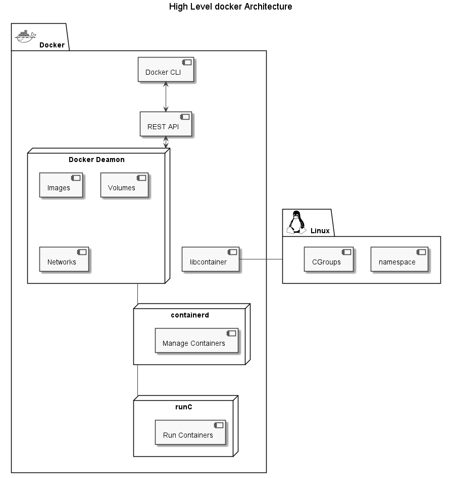

# Docker Certified Associate (DCA) exam prep

Preparation notes and tips & tricks for DCA (Docker Certified Associate) exam.

Table of Contents

- [Docker Certified Associate (DCA) exam prep](#docker-certified-associate-dca-exam-prep)
  - [Exam and certification info](#exam-and-certification-info)
    - [Certification](#certification)
    - [Exam](#exam)
  - [Docker Architecture](#docker-architecture)
    - [Docker CLI syntax](#docker-cli-syntax)
  - [Tips & Tricks](#tips--tricks)
    - [Where is everything stored](#where-is-everything-stored)
    - [Different ways of copying files](#different-ways-of-copying-files)
    - [Docker deamon stop behavior](#docker-deamon-stop-behavior)
    - [Change docker daemon host configuration](#change-docker-daemon-host-configuration)
    - [Ports mapping](#ports-mapping)
    - [Expose docker host to enable running docker CLI commands from outside](#expose-docker-host-to-enable-running-docker-cli-commands-from-outside)
    - [Use docker CLI as non root user](#use-docker-cli-as-non-root-user)
    - [Check Docker Status](#check-docker-status)
    - [Stop all running containers](#stop-all-running-containers)
    - [Setup container hostname](#setup-container-hostname)
    - [Automatically remove the container when it exits](#automatically-remove-the-container-when-it-exits)
  - [Links and resources](#links-and-resources)
  - [Definitions](#definitions)

## Exam and certification info

### Certification

- Certification is provided by Mirantis
- > [Mirantis acquired Docker Enterprise in November 2019](https://techcrunch.com/2019/11/13/mirantis-acquires-docker-enterprise/?guccounter=1&guce_referrer=aHR0cHM6Ly93d3cuZ29vZ2xlLmNvbS8&guce_referrer_sig=AQAAAChqDhj765aUpAQfg-rkCWE0kB-4eAJn0VdTGsf35u6hGrL6scvqoLar-_xYPJazylmp15VqXquNq69HWpYx3cepSnXSSUTirYLSMJEbPuBhQOfS4blsGLwsULwWzxK8iaH3zb2KplXRwnpdfMu9iz5Azc2czZr9T5bFwq0AIeN3)

### Exam

- Exam can be taken remotely
- **90** minutes to answer **55** questions
- All questions are multiple choice
  - 13 questions are *normal* multiple choice
  - 52 questions are *Discrete Option Multiple Choice (DOMC)* where
  - > Options are randomly presented, one at a time.
      For each presented option, the examinee chooses YES or NO to indicate if the option is correct.

## Docker Architecture



### Docker CLI syntax

Docker CLI has following syntax:

**Syntax:** `docker <docker-object> <sub-command> <-options> <arguments/commands>`

**Example**: `docker container run -it ubuntu`

## Tips & Tricks

### Where is everything stored

Once installed, docker creates a folder under `/etc/lib/docker/` where all the containers, images, volumes and configurations are stored.

### Different ways of copying files

Copying files is very easy, first parameter after cp command is source and second destination.

1. Copy file from host to contianer: `docker container cp /tmp/file.txt container_name:/tmp/file.txt`
2. Copy file from contianer tp host: `docker container cp container_name:/tmp/file.txt /tmp/file.txt`

### Docker deamon stop behavior

By default once docker deamon is stopped or crashes all containers will be stopped as well.

To change this behavior set `"live-restore: true"` in `/etc/docker/deamon.json` config file.

### Change docker daemon host configuration

Configuration file is located at `/etc/docker/deamon.json` and is by default in `json` format.
This file is not present by default.

### Ports mapping

> Hint: Prefer using "-p" option with static port when running containers in production.

### Expose docker host to enable running docker CLI commands from outside

On machine form where you want to access docker host, setup variable:

``` bash
export DOCKER_HOST="tcp://<docker-host-ip>:2375"
```

> Docker default ports:
>
> - **2375** - unencrypted traffic
>
> - **2376** - encrypted traffic.

**IMPORTANT**: This setting is only for testing/playground purposes. It will make docker host available on the network and by default there is no authentication.

### Use docker CLI as non root user

1. Create Docker group: `sudo groupadd docker`
2. Create a non-root user you want to use with docker: `sudo useradd -G docker <user-name>`
3. Change this user primary group: `sudo usermod -aG docker <non-root user>`
4. Logoff and login with the docker user.
5. Optional - restart docker service: `sudo systemctl restart docker`

### Check Docker Status

  **Command:** `docker system info`

  **When is it useful:** quickly see how many containers are running and what is the status of host OS

  **Result:** information about docker host environment and containers

### Stop all running containers

  **Command:** `docker container stop $(docker container ls -q)`

  **When is it useful:** quickly stop all running containers at once.

  **Result:** all containers are stopped.

### Setup container hostname

  **Command:** `docker container run -it --name=ingress --hostname=nginx nginx`

  **When is it useful:** default hostname is container id, setting up recognizable hostname can help with logging etc.

  **Result:** container hostname is set to custom one.

### Automatically remove the container when it exits

  **Command:** `docker container run -d --name=ingress --rm nginx`

  **When is it useful:** run a container and automatically remove it once stopped. This is very usefully when running CI/CD containers.

  **Result:** container starts and is removed once it's stopped.

## Links and resources

1. [Docker Certified Associate Study Guide](https://docker.cdn.prismic.io/docker/4a619747-6889-48cd-8420-60f24a6a13ac_DCA_study+Guide_v1.3.pdf)
2. [DCA Prep Guide from DevOps-Academy](https://github.com/DevOps-Academy-Org/dca-prep-guide)
3. [Interactive online docker environments on demand](https://labs.play-with-docker.com/)
4. [Medium blog - 250 Practice Questions for the DCA Exam](https://medium.com/bb-tutorials-and-thoughts/250-practice-questions-for-the-dca-exam-84f3b9e8f5ce)

## Definitions

|  <div style="min-width:200px">Term</div> |  Definition | Link |
|----------------|----------------|----------------|
|  OCI |  Open Container Initiative | https://opencontainers.org/|
| Unix Socket  | Intra-process communication between linux processes/services  | |
