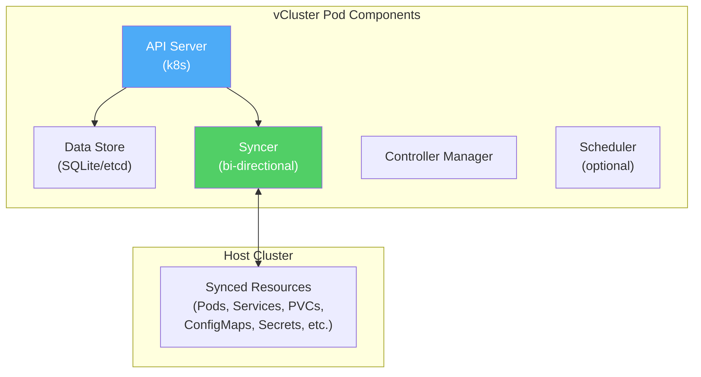
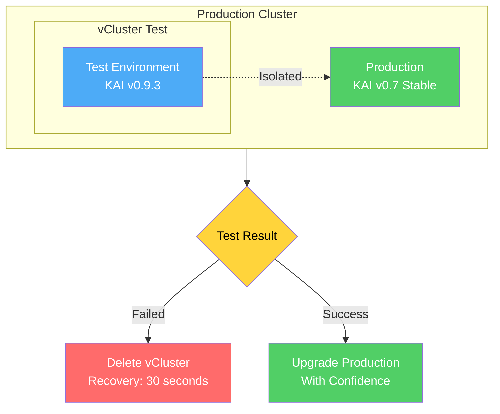

import InfoCards from '@site/src/components/InfoCards';
import DataGrid from '@site/src/components/DataGrid';

<small>Photo by <a href="https://unsplash.com/@growtika?utm_source=unsplash&utm_medium=referral&utm_content=creditCopyText">Growtika</a> on <a href="https://unsplash.com/?utm_source=unsplash&utm_medium=referral&utm_content=creditCopyText">Unsplash</a></small>

In today's cloud-native landscape, GPU workloads are becoming increasingly critical. From training large language models to running inference APIs, organizations are investing heavily in GPU infrastructure. But with this investment comes a challenge: how do you safely test and deploy new GPU schedulers without risking your entire production environment?

> **Related talks:** I'll be presenting this topic at [SREDay Paris Q4 2025](https://sreday.com/2025-paris-q4/) and [Conf42 Kube Native 2025](https://www.conf42.com/kubenative2025). Check the [talks page](/docs/talks) for more details.

<!--truncate-->

## The GPU Scheduling Challenge

Let me paint a picture of what most teams face today. You're running a Kubernetes cluster with precious GPU resources. Multiple teams depend on these GPUs for everything from model training to real-time inference. Your current scheduler works, but you've heard about NVIDIA's KAI Scheduler and its promise of fractional GPU allocation and better resource utilization.

The problem? Testing a new scheduler in production is like performing surgery on yourself - one mistake and everything stops working.

## Understanding GPU Workloads

Before we dive into the solution, let's understand what actually runs on GPUs in modern infrastructure:

<DataGrid
  columns={[
    { key: 'workload', label: 'Workload Type' },
    { key: 'examples', label: 'Real-World Examples' },
    { key: 'utilization', label: 'GPU Utilization', badge: true, badgeType: 'info' }
  ]}
  data={[
    { workload: 'Model Training', examples: 'Fine-tuning LLMs, Deep Learning', utilization: '100% for hours/days' },
    { workload: 'Stable Diffusion', examples: 'Image generation services', utilization: '~50% GPU' },
    { workload: 'LLM Inference', examples: 'ChatGPT-like APIs', utilization: '25-75% depending on model' },
    { workload: 'Video Processing', examples: 'Transcoding, streaming', utilization: 'Variable 20-80%' },
    { workload: 'CUDA Development', examples: 'Jupyter notebooks, testing', utilization: 'Often < 20%' },
    { workload: 'Batch Processing', examples: 'Scientific computing', utilization: 'Spikes to 100%' }
  ]}
/>

Notice something? Most workloads don't use 100% of a GPU all the time. Yet traditional Kubernetes scheduling treats GPUs as indivisible resources. This is where KAI Scheduler shines - but how do you test it safely?

## What is NVIDIA KAI Scheduler?

In January 2025, NVIDIA open-sourced their KAI (Kubernetes AI) Scheduler, bringing enterprise-grade GPU management to the community. It's an advanced Kubernetes scheduler designed specifically for GPU workload optimization.

**Key capabilities:**

<InfoCards
  items={[
    { feature: 'Fractional GPU allocation', benefit: 'Share single GPU between workloads' },
    { feature: 'Queue-based scheduling', benefit: 'Hierarchical resource management' },
    { feature: 'Topology awareness', benefit: 'Optimize for hardware layout' },
    { feature: 'Fair sharing', benefit: 'Prevent resource monopolization' }
  ]}
  titleKey="feature"
  fields={[
    { key: 'benefit', label: 'Benefit' }
  ]}
  columns={2}
/>

As a smart traffic controller for your GPUs, KAI ensures maximum utilization without causing collisions.

## The Production Scheduler Dilemma

Here's the reality of upgrading schedulers in production:

**Current challenges:**
- Single scheduler controls entire cluster
- Any changes affect all workloads
- No isolation between teams
- Rollback procedures take hours

**The impact:**

<DataGrid
  columns={[
    { key: 'failure', label: 'Failure Mode' },
    { key: 'impact', label: 'Impact' },
    { key: 'recovery', label: 'Recovery Time' },
    { key: 'cost', label: 'Business Cost', badge: true, badgeType: 'danger' }
  ]}
  data={[
    { failure: 'Scheduler bug', impact: 'All pods pending', recovery: '2-4 hours', cost: 'High' },
    { failure: 'CRD conflicts', impact: 'Namespace corruption', recovery: '6+ hours', cost: 'Critical' },
    { failure: 'Version mismatch', impact: 'Random pod failures', recovery: '1-2 days', cost: 'Very High' },
    { failure: 'Resource leak', impact: 'GPU exhaustion', recovery: '4-8 hours', cost: 'Critical' }
  ]}
/>

According to New Relic's 2024 data, enterprise downtime costs between $100k-1M+ per hour. Can you afford to take that risk?

## Solution: vCluster for Isolated Testing

vCluster creates a fully functional Kubernetes cluster inside a namespace of your existing cluster. It's not a new EKS cluster or GKE cluster - it's a virtual cluster running inside your current infrastructure.

**Key characteristics:**

The architecture consists of these components:
- **API Server**: Handles all Kubernetes API calls independently
- **Syncer**: Bi-directional resource synchronization with host
- **SQLite/etcd**: Complete state isolation
- **Virtual Scheduler**: Independent scheduling decisions

This architecture enables running a Kubernetes cluster inside Kubernetes, with complete isolation but shared underlying resources.

## The Syncer: vCluster's Core Component

The syncer is the component that makes vCluster work seamlessly. It's responsible for:
- Synchronizing resources between virtual and host cluster
- Translating virtual resources to host resources
- Managing resource lifecycle
- Ensuring isolation boundaries

This means your GPU workloads scheduled by KAI inside the vCluster actually run on real GPU nodes in your host cluster, but all scheduling decisions are isolated.

## The Solution: Isolated Testing with vCluster

Here's how you can safely test KAI Scheduler without risking production:

**The workflow:**
1. Create a vCluster with virtual scheduler enabled
2. Install KAI Scheduler inside the vCluster
3. Deploy test workloads with fractional GPU requests
4. Observe behavior in complete isolation
5. If something fails? Delete the vCluster in 30 seconds

**Benefits achieved:**

<DataGrid
  columns={[
    { key: 'capability', label: 'Capability' },
    { key: 'time', label: 'Time Saved', badge: true, badgeType: 'success' },
    { key: 'risk', label: 'Risk Reduced', badge: true, badgeType: 'info' }
  ]}
  data={[
    { capability: 'Test scheduler upgrades', time: '4 hours → 5 min', risk: '100% → 0%' },
    { capability: 'Rollback bad changes', time: '2 hours → 30 sec', risk: 'Critical → None' },
    { capability: 'A/B test versions', time: 'Not possible → Easy', risk: 'High → Zero' },
    { capability: 'Per-team schedulers', time: 'Days → Minutes', risk: 'Complex → Simple' },
    { capability: 'GPU sharing validation', time: 'Weeks → Hours', risk: 'High → None' }
  ]}
/>

## Supporting Multiple Teams

Consider this scenario: Your ML team wants to test KAI v0.9.3 for its new features, while your Research team requires the stable v0.7.11 version. With traditional approaches, teams must coordinate, wait, and compromise on a single version.

With vCluster, each team operates their own virtual cluster with their own KAI scheduler version, providing complete autonomy without interference.

**Parallel scheduler deployments:**

<InfoCards
  items={[
    {
      team: 'team-ml',
      scheduler: 'KAI v0.9.3',
      purpose: 'Testing new features'
    },
    {
      team: 'team-research',
      scheduler: 'KAI v0.7.11',
      purpose: 'Stable version'
    },
    {
      team: 'team-dev',
      scheduler: 'Default scheduler',
      purpose: 'Standard workloads'
    }
  ]}
  titleKey="team"
  fields={[
    { key: 'scheduler', label: 'Scheduler Version', badge: true, badgeType: 'info' },
    { key: 'purpose', label: 'Purpose' }
  ]}
  columns={3}
/>

**Architecture benefits:**
- **Virtual Scheduler**: ENABLED in each vCluster
- **KAI Location**: Inside each vCluster
- **Scheduling**: Independent per team
- **Host Impact**: NONE
- **Isolation**: COMPLETE

Each team can iterate at their own pace, test different configurations, and only promote to production when they're confident.

## Real-World Impact

Based on typical enterprise deployment scenarios, here's what you can achieve:

**Time savings:**
- Setup to first test: **5 minutes** instead of 4+ hours
- Version switching: **30 seconds** instead of 2+ hours
- Team onboarding: **Minutes** instead of days

**Risk reduction:**
- Blast radius: **Single namespace** instead of entire cluster
- Rollback complexity: **Delete command** instead of complex procedures
- Testing freedom: **Complete** instead of severely limited

## Getting Started

Want to try this approach? I've created a complete hands-on guide with all the technical details, configurations, and scripts you need:

**Technical Resources:**
- [Complete Setup Guide](https://github.com/Piotr1215/youtube/blob/main/kai-scheduler/presentation.md) - Step-by-step instructions for deploying vCluster with KAI Scheduler
- [GitHub Repository](https://github.com/Piotr1215/youtube/tree/main/kai-scheduler) - All configuration files, scripts, and examples

The guide includes:
- vCluster configuration with virtual scheduler
- KAI Scheduler installation
- Sample GPU workloads with fractional allocation
- Multi-team setup examples
- Troubleshooting tips

## Closing Thoughts

The combination of vCluster and NVIDIA KAI Scheduler represents a paradigm shift in how we can approach GPU workload management in Kubernetes. Instead of choosing between innovation and stability, you can have both.

vCluster provides the safety net that enables rapid experimentation. KAI Scheduler provides the advanced GPU management capabilities modern workloads demand. Together, they enable you to:

- Test scheduler upgrades without fear
- Give teams autonomy over their GPU scheduling
- Maximize GPU utilization through fractional allocation
- Reduce operational complexity and risk

The question isn't whether you should adopt this approach - it's what you'll build once you're no longer held back by fear of breaking production.

What GPU scheduling challenges are you facing? How could vCluster help your team move faster?
