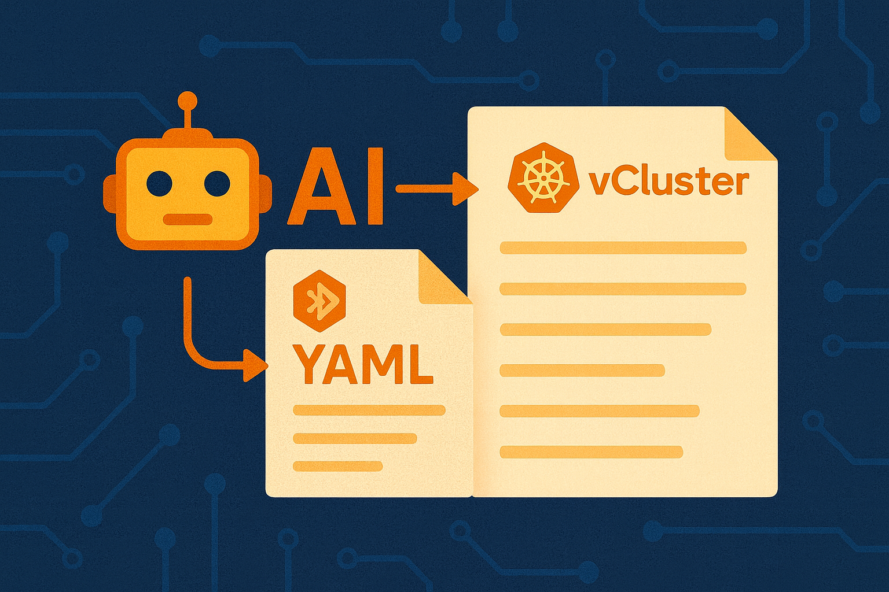
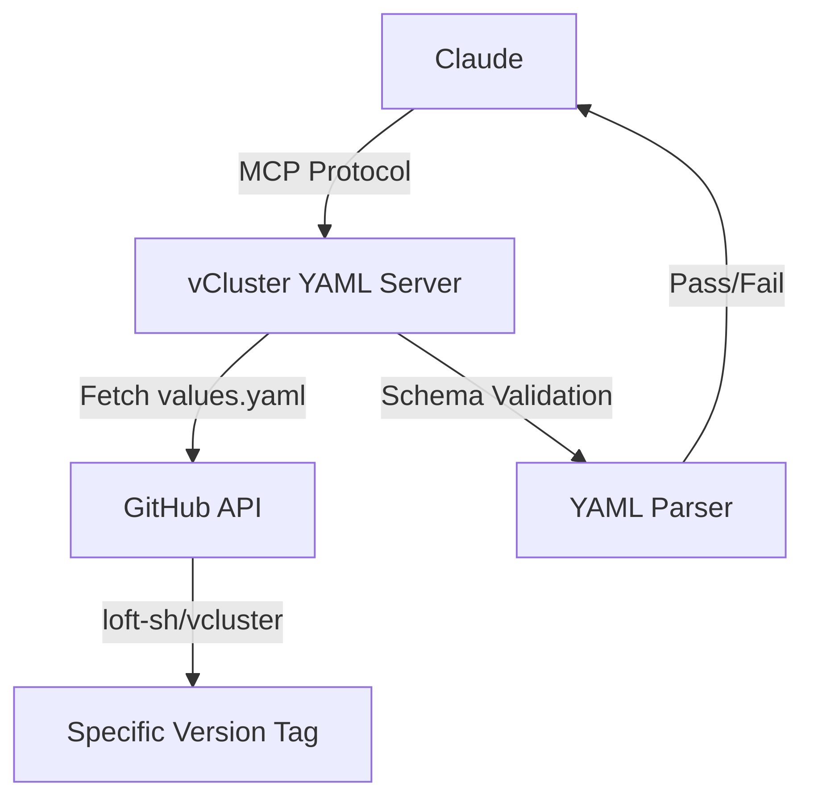
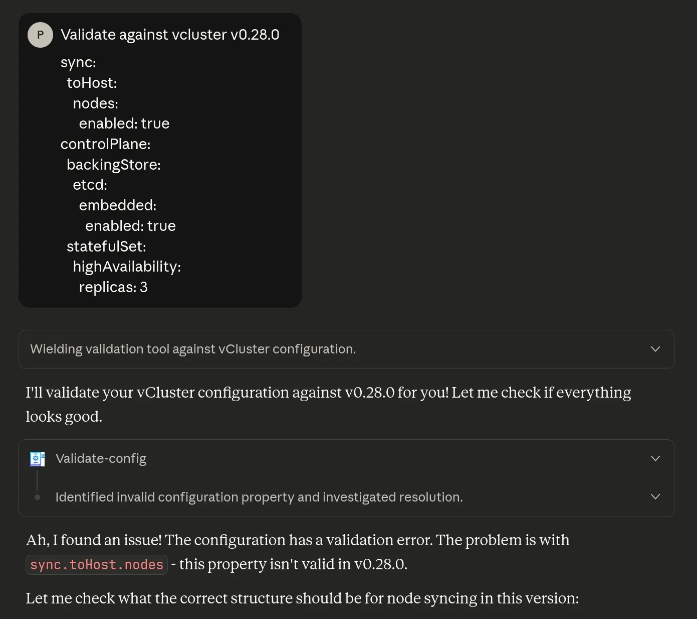
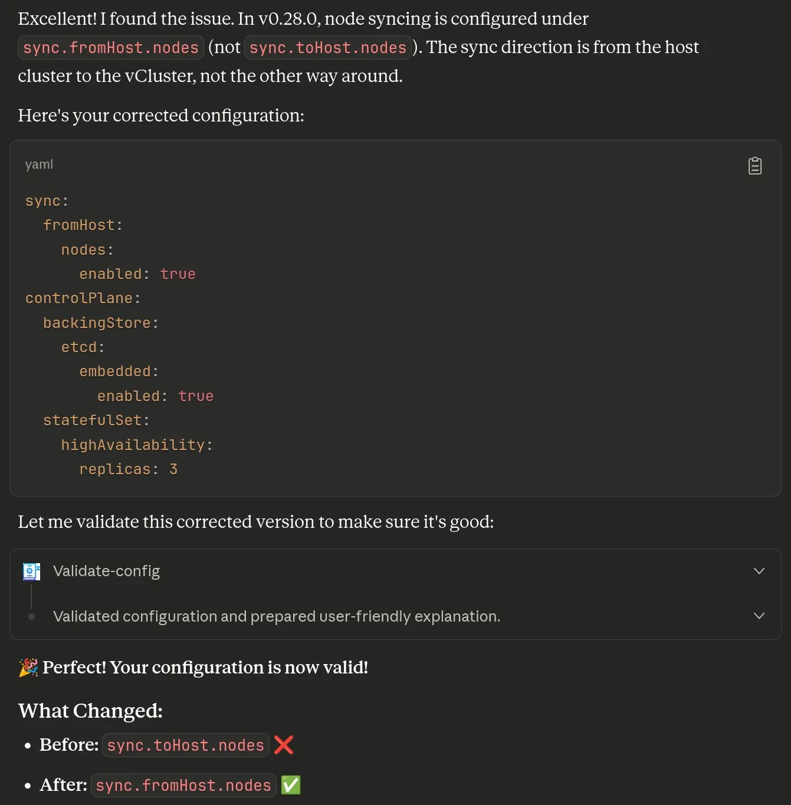

import InfoCards from '@site/src/components/InfoCards';
import DataGrid from '@site/src/components/DataGrid';



<style>{`
  article img:not(:first-of-type) {
    max-width: 700px;
    height: auto;
  }
`}</style>

**Building a Deterministic vCluster Validation MCP Server to Ground AI in Real Schemas**

You ask an AI to generate a Kubernetes manifest, Helm chart values, or Ansible playbook. It responds instantly with clean, well-formatted YAML. You apply it. Nothing works.

This isn't a bug—it's **[AI hallucination](https://en.wikipedia.org/wiki/Hallucination_(artificial_intelligence))**. The AI knows YAML syntax but hallucinates config options that don't exist, mixes incompatible versions, or confidently suggests deprecated fields. It generates what looks right based on patterns, not what **is** right according to actual schemas.

<!--truncate-->

## The Cost of Hallucinated Configs

AI hallucinations aren't just inconvenient—they're expensive. From [legal briefs with fake citations](https://www.businessinsider.com/increasing-ai-hallucinations-fake-citations-court-records-data-2025-5) to financial analyses based on invented metrics, hallucinated AI content causes real damage.

For infrastructure teams, the pattern is consistent: generate config, apply it, watch it fail, spend 30-60 minutes debugging what the AI made up.

<DataGrid
  columns={[
    { key: 'metric', label: 'Impact' },
    { key: 'value', label: 'Cost', badge: true, badgeType: 'danger' }
  ]}
  data={[
    { metric: 'Legal AI hallucination rate (top models)', value: '6.4%' },
    { metric: 'Platform engineer time debugging AI configs', value: '20-30%' },
    { metric: 'Companies using generative AI', value: '71%' },
    { metric: 'Google Bard hallucination incident (single day)', value: '$100B market cap loss' }
  ]}
/>

**The result?** Teams stop trusting AI for infrastructure work. Productivity gains vanish. You're back to grep-ing through values.yaml files manually.

## Making AI Reliable for vCluster Configs

[vCluster](https://www.vcluster.com/docs/vcluster/) is an open-source solution that enables teams to run virtual Kubernetes clusters inside existing infrastructure. These virtual clusters are Certified Kubernetes Distributions that provide strong workload isolation while running as nested environments on top of another Kubernetes cluster.

**Why vCluster configs are hard for AI:**
- Multiple major versions with different schemas (v0.19.0 vs v0.24.0)
- Complex nested YAML structure (Helm chart values)
- Validation rules hidden in comments, not schemas
- Frequent deprecations and field migrations
- Version-specific enum values

**What AI hallucinates:**
- Config options that don't exist in your version
- Deprecated fields that were renamed
- Invalid enum values
- Incompatible option combinations

Example: `controlPlane.backingStore.etcd.deploy` moved to `controlPlane.backingStore.etcd.embedded` in v0.20.0. AI trained on mixed docs will confidently suggest the wrong path for your version.

## The Solution: Deterministic Validation

Stop hallucinations by **grounding AI in actual schemas with deterministic validation**.

I built an [MCP server](https://github.com/Piotr1215/vcluster-yaml-mcp) that connects any AI assistant—Claude, ChatGPT, or any MCP-compatible tool—directly to vCluster's GitHub repository. Every query, every validation, every config generation is grounded in the real Helm values for the exact version you specify. The pattern applies to any complex infrastructure configuration—vCluster is just the implementation.



**How it works:**
1. Fetches configs directly from `github.com/loft-sh/vcluster` (source of truth)
2. Every tool accepts explicit version params (`v0.24.0`, `main`, etc.)
3. Validates against actual schemas—no pattern matching
4. 15-minute smart cache (respects GitHub API limits)
5. Dual interface: MCP (for AI) + CLI (for humans)

## Why Model Context Protocol?

[Model Context Protocol (MCP)](https://modelcontextprotocol.io/) is an open standard created by Anthropic for connecting AI assistants to external data sources and tools. Instead of building custom integrations for each AI, MCP provides a universal interface.

**What makes MCP powerful:**

The [MCP specification](https://modelcontextprotocol.io/specification/2025-03-26) defines a client-server architecture where:
- **MCP Clients** (AI applications) can connect to any MCP server
- **MCP Servers** expose tools, resources, and prompts to AI assistants
- **Transport layer** supports stdio, HTTP, and Server-Sent Events (SSE)

This means one MCP server works everywhere:

<InfoCards
  items={[
    { client: 'Claude Desktop', status: 'Native Support', icon: '✓' },
    { client: 'Claude Web/Code', status: 'Native Support', icon: '✓' },
    { client: 'ChatGPT Desktop', status: 'Officially Adopted (March 2025)', icon: '✓' },
    { client: 'Any MCP-Compatible AI', status: 'Open Standard', icon: '✓' }
  ]}
  titleKey="client"
  fields={[
    { key: 'status', label: 'Status' }
  ]}
  columns={2}
/>

**Build once, use everywhere.** No custom integrations. No vendor lock-in.

The vCluster YAML server is both an MCP server (for AI) and a standalone CLI tool (for humans and automation). Full architecture details in the [GitHub repo](https://github.com/Piotr1215/vcluster-yaml-mcp).

## Three Features That Matter

### No More Version Drift

```bash
# Query specific versions
vcluster-yaml query "sync.fromHost" --version v0.19.0
vcluster-yaml query "sync.fromHost" --version v0.24.0

# AI can query multiple versions in parallel
# No state conflicts, no version switching
```

Your AI assistant now knows **exactly** which options exist in which version. No more mixing v0.19 examples with v0.24 configs.

### No More Silent Failures

When your AI generates a config, it **validates before showing you**:

**You ask:**
> "Create a vCluster config with HA etcd and node sync for v0.24"

**Claude does:**
1. Queries v0.24 schema
2. Generates YAML
3. **Validates it automatically**
4. Shows you only validated output

**What it looks like in practice:**

First, Claude catches the error:



Then provides the corrected, validated config:



No copy-paste-debug loop. Every config works on first apply.

### No More Context Switching

```yaml
# storage: Valid options: "ephemeral", "persistent"
```

The server extracts rules like enums, dependencies, and defaults—knowledge AI wouldn't have from schema alone.

## Try It Now (2 Minutes)

Works with Claude Desktop, Claude Web/Code, ChatGPT Desktop, or any MCP-compatible AI.

**Option 1: Local MCP**

Add to your AI's MCP configuration (example for Claude Desktop at `~/Library/Application Support/Claude/claude_desktop_config.json`):

```json
{
  "mcpServers": {
    "vcluster-yaml": {
      "command": "npx",
      "args": ["-y", "vcluster-yaml-mcp-server"]
    }
  }
}
```

**Option 2: Remote (No Install)**

```json
{
  "mcpServers": {
    "vcluster-yaml": {
      "type": "http",
      "url": "https://vcluster-yaml.cloudrumble.net/mcp"
    }
  }
}
```

Restart your AI client.

**Try these prompts:**

**1. Generate Validated Config**
> "Create a vCluster v0.24 config with HA etcd, ingress, and node sync"

**2. Version Comparison**
> "Compare sync.fromHost between v0.19.0 and v0.24.0"

**3. Fix Existing Config**
> "Validate this config against v0.24: [paste your YAML]"

Watch your AI assistant query schemas, validate in real-time, and give you production-ready configs.

<!-- TODO: Add GIF of Claude using MCP server here -->

## Dual Interface: AI + CLI

The server provides two ways to access the same validation engine:

**1. MCP Protocol** (for AI assistants)
Connect any MCP-compatible AI to query schemas and validate configs interactively.

**2. Standalone CLI** (for humans and automation)
Direct command-line access. No AI needed. Perfect for CI/CD pipelines and quick validations:

```bash
# Quick validation
vcluster-yaml validate my-config.yaml --version v0.24.0

# Pipe from stdin
cat config.yaml | vcluster-yaml validate -

# CI/CD integration
vcluster-yaml validate vcluster.yaml --version "${VCLUSTER_VERSION}" --quiet
[ $? -eq 0 ] || exit 1

# Batch validation
for f in configs/*.yaml; do
  vcluster-yaml validate "$f" || echo "Failed: $f"
done
```

Shell completion, JSON/table output, and designed for automation.

Full CLI docs: [github.com/Piotr1215/vcluster-yaml-mcp](https://github.com/Piotr1215/vcluster-yaml-mcp/blob/main/docs/CLI.md)

## Available MCP Tools

<DataGrid
  columns={[
    { key: 'tool', label: 'Tool' },
    { key: 'purpose', label: 'Purpose' },
    { key: 'version', label: 'Version Aware', badge: true, badgeType: 'info' }
  ]}
  data={[
    { tool: 'list-versions', purpose: 'Get all available vCluster versions (tags/branches)', version: 'N/A' },
    { tool: 'smart-query', purpose: 'Query config options by dot notation or natural language', version: 'Yes' },
    { tool: 'create-vcluster-config', purpose: 'Generate and validate configs in one step', version: 'Yes' },
    { tool: 'validate-config', purpose: 'Validate existing YAML against specific version', version: 'Yes' },
    { tool: 'extract-validation-rules', purpose: 'Extract enums, constraints from YAML comments', version: 'Yes' }
  ]}
/>

**All tools accept explicit `--version` parameter. Query multiple versions in parallel without state conflicts.**

## Architecture

The server is built on four principles that make it reliable for production use:

<DataGrid
  columns={[
    { key: 'principle', label: 'Principle' },
    { key: 'description', label: 'Description' }
  ]}
  data={[
    { principle: 'Stateless', description: 'Every query takes explicit version params. Query v0.19 and v0.24 in parallel—no conflicts, no state drift.' },
    { principle: 'Source-of-Truth', description: 'Fetches directly from loft-sh/vcluster GitHub. No manual updates. Always reflects actual source.' },
    { principle: 'Token-Optimized', description: 'kubectl-style output, not JSON dumps. 800-1500 tokens vs 2K+.' },
    { principle: 'Production-Ready', description: '15-min smart cache, HTTP/SSE transport, comprehensive tests, Docker container available.' }
  ]}
/>

## Beyond vCluster

This pattern works for any config-heavy infra tool:
- Terraform modules
- Kubernetes operators
- Helm charts
- Cloud provider configs

The question isn't whether AI will help manage infrastructure. It's **how we build the grounding layer that makes it reliable**.

This is that layer for vCluster. What could it be for your tools?

## Get Started

**Resources:**
- [GitHub repo](https://github.com/Piotr1215/vcluster-yaml-mcp)
- [npm package](https://www.npmjs.com/package/vcluster-yaml-mcp-server)
- [CLI docs](https://github.com/Piotr1215/vcluster-yaml-mcp/blob/main/docs/CLI.md)
- Public instance: `vcluster-yaml.cloudrumble.net/mcp`

**Try it:**
```bash
# CLI only
npx -p vcluster-yaml-mcp-server vcluster-yaml query sync

# With AI
# Add MCP config above, restart your AI client (Claude, ChatGPT, etc.)
```

**Contribute:**
- [Issues](https://github.com/Piotr1215/vcluster-yaml-mcp/issues)
- [Discussions](https://github.com/Piotr1215/vcluster-yaml-mcp/discussions)
- PRs welcome

---

Try it. Let me know what breaks. Star it if it saves you an hour of debugging.
