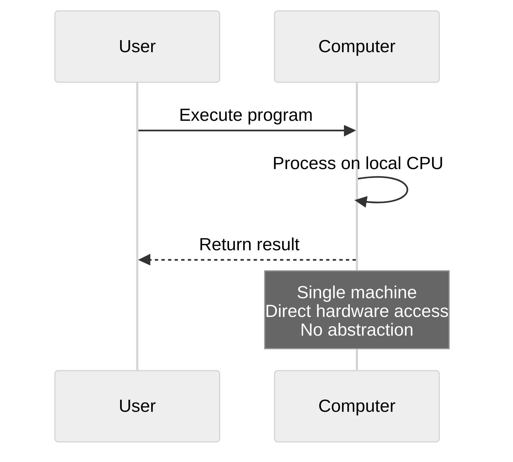
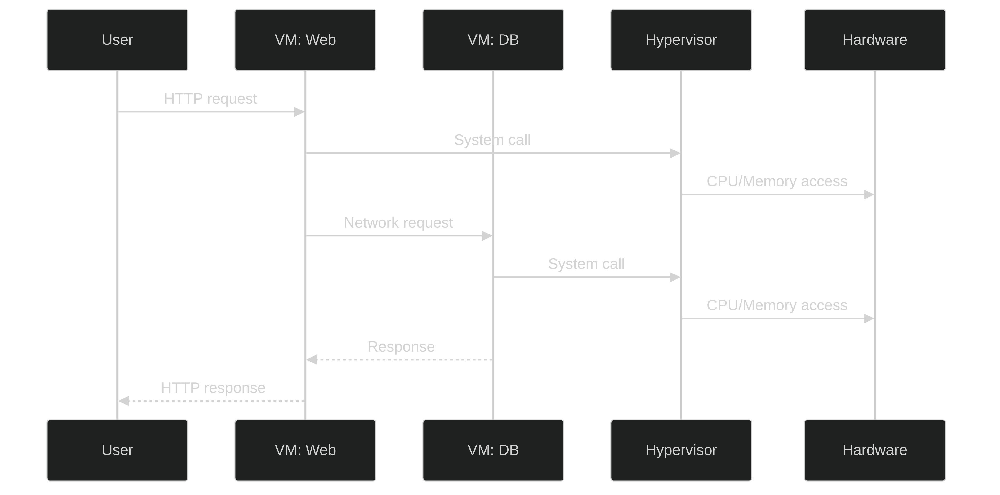
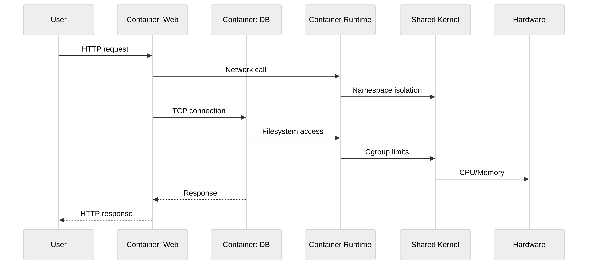
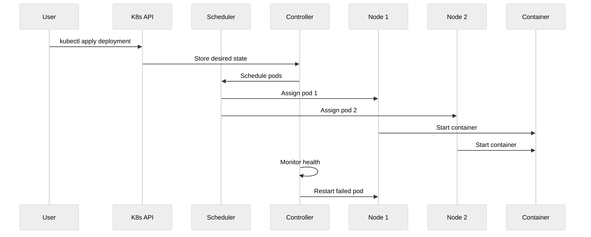
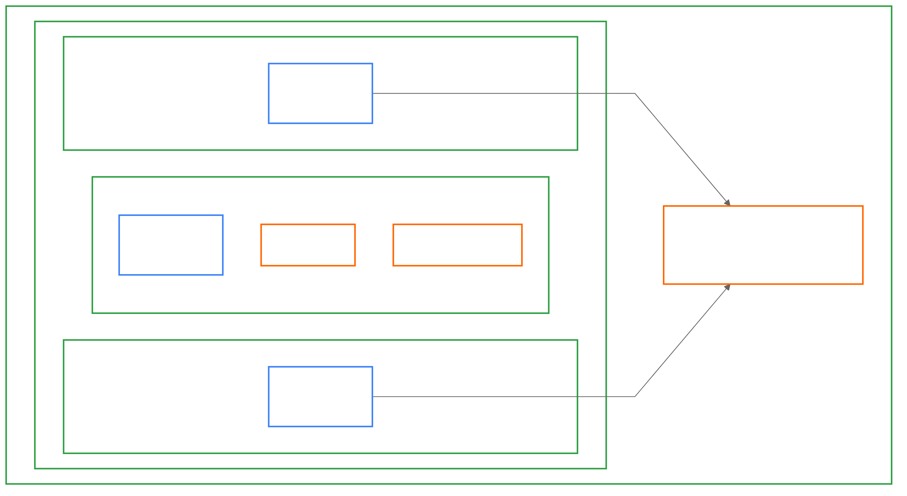
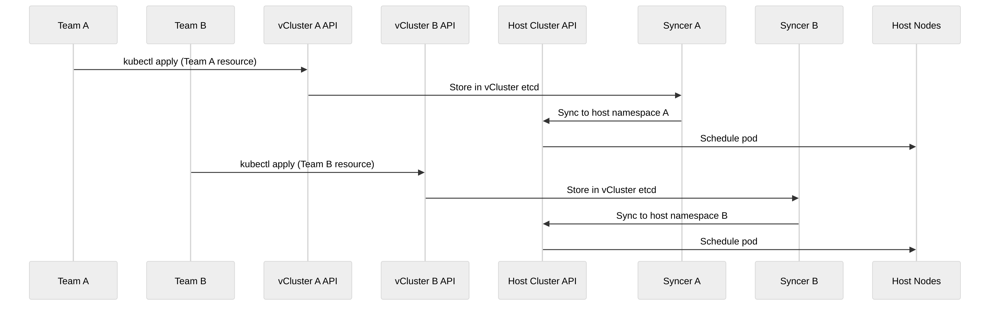

import InfoCards from '@site/src/components/InfoCards';
import DataGrid from '@site/src/components/DataGrid';

**Last week I returned from [KCD UK](https://community.cncf.io/events/details/cncf-kcd-uk-presents-kubernetes-community-days-uk-edinburgh-2025/) where I led a workshop introducing people to vCluster** ([try it yourself here](https://killercoda.com/decoder/course/vcluster/vcluster_introduction)). At the workshop and at our booth, we fielded dozens of questions from people with wildly different backgrounds.

Some attendees had deep Kubernetes expertise but had never heard of virtual clusters. Others worked with containers daily and were exploring the orchestration layer. People came from different knowledge bases and experience levels.

> **The most common question? "What is vCluster, and why would I need it?"**

The short answer: vCluster is an open-source solution that enables teams to run virtual Kubernetes clusters inside existing infrastructure. These virtual clusters are Certified Kubernetes Distributions that provide strong workload isolation while running as nested environments on top of another Kubernetes cluster.

But to understand *why* that matters—and whether you need it—you need to see how we got here.

<!--truncate-->

**By understanding this evolution, you'll see why virtual Kubernetes clusters solve real multi-tenancy problems that traditional approaches can't.**

## The Computing Revolution

In the beginning, we had computers. The [ENIAC](https://en.wikipedia.org/wiki/ENIAC) filled entire rooms in 1945. The [Apple II](https://en.wikipedia.org/wiki/Apple_II) in 1977 and [IBM PC](https://en.wikipedia.org/wiki/IBM_Personal_Computer) in 1981 brought computation to offices and homes. You write code, it runs on that hardware. Simple.

This worked pretty well until you needed to deploy fleets of them. Then the problems became obvious:

**The Problems:**
- **Single point of failure:** If the machine fails, your computation stops. No redundancy. No failover. Just downtime.
- **Slow scaling:** Buying another physical machine means racking it, cabling it, installing the OS, and configuring it. Weeks of lead time for capacity you might only need during peak hours.
- **Resource waste:** Expensive, inflexible hardware sitting idle.

<mark>Something had to change.</mark>

## Better Together: Distributed Computing

The obvious first step was networking. [ARPANET](https://en.wikipedia.org/wiki/ARPANET) connected four university computers in 1969. The [client-server model](https://en.wikipedia.org/wiki/Client%E2%80%93server_model) emerged in the 1980s. By the 1990s, [Beowulf clusters](https://en.wikipedia.org/wiki/Beowulf_cluster) let researchers build supercomputers from commodity hardware.

Now you could distribute work. One machine runs your database. Another runs your web server. A third handles batch processing. If one fails, the others keep running. You have redundancy and you can scale by adding more machines.

This was better. But it created new problems:

**The Problems:**
- **Stranded resources:** Your database server runs at 80% CPU while your web server idles at 15%. You can't dynamically shift capacity between machines.
- **Operational complexity:** Tracking which workload runs where, handling networking and security manually, constantly racking hardware and swapping failed drives.
- **Cost inefficiency:** Wasting money on idle hardware that can't be repurposed without physically moving cables and reinstalling operating systems.

<mark>We needed a way to share physical hardware between workloads.</mark>

## Virtual Machines Let Us Share Physical Hardware

Then someone had a brilliant idea: what if we could run multiple "virtual" computers on one physical machine?

[VMware](https://en.wikipedia.org/wiki/VMware) brought this to x86 in 1998. [Xen](https://en.wikipedia.org/wiki/Xen) followed in 2003. [KVM](https://en.wikipedia.org/wiki/Kernel-based_Virtual_Machine) merged into Linux in 2007. A hypervisor sits between hardware and operating systems, creating virtual machines that behave like physical hardware.

This was significantly better:

**The Benefits:**
- **Efficient resource sharing:** Run multiple VMs on one physical server. Put that 80% CPU database and 15% CPU web server on the same host.
- **Dynamic provisioning:** Create VM templates, spin them up and down based on demand, migrate between hosts without downtime.
- **Dramatic improvement:** Resource utilization improved, provisioning went from weeks to minutes.

**But then we realized VMs were bloated and heavyweight.**

**The Problems:**
- **Massive overhead:** Each VM runs its own kernel, system libraries, daemons, and network stack—gigabytes of redundant code.
- **Slow operations:** Booting takes minutes. Downloading and distributing VM images is slow. Migration means moving entire OS images.
- **Management burden:** Every VM needs patching, monitoring, and management.

<mark>You traded hardware sprawl for VM sprawl. We needed something lighter.</mark>

## Virtual Machines Can Be Too Slow

Then someone smart figured out that you could build an abstraction that looks like a regular OS from the perspective of the software running inside, but when that software makes a system call, it goes to the host machine instead.

[LXC](https://en.wikipedia.org/wiki/LXC) (Linux Containers) emerged in 2008 using [Linux namespaces and cgroups](https://en.wikipedia.org/wiki/Linux_namespaces). But [Docker](https://en.wikipedia.org/wiki/Docker_(software)) in 2013 made containers actually usable for everyone.

The key insight: all that extra OS overhead gets shared. A container image packages your application and its dependencies—nothing more. No full OS. No kernel. Just your code and the libraries it needs.

**The Benefits:**
- **Lightning fast:** Containers start in milliseconds instead of minutes.
- **Resource efficient:** Megabytes instead of gigabytes.
- **High density:** Run hundreds of containers on a single host.
- **Developer productivity:** Replicate production environments locally, deploy hundreds of times per day.

<mark>This was a massive improvement.</mark>

<mark>How do you orchestrate hundreds of containers across dozens of machines?</mark>

Docker became very popular and soon people started building all sorts of different containers. A typical deployed system has at least three components: the application, a database, and maybe a proxy like nginx or a cache like redis.

These components need to work together:
- Database comes online first
- Then redis, then the app, then the proxy
- Each needs to check the health of the previous one
- Your app can't start until the database is ready
- The proxy can't route traffic until the app is healthy

### Containers Rarely Work Alone

You need to **orchestrate** your containers. [Docker Compose](https://docs.docker.com/compose/) did this simply for a single host.

**But what about across dozens or hundreds of hosts?**
- Which host runs which container?
- How do containers find each other across machines?
- What happens when a host fails?
- How do you route traffic?
- How do you handle dynamic autoscaling based on load?
- How do you distribute containers across hosts for redundancy?
- How do you handle rolling updates without downtime?

<mark>Running containers at scale without proper orchestration is operationally infeasible.</mark>

## Containers at Scale Need Orchestration

Google had been running [Borg](https://en.wikipedia.org/wiki/Borg_(cluster_manager)) internally since 2003, managing billions of containers. They knew the answers. In 2014 they open-sourced [Kubernetes](https://en.wikipedia.org/wiki/Kubernetes) and brought that experience to everyone.

The key insight: doing this **declaratively** is very powerful because it's both standardized and reproducible. You don't say "start this container on node-7." You say "I want 3 replicas of this app, each needs 512MB memory" and Kubernetes figures out where to run them.

Kubernetes treats a cluster of machines as a single compute resource. Scheduling, service discovery, load balancing, self-healing, autoscaling—it handles all of it. The control plane continuously converges reality toward your declared desired state.

This let us build entire compute platforms around this concept. Deploying stuff is really complicated—tons of little knobs and dials needing to be turned and tweaked. In the old days everyone had bespoke frameworks and it was super inefficient.

If we capture those abstractions in a standardized API and make it flexible enough to satisfy lots of use cases, one engineer can work on and scale up many different deployments. The system itself can self-heal if there's a problem.

<mark>This is the major reason people want to use Kubernetes. Multi-tenancy.</mark>

Platform teams need to serve many internal customers—Team A, Team B, Team C, maybe dozens of teams. You want to give them self-service Kubernetes access. But Kubernetes namespaces aren't strong enough for true isolation.

**Consider what actually happens in production:**

**The Problems:**
- **CRD conflicts:** Team A deploys a service mesh with cluster-wide CRDs. Team B already has a different version of those CRDs. The conflict causes Team B's applications to fail during deployment. No way to isolate cluster-scoped resources.

- **Version lock-in:** You need to upgrade to Kubernetes 1.30 for a security patch. Team C has a critical application that breaks on 1.30. You can't upgrade safely, but you can't stay on a vulnerable version either.

- **Scheduler conflicts:** Team D wants a custom scheduler for GPU workloads. Team E needs the default scheduler. There's only one scheduler per cluster.

- **Blast radius:** A platform team member accidentally installs a broken admission webhook. It impacts every namespace in the cluster. All deployments across all teams start failing. Debugging requires coordinating across 15 teams.

**The financial impact is significant:**

According to a [2024 ITIC study](https://www.the20.com/blog/the-cost-of-it-downtime/), <mark>98% of organizations report that a single hour of downtime costs over $100,000</mark>, with the average reaching [$9,000 per minute](https://gatling.io/blog/the-cost-of-downtime) across industries. When a shared control plane issue affects multiple teams simultaneously, these costs multiply rapidly.

Kubernetes namespaces provide resource isolation, but they don't provide control plane isolation. Teams share the same API server, scheduler, controllers, and admission webhooks. This creates operational constraints that don't scale.

The alternative? Spin up separate clusters per team. But now you're managing dozens of physical clusters—each with its own control plane, nodes, and operational overhead. Expensive and operationally complex.

Platform teams needed better isolation without multiplying management overhead.

## Virtual Clusters: Lightweight Kubernetes Clusters

This is where we circle back to the beginning. Remember how VMs solved the problem of stranded resources on physical hardware? The same insight applies here.

[vCluster](https://www.vcluster.com/) runs Kubernetes control plane components (API server, controller manager, and optionally a scheduler) inside a single pod on a host cluster. A syncer component bridges the virtual and host clusters, translating resources between them. The virtual cluster stores its state in SQLite or etcd, completely isolated from the host.

From the tenant's perspective, they have a full Kubernetes cluster:

**How It Solves The Problems:**

- **Independent upgrades:** Each team controls their Kubernetes version. Team A tests 1.30 while Team B stays on 1.28. No coordination required.

- **Flexible service sharing:** Teams choose what to share:
  - **Fully shared:** Use the host cluster's ingress controller and cert-manager
  - **Partially shared:** Share some services, run others independently within the vCluster
  - **Fully isolated:** Run all services independently within the vCluster

- **Flexible compute sharing:** Teams choose how to share infrastructure:
  - **Shared nodes:** Multiple vClusters share the same host cluster nodes for cost efficiency
  - **Private nodes:** Teams can join dedicated nodes directly to their vCluster for workloads requiring complete isolation (GPU training, compliance requirements)
  - **Hybrid:** Mix shared and private nodes based on workload needs

- **True control plane isolation:** Each vCluster has its own API server, scheduler, and controllers. A broken admission webhook in vCluster A doesn't affect vCluster B.

The cost efficiency is dramatic. You run dozens of vClusters on a single host cluster, sharing node capacity efficiently. One platform engineer can serve hundreds of teams without managing hundreds of physical clusters.

**Recent developments have expanded the flexibility:**

- **[Private Nodes](https://www.vcluster.com/blog/vnode-kubernetes-node-isolation-multi-tenancy)** (v0.27) let teams join dedicated nodes directly to their vCluster for workloads requiring complete isolation—like GPU training jobs or compliance-sensitive applications.
- **[Auto Nodes](https://www.vcluster.com/blog/introducing-vcluster-auto-nodes-karpenter-based-dynamic-autoscaling-anywhere)** (v0.28) bring Karpenter-based elastic scaling to any infrastructure, giving teams dynamic compute without manual node management.
- **[vCluster Standalone](https://www.vcluster.com/blog/vcluster-standalone-multi-tenancy-kubernetes)** (v0.29) removes the dependency on a host cluster entirely, allowing installation directly on bare metal or VMs.

<mark>You can tailor isolation to your needs:</mark> shared nodes for cost efficiency, private nodes for GPU workloads or security requirements, or standalone for complete infrastructure control.

Each abstraction solved a real problem. Each created a new one.

vClusters solve multi-tenancy but add another abstraction layer. Debugging requires understanding both vCluster and host cluster layers. Networking configuration becomes more complex. Permissions need careful mapping between vCluster and host resources.

**But the trade-off is favorable** if you need multi-tenant Kubernetes at scale. The cost savings and operational simplification outweigh the added complexity.

## The Pattern

**You see the progression:**

- **Physical computers → VMs** (resources were stranded)
- **VMs → Containers** (OS overhead was too heavy)
- **Containers → Kubernetes** (orchestration was chaos)
- **Kubernetes → vClusters** (multi-tenancy was broken)

<mark>Each abstraction solved a real problem. Each created a new one. This is how abstraction works.</mark>

You trade one kind of complexity for another. You move problems up the stack. Physical constraints become logical constraints. Hardware limitations become software limitations.

The question is never "should we abstract?" The question is "what complexity are we willing to trade?"

## Try It Yourself

If you want hands-on experience with vClusters, try the [Killercoda interactive tutorial](https://killercoda.com/decoder/course/vcluster/vcluster_introduction) I used at the workshop. You'll see exactly how vClusters provide isolation, how they integrate with host clusters, and what the operational model looks like.

Understanding the history and first principles makes the technology click. You'll see vClusters not as "yet another tool" but as the logical next step in a progression that started with physical computers six decades ago.

---

## Resources

**Learn More:**
- [vCluster Documentation](https://www.vcluster.com/docs)
- [Killercoda Interactive Tutorial](https://killercoda.com/decoder/course/vcluster/vcluster_introduction) - The hands-on workshop from KCD UK
- [Kubernetes Multi-Tenancy Working Group](https://github.com/kubernetes-sigs/multi-tenancy)

**[Watch My Talks](https://cloudrumble.net/talks):**
- [Flexible Multi-Tenancy with vCluster](https://www.youtube.com/watch?v=sfGyBZmNxqk) - SREDay London 2025 ([event page](https://sreday.com/2025-london-q3/))
- [The Future of Kubernetes Tenancy](https://www.youtube.com/watch?v=88Yeik-SagQ) - Webinar with vCluster CEO

**Events:**
- [KCD UK Edinburgh 2025](https://community.cncf.io/events/details/cncf-kcd-uk-presents-kubernetes-community-days-uk-edinburgh-2025/) - Where this blog idea was born

---

Every abstraction in computing history emerged to solve a real problem. Virtual clusters are no different. If you're running multi-tenant Kubernetes at scale, dealing with version conflicts, or managing dozens of teams with different requirements, <mark>vClusters offer the control plane isolation that namespaces can't provide</mark>.

Start with the [interactive tutorial](https://killercoda.com/decoder/course/vcluster/vcluster_introduction), explore the [documentation](https://www.vcluster.com/docs), and see how virtual clusters can transform your Kubernetes multi-tenancy strategy.
