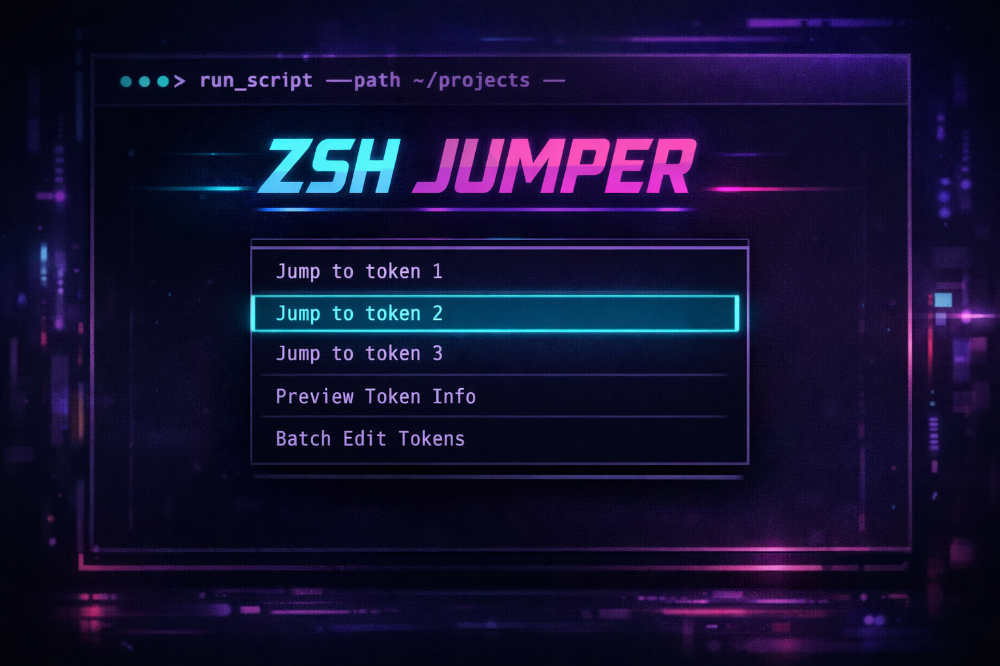

<style>{`
  article img:not(:first-of-type) {
    max-width: 700px;
    height: auto;
  }
`}</style>

You've typed a 10-word kubectl command. You realize the namespace is wrong. Now you're holding `Ctrl+Left` six times to get there. Or worse, reaching for the mouse.

Vim solved this for text editing decades ago. Why are we still navigating command lines like it's 1985?

[zsh-jumper](https://github.com/Piotr1215/zsh-jumper) brings fuzzy search to command line navigation. Press a key, pick a word, cursor jumps there. Or press `;` and a letter for instant EasyMotion-style jumps.

<!--truncate-->

## The Problem

Terminal commands grow long:

```bash
kubectl get pods -n kube-system --output wide --selector app=nginx
```

You need to edit `kube-system`. Options:

1. **Arrow keys** - Hold until you get there. Slow.
2. **Ctrl+Left/Right** - Jump word by word. Better, but still multiple presses.
3. **Home then Ctrl+Right** - Start from beginning. Indirect.
4. **Mouse** - Works, but your hands leave the keyboard.

None of these scale. A 15-word command means 15 potential targets.

## The Solution

```bash
$ kubectl get pods -n kube-system --output wide
                    ▲
              [Ctrl+X /]
                    │
→ [a]kubectl [s]get [d]pods [f]-n [g]kube-system [h]--output [j]wide   ← overlay
┌─────────────────────────────────────┬────────────────────────────────────────┐
│ jump>                               │ kubectl controls the Kubernetes...     │
│ ^S:wrap | ^E:var | ^R:replace | ^M:m│                                        │
│─────────────────────────────────────│                                        │
│> 1: kubectl                         │ Basic Commands (Beginner):             │
│  2: get                             │   create    Create a resource          │
│  3: pods                            │   expose    Expose a resource          │
│  4: -n                              │   run       Run a particular image     │
│  5: kube-system                     │   set       Set specific features      │
│  6: --output                        │                                        │
│  7: wide                            │ Basic Commands (Intermediate):         │
└─────────────────────────────────────┴────────────────────────────────────────┘
```

The overlay shows letter hints (`[a]kubectl [s]get [d]pods`) for instant jump. The picker has numbered items for fuzzy search, with `--help` preview on the right.

Type `kube`, hit enter. Cursor lands at `kube-system`. Edit, continue.

Or press `;` then `g` to jump directly to `kube-system`. No fuzzy searching needed.

The mental model matches how you think: "I want to change the namespace" not "I need to move left 6 words."

## Installation

Requires fzf (or sk, peco, percol). Most of you have fzf already.

```zsh
# zinit
zinit light Piotr1215/zsh-jumper

# antigen
antigen bundle Piotr1215/zsh-jumper

# oh-my-zsh
git clone https://github.com/Piotr1215/zsh-jumper \
    ${ZSH_CUSTOM:-~/.oh-my-zsh/custom}/plugins/zsh-jumper
# then add zsh-jumper to plugins in .zshrc
```

Default binding: `Ctrl+X /`

## FZF Actions

Beyond jumping, the picker offers token manipulation:

| Key | Action |
|-----|--------|
| `Enter` | Jump to selected token |
| `Ctrl+S` | Wrap token in `"..."`, `'...'`, `$(...)`, etc. |
| `Ctrl+E` | Extract token to `UPPERCASE` variable |
| `Ctrl+R` | Replace token (delete and position cursor) |
| `Ctrl+M` | Move/swap token with another position |
| `;` | Enter instant mode (then press a-z to jump) |

**Variable extraction** converts `my-gpu` to:
```bash
MY_GPU="my-gpu"
kubectl run test --image "$MY_GPU"
```

**Instant mode**: Press `;` then a hint letter to jump directly. The overlay on your command line shows the mapping.

**Replace mode** is particularly useful: it deletes the token and leaves cursor in place, so you get full zsh tab completion for the replacement text.

For complex multiline editing, `Ctrl+X Ctrl+E` (edit in `$EDITOR`) still shines. zsh-jumper is for quick navigation and token manipulation.

## Preview Panel

The right panel shows contextual help:

- **Commands**: `--help` output (with bat highlighting), fallback to `tldr`, then `man`
- **Files**: Content preview via `bat` (or `head`)
- **Directories**: `ls -la` listing

This makes the picker double as a quick reference. Forgot what flags kubectl accepts? Just invoke the picker.

## Why Word Numbering?

The picker shows numbered words:

```
1: kubectl
2: get
3: -n
4: --user
5: admin
```

This prevents ambiguity. If you search for `-u`, you want `-n` at position 3, not a substring match inside `--user`. Numbers ensure exact cursor placement.

## Configuration

All options via zstyle, set before loading the plugin:

```zsh
# Force specific picker
zstyle ':zsh-jumper:' picker fzf

# Custom picker options
zstyle ':zsh-jumper:' picker-opts '--height=50% --reverse --border'

# Where cursor lands: start (default), middle, end
zstyle ':zsh-jumper:' cursor end

# Custom keybinding
zstyle ':zsh-jumper:' binding '^J'
```

For tmux users: the plugin auto-detects tmux and uses `fzf-tmux` for a floating popup instead of inline fzf.

## Vi Mode

If you use vi mode in zsh, bind to both insert and command modes:

```zsh
zstyle ':zsh-jumper:' disable-bindings yes
bindkey -M viins '^X/' zsh-jumper-widget
bindkey -M vicmd '^X/' zsh-jumper-widget
```

## Workflow Tips

The built-in actions handle most edits directly:

- **Wrong value?** `Ctrl+R` to replace with full tab completion
- **Need quotes?** `Ctrl+S` to wrap in `"..."`, `'...'`, or `$(...)`
- **Reuse a value?** `Ctrl+E` to extract to a variable
- **Wrong order?** `Ctrl+M` to swap positions

For anything else, jump to the word then use standard zsh:

- `Alt+D` - Delete word forward
- `Ctrl+W` - Delete word backward
- `Ctrl+K` - Kill to end of line

## Multiline Commands

Works with backslash continuations:

```bash
docker run -d \
    --name my-container \
    --network host \
    nginx:latest
```

Line continuation characters are filtered out. You see only actual command tokens in the picker.

## Extensibility

For power users, custom actions and previewers via TOML config:

```zsh
zstyle ':zsh-jumper:' config ~/.config/zsh-jumper/config.toml
```

```toml
[[actions]]
binding = 'ctrl-u'
description = 'uppercase'
script = '~/.config/zsh-jumper/scripts/uppercase.sh'

[[previewers]]
pattern = '^https?://'
description = 'URL preview'
script = '~/.config/zsh-jumper/scripts/url-preview.sh'
```

Run `zsh-jumper-list` to see all registered actions and previewers.

## Performance

CI measures and enforces thresholds on every commit:

| Metric | What it measures | Threshold |
|--------|------------------|-----------|
| **Load** | Time to source the plugin | < 200ms |
| **Parse** | Tokenize a 10-word command 100× | < 150ms |
| **Leak** | Memory delta after 10 load/unload cycles | < 400KB |

Live badges in the [README](https://github.com/Piotr1215/zsh-jumper) show actual values from the latest CI run. The plugin loads in under 1ms and cleans up properly on unload.

---

**Resources:**
- [zsh-jumper on GitHub](https://github.com/Piotr1215/zsh-jumper)
- [fzf](https://github.com/junegunn/fzf) - Required fuzzy finder
