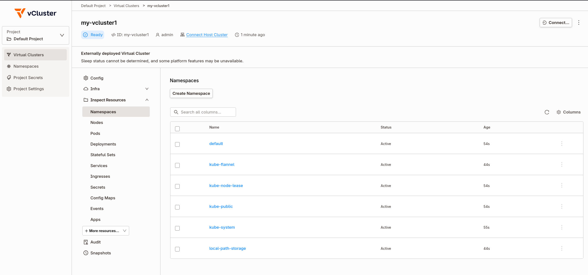

<style>{`
  article img:not(:first-of-type) {
    max-width: 700px;
    height: auto;
  }
`}</style>

Local Kubernetes development has rough edges. kind and minikube make cluster creation trivial, but common workflows need extra setup.

Exposing a LoadBalancer service means configuring MetalLB or tunneling through ngrok. Testing a new image means running `kind load docker-image` every iteration.

vind encapsulates these workflows. Kubernetes nodes run as Docker containers sharing the host daemon, so images pull straight from the local cache. A built-in LoadBalancer controller assigns real IPs without additional configuration.

<!--truncate-->

## vind

[vind](https://github.com/loft-sh/vind) (vCluster in Docker) runs the Kubernetes control plane and simulated nodes as Docker containers. They share your host's Docker daemon. Currently experimental but functional.

**Prerequisites:**
- Docker with containerd image store enabled (see below)
- vCluster CLI v0.31.0+ ([install guide](https://www.vcluster.com/docs/vcluster/deploy/basics))
- Linux: bridge kernel modules loaded

**Docker setup** (required for registry proxy):
```bash
# Enable containerd image store
echo '{"features":{"containerd-snapshotter":true}}' | sudo tee /etc/docker/daemon.json
sudo systemctl restart docker

# Verify
docker info | grep "driver-type"
# Should show: driver-type: io.containerd.snapshotter.v1
```

**Linux kernel modules** (if node join fails):
```bash
sudo modprobe bridge br_netfilter
```

**vind workflow:**

```yaml
# vcluster.yaml - need at least one node for pods to schedule
experimental:
  docker:
    nodes:
    - name: "worker-1"
```

```bash
# 1. Set Docker driver (once)
vcluster use driver docker

# 2. Create cluster with node config
vcluster create my-cluster --values vcluster.yaml

# 3. Deploy (images from your local Docker cache)
kubectl apply -f deployment.yaml
# LoadBalancer gets an IP
```

Your local Docker images are already available. LoadBalancer services get real IPs reachable from your machine.

## vCluster Platform Free Tier

vind works standalone. Connecting it to [vCluster Platform's free tier](https://www.vcluster.com/blog/launching-vcluster-free-get-enterprise-features-at-no-cost) adds management features.

**Enterprise features now free:**
- Sleep mode (pause/resume clusters)
- Templates and self-service
- User management and RBAC
- CRD sync and sync patches
- Embedded etcd

**Limits:**
- 64 vCPU cores
- 32 GPUs
- Unlimited users
- Unlimited host clusters
- Unlimited virtual clusters

Covers homelabs, dev environments, CI pipelines, and conference demos.



**Activate free tier:**

1. Deploy vCluster Platform following the [installation guide](https://www.vcluster.com/docs/platform/install/quick-start-guide)
2. Enter your email when prompted in the Platform UI
3. Complete activation via the email link

Once connected, vind clusters appear in the Platform dashboard with options for multi-cluster management, team access sharing, and external node joining.

## Registry Proxy

The registry proxy is why vind iteration is faster than kind. Comparison:

**kind:**
```bash
docker build -t myapp:v2 .           # Build locally
kind load docker-image myapp:v2      # Copy entire image into cluster
kubectl set image deploy/app app=myapp:v2  # Deploy
# Wait for image copy... then deploy
```

**vind:**
```bash
docker build -t myapp:v2 .           # Build locally
kubectl set image deploy/app app=myapp:v2  # Deploy immediately
# Pod starts, registry proxy serves image from local Docker
```

The registry proxy runs inside vind and intercepts image pulls. When containerd inside the worker node requests `myapp:v2`, the proxy checks the host Docker daemon first. Local images are served directly.

This also works for public images. Pull `nginx:latest` once on your host, every vind cluster reuses it.

```bash
# On host
docker pull nginx:latest

# In vind cluster - instant, no network pull
kubectl run nginx --image=nginx:latest
```

## LoadBalancer Services That Work

With kind, LoadBalancer services stay `<pending>` without additional setup. NodePort or port-forward become the standard workarounds.

vind includes a LoadBalancer controller that assigns real IPs:

```bash
kubectl create deployment web --image=nginx
kubectl expose deployment web --port=80 --type=LoadBalancer

kubectl get svc web
# NAME   TYPE           CLUSTER-IP     EXTERNAL-IP   PORT(S)
# web    LoadBalancer   10.96.45.123   172.19.0.5    80:31234/TCP
```

That IP is routable from your host:

```bash
curl 172.19.0.5
# <!DOCTYPE html>
# <title>Welcome to nginx!</title>
# ...
```

Multiple LoadBalancer services get different IPs.

## Multi-Node Clusters

Test node affinity, pod anti-affinity, or DaemonSets with multiple workers:

```yaml
# vcluster.yaml
experimental:
  docker:
    nodes:
    - name: "worker-1"
    - name: "worker-2"
    - name: "worker-3"
```

```bash
vcluster create multi-node --values vcluster.yaml
kubectl get nodes
# NAME       STATUS   ROLES    AGE
# worker-1   Ready    <none>   30s
# worker-2   Ready    <none>   30s
# worker-3   Ready    <none>   30s
```

Each node is a Docker container. Add more by adding lines to the config.

## External Nodes via Platform

With vCluster Platform Pro, you can join real machines to your vind cluster using vCluster VPN. This enables hybrid scenarios: your laptop runs the control plane, a Raspberry Pi or cloud VM joins as a worker.

```yaml
# vcluster.yaml
experimental:
  docker:
    nodes:
    - name: local-node
privateNodes:
  vpn:
    enabled: true
    nodeToNode:
      enabled: true
```

```bash
vcluster create hybrid --values vcluster.yaml
```

The external machine connects through the Platform and appears as a node in `kubectl get nodes`. Test ARM workloads, edge scenarios, or distribute workloads across machines.

## vind vs kind

| Feature | kind | vind |
|---------|------|------|
| LoadBalancer | Requires MetalLB setup | Built-in controller |
| Images | `kind load` per change | Pull-through from Docker |
| Multi-node | Separate config | Add lines to yaml |
| Pause/resume | Delete and recreate | `vcluster pause/resume` |
| Management UI | CLI only | Platform (free tier) |
| External nodes | Local only | VPN join (Pro) |

### Choose vind when

LoadBalancer services need real IPs without MetalLB. Image iteration is frequent (demos, rapid development). Clusters need pausing to free resources. A management UI would help.

### Stick with kind when

The workflow already works. CI/CD pipelines need maximum compatibility. Minimal dependencies matter more than features.

## Resources

- [vind | vCluster in Docker | Across The Tenancy Spectrum](https://www.youtube.com/watch?v=In8vzpKecLs) - Video walkthrough
- [vind GitHub](https://github.com/loft-sh/vind)
- [vind Documentation](https://www.vcluster.com/docs/vcluster/configure/vcluster-yaml/experimental/docker)
- [Launching vCluster Free](https://www.vcluster.com/blog/launching-vcluster-free-get-enterprise-features-at-no-cost) - Free tier announcement
- [Platform Installation Guide](https://www.vcluster.com/docs/platform/install/quick-start-guide)
