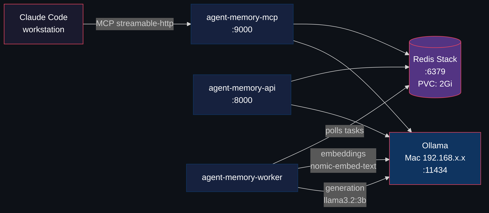
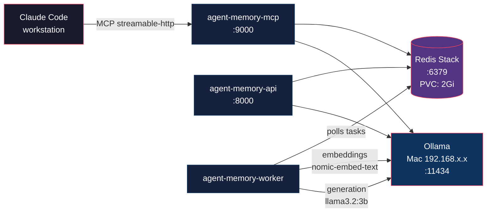
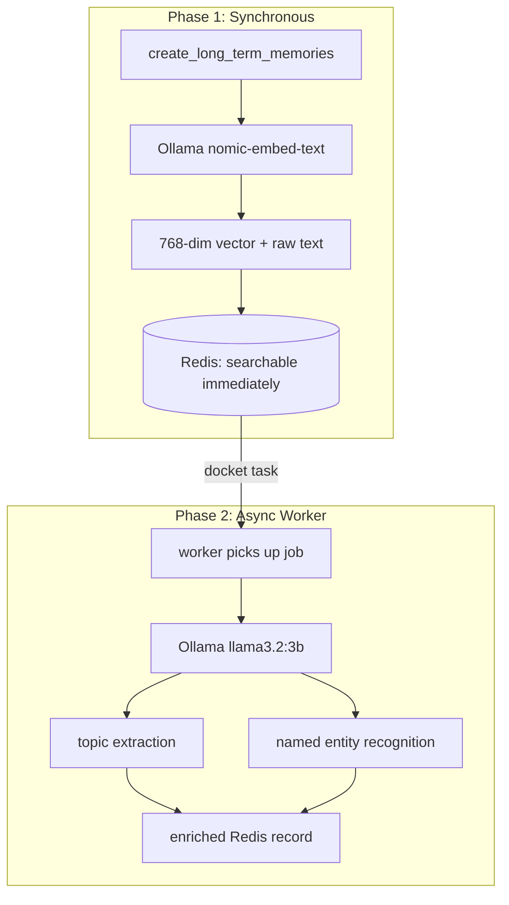

import InfoCards from '@site/src/components/InfoCards';



<style>{`
  article img:not(:first-of-type) {
    max-width: 700px;
    height: auto;
  }
`}</style>

AI agents learn things about you as you work. Your coding style, your infrastructure quirks, which tools you prefer, how you name things. That context accumulates across dozens of sessions. But it evaporates when the session ends or when you switch tools. Use Claude Code in the terminal, Cursor in the IDE, and a web-based MCP client on your phone. Three tools, three isolated memory silos. You can share static knowledge with files. But the context that accumulates from your interactions has nowhere to go.

What if the memory layer was separate from the tools entirely? [Redis Agent Memory Server](https://github.com/redis/agent-memory-server) does exactly that. It's an open-source memory service that speaks [MCP](https://modelcontextprotocol.io/) over HTTP. CLI tools (Claude Code, Codex, Gemini CLI), IDE tools (Cursor, Windsurf, Copilot), and any web-based MCP client all connect to the same store. Because the server runs over HTTP, you can expose it beyond the homelab with Cloudflare Tunnels or similar, so tools outside your network connect too. The memory lives on your infrastructure, not theirs.

The server provides two tiers: working memory (session-scoped context that auto-promotes to long-term) and long-term memory (persistent, semantically searchable). It exposes both a REST API and an MCP interface.

I deployed it on my homelab Kubernetes cluster. Four pods, one PVC, zero API costs. Here's how.

<!--truncate-->

## Architecture

Four components, each a separate Kubernetes deployment. Here's what happens under the hood.

**Storing.** When you tell it to remember something, it converts your text into a list of numbers (an embedding). Redis stores those numbers alongside the raw text. The memory is searchable immediately.

**Retrieving.** When a tool queries memory, your query becomes numbers too. Redis finds stored memories with the closest numbers, by meaning, not by keyword. An AI tool asking "what do I know about deployment patterns?" finds a memory you stored as "we always use Recreate strategy for PVC-backed workloads" even though the words don't overlap. Unlike wikis or Obsidian vaults where you organize content yourself and search by keyword, here you store unstructured text and the system handles the rest.

**Enriching.** In the background, a worker asks a small local LLM "what topics are in this text?" and tags each memory with structured metadata. Combined with topic and entity tags, you get precise recall without writing structured queries. Think of it as auto-filing.



| Component | Image | Purpose |
|-----------|-------|---------|
| Redis Stack | `redis/redis-stack-server:7.4.0-v8` | Vector store + pub/sub + persistence |
| API Server | `piotrzan/agent-memory-server:0.13.2-custom-v3` | REST API on port 8000 |
| MCP Server | Same custom image | MCP interface on port 9000 |
| Task Worker | Same custom image | Async processing (embeddings, NER, topic extraction) |

The worker handles the async enrichment. Here's the full lifecycle:

### Memory Lifecycle

Storing a memory happens in two phases:



Phase 1 is synchronous. nomic-embed-text converts your text into a 768-dimension vector. Redis stores both the vector and the raw text immediately, so you can search for it right away.

Phase 2 runs in the background. The worker pulls async tasks from Redis (using [docket](https://github.com/chrisguidry/docket)), sends text to llama3.2:3b for topic extraction and NER, and writes structured metadata back. This makes future searches more precise; you can filter by topic or entity, not just vector similarity.

### Why Not Just Use OpenAI-backed Memory?

Most AI memory solutions ([Mem0](https://mem0.ai/), [Zep](https://www.getzep.com/)) require OpenAI or another cloud LLM for embeddings and extraction. Every memory stored costs API tokens. Every semantic search costs more tokens.

Redis Agent Memory Server supports [LiteLLM](https://docs.litellm.ai/), which means it works with 100+ providers. Including Ollama. Running locally. For free.

<InfoCards
  items={[
    { feature: 'Embeddings', cloud: 'OpenAI ada-002 ($0.10/1M tokens)', local: 'Ollama nomic-embed-text (free)' },
    { feature: 'Generation', cloud: 'GPT-4 for extraction ($30/1M tokens)', local: 'Ollama llama3.2:3b (free)' },
    { feature: 'Vector Store', cloud: 'Pinecone/Weaviate (managed)', local: 'Redis Stack RediSearch (self-hosted)' },
    { feature: 'Data Location', cloud: 'Third-party servers', local: 'Your cluster, your PVC' }
  ]}
  titleKey="feature"
  fields={[
    { key: 'cloud', label: 'Cloud' },
    { key: 'local', label: 'Homelab' }
  ]}
  columns={2}
/>

With Ollama on a spare Mac and Redis on Kubernetes, the entire memory pipeline runs locally. Memories never leave the network.

---

## Deploying to Kubernetes

Everything below is the actual deployment. If you just wanted the concept, you can stop here. If you want to run this on your own cluster, keep going.

### Prerequisites

- **A Kubernetes cluster.** Any distro works: k3s on a single node, kubeadm, Talos, managed. If you don't have one yet, [k3s](https://k3s.io/) gets you there in one command
- A machine running [Ollama](https://ollama.com/) with `nomic-embed-text` and `llama3.2:3b` pulled. Can be the same node, a spare laptop, a Mac. Needs ~4GB RAM for both models
- ~2.3GB cluster RAM at pod limits for the 4 deployments (actual usage is lower)
- A storage class that supports PVCs (Longhorn, local-path, OpenEBS, anything)
- Optional: ArgoCD for GitOps sync, or just `kubectl apply`

Everything lives in the `ai-tools` namespace. ArgoCD syncs from Git.

### Redis Stack

Redis is doing triple duty here: vector index (RediSearch for semantic search), task queue (docket polls it for async worker jobs), and persistent store (AOF + PVC for the actual memories). One pod instead of running Postgres + Pinecone + RabbitMQ separately. Same ops patterns as any other stateful workload: PVC, AOF persistence, health checks. Redis Stack bundles RediSearch (vector similarity) and RedisJSON. The `appendonly` flag enables AOF persistence, so data survives pod restarts. `allkeys-lru` eviction keeps memory bounded at 512MB. Oldest entries get evicted when full.

```yaml
apiVersion: apps/v1
kind: Deployment
metadata:
  name: agent-memory-redis
  namespace: ai-tools
spec:
  replicas: 1
  strategy:
    type: Recreate  # avoid two pods fighting over PVC
  selector:
    matchLabels:
      app.kubernetes.io/name: agent-memory-redis
  template:
    metadata:
      labels:
        app.kubernetes.io/name: agent-memory-redis
        app.kubernetes.io/component: redis
    spec:
      containers:
        - name: redis
          image: redis/redis-stack-server:7.4.0-v8
          env:
            - name: REDIS_ARGS
              value: "--appendonly yes --maxmemory 512mb --maxmemory-policy allkeys-lru"
          ports:
            - containerPort: 6379
              name: redis
          volumeMounts:
            - name: data
              mountPath: /data
          resources:
            limits:
              cpu: 500m
              memory: 768Mi
            requests:
              cpu: 100m
              memory: 256Mi
          livenessProbe:
            exec:
              command: ["redis-cli", "ping"]
            initialDelaySeconds: 15
            periodSeconds: 30
          readinessProbe:
            exec:
              command: ["redis-cli", "ping"]
            initialDelaySeconds: 5
            periodSeconds: 10
      volumes:
        - name: data
          persistentVolumeClaim:
            claimName: agent-memory-redis-data
---
apiVersion: v1
kind: PersistentVolumeClaim
metadata:
  name: agent-memory-redis-data
  namespace: ai-tools
spec:
  accessModes:
    - ReadWriteOnce
  storageClassName: longhorn
  resources:
    requests:
      storage: 2Gi
```

`Recreate` strategy is important because two Redis instances can't share the same PVC.

### The Application Pods

All three application components share environment variables. The key ones:

```yaml
env:
  - name: REDIS_URL
    value: redis://agent-memory-redis.ai-tools.svc:6379
  - name: LONG_TERM_MEMORY
    value: "true"
  - name: ENABLE_TOPIC_EXTRACTION
    value: "true"
  - name: ENABLE_NER
    value: "true"
  - name: GENERATION_MODEL
    value: ollama/llama3.2:3b    # explicit tag matters!
  - name: EMBEDDING_MODEL
    value: ollama/nomic-embed-text
  - name: OLLAMA_API_BASE
    value: http://ollama.ai-tools.svc:11434  # point at your Ollama service
  - name: REDISVL_VECTOR_DIMENSIONS
    value: "768"                  # nomic-embed-text output size
  - name: DISABLE_AUTH
    value: "true"                 # homelab, internal network
```

Each component gets a different command:

```yaml
# API server (default entrypoint)
# No command override needed -- runs uvicorn on port 8000

# MCP server
command: ["agent-memory", "mcp", "--mode", "streamable-http"]

# Task worker
command: ["agent-memory", "task-worker"]
```

The API server handles REST requests. The MCP server speaks Model Context Protocol over streamable-http. The worker runs docket-based async tasks.

### Exposing Ollama to the Cluster

Ollama can run on any machine on your network: the cluster node itself, a spare laptop, a desktop. If it runs outside the cluster, you need a headless Service with manual Endpoints pointing at whatever IP runs Ollama:

```yaml
apiVersion: v1
kind: Service
metadata:
  name: ollama
  namespace: ai-tools
spec:
  clusterIP: None
  ports:
  - port: 11434
    targetPort: 11434
    name: http
---
apiVersion: v1
kind: Endpoints
metadata:
  name: ollama
  namespace: ai-tools
subsets:
- addresses:
  - ip: <OLLAMA_HOST_IP>
  ports:
  - port: 11434
    name: http
```

Now any pod in the cluster can reach Ollama at `ollama.ai-tools.svc:11434`. If Ollama runs on a cluster node, you can skip the Endpoints and use a regular Service or just point `OLLAMA_API_BASE` at the node IP directly.

:::info My setup
In my homelab, Ollama runs on a Mac on the local network. The Service is named `ollama-mac` with an `availability: "ephemeral"` annotation as documentation. When the Mac sleeps, the worker's Ollama calls fail and tasks retry when it wakes up.
:::

## Adding Streamable HTTP Support

Upstream agent-memory-server supports `stdio` and `sse` transport modes for MCP. Neither works well for a Kubernetes deployment where Claude Code connects over HTTP.

`stdio` requires a local process. `sse` uses server-sent events but doesn't support the streamable-http transport that Claude Code's HTTP MCP client expects.

A small patch fixes this. Three changes:

1. Add `streamable-http` as a valid `--mode` choice in the CLI
2. Set `stateless_http=True` so Claude Code subagents (which don't complete the MCP initialization handshake) still work
3. Return `Response()` instead of `None` to prevent a TypeError when SSE clients disconnect

```diff
# cli.py - add streamable-http mode
-    type=click.Choice(["stdio", "sse"]),
+    type=click.Choice(["stdio", "sse", "streamable-http"]),

# cli.py - handle the new mode
+        elif mode == "streamable-http":
+            await mcp_app.run_streamable_http_async()

# mcp.py - stateless mode for subagents
+        kwargs.setdefault("stateless_http", True)

# mcp.py - fix SSE disconnect crash
+            return Response()
```

The build script clones upstream, applies the patch, and builds:

```bash
git clone --depth 1 https://github.com/redis/agent-memory-server.git "$BUILD_DIR"
cd "$BUILD_DIR"
git apply mcp-patches.patch
docker build -f Dockerfile.patched --target standard -t "$IMAGE" .
```

The resulting image (`piotrzan/agent-memory-server:0.13.2-custom-v3`) is used by all three application pods. The plan is to PR this upstream so the custom image won't be needed long-term.

## Connecting MCP Clients

The MCP server pod exposes port 9000. How you make it reachable depends on your setup: a NodePort, an Ingress, Gateway API, a LoadBalancer, or even `kubectl port-forward` for testing. The only requirement is that your MCP client can reach the `/mcp` endpoint over HTTP.

Any MCP client that supports HTTP transport can connect. The configuration is the same pattern across tools:

```json
{
  "mcpServers": {
    "agent-memory": {
      "type": "http",
      "url": "http://<your-mcp-host>/mcp"
    }
  }
}
```

Replace `<your-mcp-host>` with whatever hostname or IP reaches your MCP service. That's it. Any MCP-capable tool (Claude Code, Cursor, Windsurf, Codex) now has persistent memory across all sessions on any machine that can reach the endpoint.

:::info My setup
I expose the MCP server through Envoy Gateway with an HTTPRoute:

```yaml
apiVersion: gateway.networking.k8s.io/v1
kind: HTTPRoute
metadata:
  name: agent-memory
spec:
  parentRefs:
  - name: homelab-gateway
    namespace: envoy-gateway-system
    sectionName: http
  hostnames:
  - "agent-memory.homelab.local"
  rules:
  - backendRefs:
    - name: agent-memory-mcp
      namespace: ai-tools
      port: 9000
```

Gateway API requires a `ReferenceGrant` in the target namespace when an HTTPRoute references a backend Service in a different namespace. Without it, the route silently fails.
:::

### What You Get

Once connected, any MCP client gains these tools:

- `create_long_term_memories` -- store facts, preferences, patterns
- `search_long_term_memory` -- semantic search across all stored memories
- `set_working_memory` -- session-scoped context that auto-promotes to long-term
- `get_working_memory` -- recall current session state
- `memory_prompt` -- get a context-enriched prompt with relevant memories injected

Say "remember that I always use bun instead of npm" and it persists. Next session, on a different machine, in a different tool, the memory is there. The semantic search means it finds relevant memories even with different wording.

## Gotcha: The Ollama Model Tag

The worker kept crashing with an `AuthenticationError`. Misleading, because there's no authentication involved. The actual problem:

```
litellm.exceptions.AuthenticationError: OllamaException -
model "llama3.2" not found, try pulling it first
```

Ollama had the model as `llama3.2:3b`. The config said `ollama/llama3.2` (no size tag). LiteLLM tried to find `llama3.2` without the `:3b` suffix, Ollama returned "not found", and LiteLLM wrapped that as an `AuthenticationError`.

The fix: use the explicit tag `ollama/llama3.2:3b` in `GENERATION_MODEL`. Always specify the full model name including size tag when using Ollama through LiteLLM.

## Why This Matters for Homelabs

This setup solves a real problem: AI tools are stateless by default. Every session is a blank slate. Memory servers fix that, but most require cloud APIs that cost money and send your data to third parties.

Think about what AI memories contain: details about your codebase, your infrastructure topology, your workflow habits, your credentials naming patterns. With cloud memory services, that data lives on someone else's servers. With this setup, every step is local. Ollama computes embeddings on your Mac, Redis stores them on your cluster's PVC, searches run against your local vector index. Memories never leave your network.

Running agent-memory-server on Kubernetes with Ollama gives you:

- Full data sovereignty -- memories stay on your hardware
- Zero inference costs -- Ollama on a spare Mac handles all embeddings and generation
- Kubernetes ops tooling -- health checks, rolling updates, PVC persistence, ArgoCD GitOps
- Multi-machine memory -- any device pointing at the MCP endpoint shares the same memory store

The stack is ~2.3GB RAM at limits (Redis 768Mi + three app pods at 512Mi each). Actual usage sits well below that; requests total ~640Mi (Redis 256Mi + 3x128Mi).

## Links

- [Redis Agent Memory Server](https://github.com/redis/agent-memory-server) -- upstream project
- [Model Context Protocol](https://modelcontextprotocol.io/) -- the MCP specification
- [Ollama](https://ollama.com/) -- local LLM inference
- [RediSearch](https://redis.io/docs/latest/develop/interact/search-and-query/) -- vector similarity search in Redis
- [Homelab repo](https://github.com/Piotr1215/homelab) -- full working manifests in `gitops/apps/agent-memory-server/`
