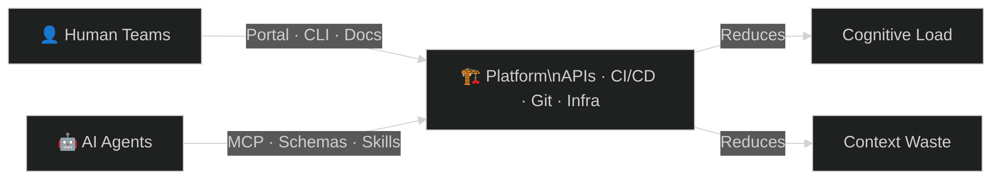

Platform engineering matured around one thesis: reduce cognitive load for developers. The [CNCF Platforms White Paper](https://tag-app-delivery.cncf.io/whitepapers/platforms/) codified the pattern. Internal developer portals, golden paths, self-service infrastructure — all designed so human teams ship faster without drowning in complexity.

AI agents now consume the same infrastructure. They clone repos, call CI/CD APIs, create pull requests, query issue trackers. But they don't read your Confluence wiki or file support tickets. They parse tool schemas and call structured APIs.

The bottlenecks shift. Humans hit cognitive overload: too many tools, tribal knowledge, context switching. Agents hit context window limits: too many tokens, irrelevant information, unstructured access. Same problem class, different constraint.

The CNCF platform engineering model transfers directly. Here's the mapping, dimension by dimension.

<!--truncate-->

## Two Consumers, One Platform

The CNCF Platforms White Paper defines platform engineering across dimensions like self-service, golden paths, documentation, and guardrails. Each dimension has a direct analog for AI agents.

| Dimension | Human Teams | AI Agents |
|---|---|---|
| **Self-service goal** | Reduce cognitive load, eliminate tickets | Reduce context window waste, eliminate ambiguity |
| **Interface** | Portal, CLI, UI, docs | MCP tools, APIs, structured schemas, tool descriptions |
| **Golden paths** | Opinionated templates, scaffolding, starter kits | Skills, agent prompts, workflow definitions, pre-built tool chains |
| **Discovery** | Service catalog, search, docs site | Tool registries, ToolSearch, capability advertisement |
| **Documentation** | How-tos, runbooks, READMEs | Structured context (CLAUDE.md), tool schemas, few-shot examples in descriptions |
| **Cognitive load** | Too many choices, context switching, tribal knowledge | Context window limits, token budgets, irrelevant context noise |
| **Guardrails** | RBAC, policies, compliance gates | Sandboxing, permission boundaries, tool allowlists, destructive action blocks |
| **Toil** | Manual deploys, ticket queues, config drift | Re-discovering context, re-reading files, redundant searches, hallucinated paths |
| **Onboarding** | Orientation docs, buddy system, ramp-up period | System prompts, CLAUDE.md, agent norms, skill loading |
| **Collaboration** | Slack, PRs, pair programming | Agent channels, MCP messaging, shared memory stores, handoff protocols |
| **Scaling** | Hire more people, cross-train | Spawn more agents, share skills, parallelize |
| **Failure mode** | Burnout, knowledge silos, bus factor | Context overflow, stale memory, tool misuse, cascading bad decisions |
| **Cost model** | Salaries, time, opportunity cost | Tokens, API calls, compute time, context window budget |

The mapping isn't forced. These dimensions emerged because platform engineering solves a universal problem: making infrastructure accessible to its consumers. The consumer type changes the interface, not the architecture.

## Where It Gets Concrete

Three dimensions show the mapping most clearly.

### Self-service: from portals to tool registries

For humans, self-service means a portal where you click "Create Kubernetes Cluster" and get one in minutes. No tickets, no waiting.

For agents, self-service means discoverable tools with structured schemas. An agent calls `ToolSearch("kubernetes cluster")` and gets back a `create_cluster` function with typed parameters. No parsing documentation, no guessing at CLI flags.

The same backend serves both. The portal and the tool schema are two interfaces to the same provisioning API.

### Golden paths: from templates to skills

Human golden paths are opinionated templates. `create-react-app` scaffolds a project. A Backstage template wires up CI/CD, monitoring, and deployment in one click.

Agent golden paths are skills — packaged workflows with clear inputs and outputs. A `deploy-service` skill encapsulates the same decisions the template made: which registry, which pipeline, which environment. The agent composes skills instead of following a wizard.

### Documentation: from READMEs to structured context

Humans read READMEs, runbooks, and how-to guides. The documentation is narrative, written for comprehension.

Agents consume structured context: `CLAUDE.md` files with project conventions, tool schemas with parameter descriptions, few-shot examples embedded in tool descriptions. Narrative documentation wastes context window. Structured context is information-dense.

A platform that serves both invests in both formats — or better, generates one from the other.

## Three Dimensions the CNCF Model Missed

The original model doesn't cover three concerns that matter only (or primarily) for AI agents.

**Context management.** Humans manage context through experience. An SRE who's been on-call for a year knows which alerts matter. That context is implicit and essentially free.

Agents have explicit context budgets. Every file read, every search result, every system prompt consumes tokens from a finite window. A platform at the "Provisional" level dumps entire files into the prompt. At "Optimizing," agents request exactly what they need and the platform delivers it pre-filtered.

Context management is the single highest-leverage investment for an AI agent platform. Bad context means wasted tokens, slower responses, and worse decisions.

**Memory.** Humans accumulate knowledge over time. Institutional memory lives in people's heads, in Slack history, in wikis.

Agents start fresh every session unless the platform provides memory infrastructure. At the "Provisional" level, there's no persistence — every session rediscovers the same project structure. At "Operational," sessions get annotated and handed off manually. At "Optimizing," agents extract insights automatically and share them across a federated knowledge store.

**Authority.** Human trust is earned through track record, code review, and organizational culture. A senior engineer merges without approval. A junior gets two reviewers.

Agent authority requires explicit boundaries. Permission systems define which tools an agent can call, which resources it can modify, which actions require human approval. At maturity, these boundaries become dynamic — an agent with a strong track record gets expanded permissions automatically.

## The Combined Maturity Model

The [CNCF Platform Engineering Maturity Model](https://tag-app-delivery.cncf.io/whitepapers/platform-eng-maturity-model/) defines four levels: Provisional, Operational, Scalable, and Optimizing. Each level applies to both human and AI platform consumers. The table below shows the human level (top row) and AI agent equivalent (bottom row) for each dimension.

| Dimension | | Provisional | Operational | Scalable | Optimizing |
|---|---|---|---|---|---|
| **Investment** | Human | Voluntary, temporary | Dedicated team | Platform as product | Enabled ecosystem |
| | AI | Ad-hoc API keys, manual setup | Dedicated agent infra, budgeted tokens | Agent platform as product, ROI per task | Self-provisioning agent ecosystem |
| **Adoption** | Human | Erratic | Extrinsic push | Intrinsic pull | Participatory |
| | AI | Hardcoded tool lists | Tool registries, skill loading | Self-discovery, capability advertisement | Agents contribute tools back |
| **Interfaces** | Human | Custom processes | Standard tooling | Self-service | Integrated services |
| | AI | Raw CLI, unstructured prompts | MCP tools, structured schemas | Self-service composition, skill chaining | Multi-agent orchestration |
| **Operations** | Human | By request | Centrally tracked | Centrally enabled | Managed services |
| | AI | One-off scripts | Centrally managed skills | Automated curation, health checks | Agents maintain own platform |
| **Measurement** | Human | Ad hoc | Consistent collection | Insights | Quantitative and qualitative |
| | AI | Manual log review | Success/failure tracking | Automated pattern detection | Agents optimize agents |
| **Context** | AI | Entire files in prompt | Curated system prompts | Dynamic context injection | Agents request what they need |
| **Memory** | AI | No persistence | Session annotations | Structured long-term memory | Automatic extraction, federated knowledge |
| **Authority** | AI | No boundaries | Static allowlists | Delegated authority with escalation | Dynamic trust based on track record |

The key insight: most organizations are at different levels for human and AI consumers. A platform might be "Scalable" for developers — self-service portal, product mindset, dedicated team — but "Provisional" for agents — ad-hoc API keys, unstructured prompts, no memory.

Knowing where you stand on both axes tells you where to invest.

## What Platform Teams Should Do

**Audit your AI agent maturity.** Walk through each dimension. Where are you Provisional? Most teams discover they have no structured context strategy and no memory infrastructure.

**Invest in structured interfaces first.** MCP tool schemas, typed APIs, and discoverable registries are the highest-ROI investment. They make your existing platform accessible to agents without rebuilding anything.

**Treat context as a budget.** Every token an agent spends reading irrelevant information is waste. Create `CLAUDE.md` files for your repositories. Write tool descriptions that include parameters and examples. Trim your system prompts.

**Build memory infrastructure.** Agents that start fresh every session repeat the same discovery work. Even simple persistence — session notes, project context files — eliminates massive redundancy.

**Don't build a separate AI platform.** The same APIs, the same CI/CD, the same infrastructure serves both audiences. What changes is the interface layer. Add tool schemas alongside your portal. Add structured context alongside your documentation.

The CNCF got the model right. The platform serves its consumers. Now it has two kinds.
