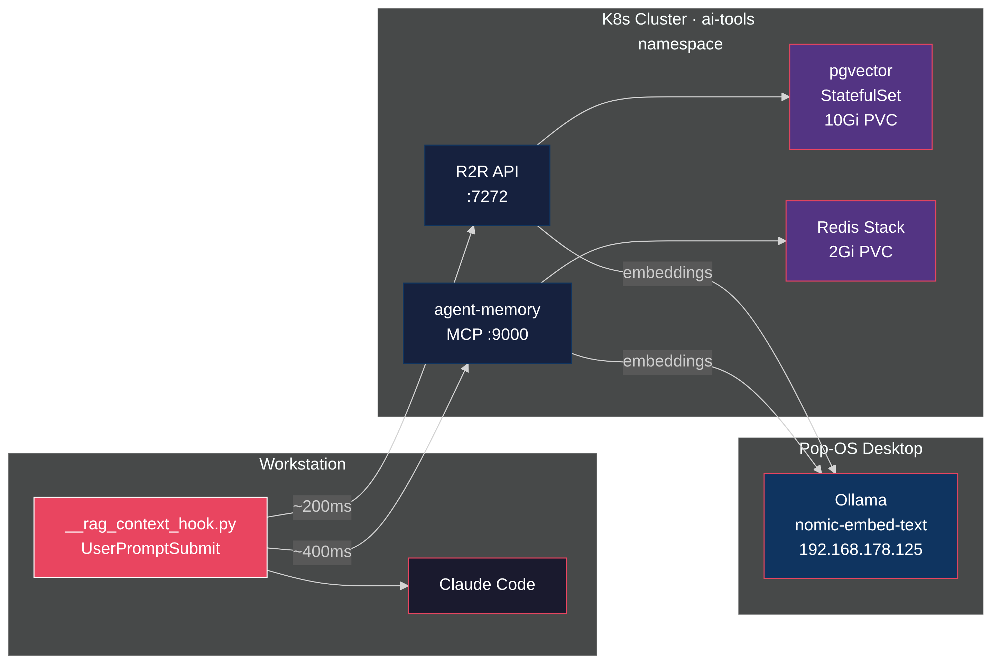

import InfoCards from '@site/src/components/InfoCards';



<style>{`
  article img:not(:first-of-type) {
    max-width: 700px;
    height: auto;
  }
`}</style>

I have 392 notes in Obsidian and ~2,800 memories from past AI sessions. My AI agent knows none of it unless I paste it in manually. And I can only paste what I remember to paste — which defeats the point of having a knowledge store.

So I built a hook that fires before every prompt, searches both stores in parallel, and injects the relevant context before the agent thinks. R2R as the RAG backend, pgvector for storage, Ollama for embeddings, all on a homelab Kubernetes cluster. Total latency: under 250ms. Zero tokens consumed in the retrieval path.

The value isn't the search itself. It's what surfaces when you stop choosing what's relevant. Ask about a Kubernetes pattern and a six-month-old Obsidian note appears. Debug a tmux issue and a memory from a previous session shows up with the exact fix. The agent answers from your accumulated knowledge, not just its training data.

<!--truncate-->

## Architecture

Three backend services and one client-side hook.


Each prompt follows this path:

1. You type a prompt in Claude Code
2. The `UserPromptSubmit` hook fires before the agent sees it
3. The hook searches R2R (Obsidian vault, ~100ms) and agent-memory (session insights, ~100ms) in parallel
4. Relevant chunks get injected as `system-reminder` context
5. The agent sees your prompt plus the matched knowledge
6. If a note title looks relevant, the agent drills deeper via the Obsidian MCP server

Two knowledge stores serve different purposes. R2R holds the Obsidian vault: 392 notes of accumulated technical knowledge, architecture decisions, tool configurations. Agent-memory holds session-derived insights: debugging patterns, preference corrections, workflow discoveries that emerged from actual AI interactions.

| Component | Purpose | Storage | Latency |
|-----------|---------|---------|---------|
| R2R (SciPhi) | Obsidian vault search | pgvector on K8s, 10Gi PVC | ~100ms |
| agent-memory | Session memory search | Redis Stack on K8s, 2Gi PVC | ~100ms |
| Ollama | nomic-embed-text embeddings | Pop-OS desktop (always-on) | &lt;100ms |
| Anthropic Haiku | R2R completions via LiteLLM | Cloud API | on-demand |

## How Vector Search Works

The search pipeline runs without an LLM. The key component is an embedding model: nomic-embed-text (274MB), running on Ollama. It converts text into a 768-dimensional vector — a list of 768 floating-point numbers that represent the text's meaning as coordinates in high-dimensional space.

The model was trained on millions of text pairs so that texts with similar meaning land near each other. "Longhorn PVC backup" and "persistent volume restore" end up as nearby points, even though they share zero words.

### Ingestion

When the 392 Obsidian notes were loaded into R2R, each note got chunked into segments. Each chunk went to Ollama, which ran it through nomic-embed-text and returned a 768-number vector. pgvector stored both the vector and the original text:

```
pgvector row:
  id:        uuid
  text:      "StatefulSet gets a 10Gi Longhorn PVC..."
  embedding: [0.023, -0.187, 0.442, ..., 0.091]  (768 floats)
  metadata:  {title: "r2r-rag-pipeline", source: "obsidian"}
```

pgvector builds an HNSW index over these vectors so it doesn't compare against every row at query time.

### Search

When you type "how do I backup Longhorn volumes?", the hook sends your prompt to Ollama, gets back 768 numbers, and sends those to pgvector. pgvector computes cosine similarity — the angle between your prompt vector and every stored vector — and returns the closest matches. Identical direction = 1.0, orthogonal = 0.0. The threshold is 0.60; anything below gets dropped as irrelevant.

This is pure linear algebra. Dot products and normalization. That's why it runs in ~100ms with zero token costs.

### Two stores, same space

Both R2R and agent-memory use nomic-embed-text for embeddings. The vectors live in the same semantic space, which means a prompt about "Longhorn backup" finds relevant hits in both stores.

| | R2R / pgvector | agent-memory / Redis Stack |
|---|---|---|
| Storage engine | Postgres with vector extension | Redis with RediSearch module |
| Index type | HNSW (approximate nearest neighbor) | HNSW |
| Content | Obsidian notes (chunked) | Session memories (whole entries) |
| Dimensions | 768 | 768 |

The difference is what they hold. pgvector stores your curated knowledge. Redis stores what the agent learned from working with you.

## The Database Journey

I started with the [CloudNativePG operator](https://cloudnative-pg.io/). It's the standard for running Postgres on Kubernetes — WAL archiving, automated failover, point-in-time recovery. Production-grade.

It didn't work. Two problems.

First, the pgvector image. CNPG validates container images through a webhook, and `pgvector/pgvector:pg17` didn't match the expected image patterns. The webhook rejected the pod.

Second, ImageVolume extensions. CNPG has a mechanism for loading Postgres extensions via ephemeral volumes. The pgvector extension needs to be loaded as a shared library, and the ImageVolume approach hit path resolution issues on my cluster's containerd version.

I spent a day debugging webhook configurations and extension loading. Then I stopped and asked: what am I actually building?

A homelab. Single node. No HA requirement. No point-in-time recovery needed. The data is my Obsidian vault — I have the source of truth on disk. If the database dies, I re-ingest.

A plain StatefulSet with the `pgvector/pgvector:pg17` image works:

```yaml
apiVersion: apps/v1
kind: StatefulSet
metadata:
  name: r2r-db
  namespace: ai-tools
spec:
  serviceName: r2r-db
  replicas: 1
  template:
    spec:
      containers:
        - name: postgres
          image: pgvector/pgvector:pg17
          env:
            - name: PGDATA
              value: /var/lib/postgresql/data/pgdata
          volumeMounts:
            - name: data
              mountPath: /var/lib/postgresql/data
            - name: init
              mountPath: /docker-entrypoint-initdb.d
      volumes:
        - name: init
          configMap:
            name: r2r-db-init
```

An init ConfigMap creates the vector extension:

```sql
CREATE EXTENSION IF NOT EXISTS "vector";
```

The StatefulSet gets a 10Gi Longhorn PVC, a readiness probe on `pg_isready`, and a Service. Postgres starts, loads pgvector, R2R connects.

Simplicity wins on a homelab. Save the operator for production.

## Ingesting the Obsidian Vault

R2R accepts documents through a multipart API. The ingestion script walks the vault directory and uploads each markdown file as `raw_text`. 392 notes, about three minutes.

Two gotchas during ingestion.

**Filenames as DocumentType.** R2R parses the uploaded filename to determine document type. Obsidian's zettelkasten IDs (`1711476153-YXRZ.md`) worked fine. But filenames with special characters got parsed as unknown types. The fix: sanitize filenames before upload and always set the content type to `text/plain`.

**Document summary generation.** R2R's default pipeline generates a summary for each ingested document by calling the configured LLM. For 392 documents, that meant 392 Haiku calls during ingestion. Slow, expensive, and unnecessary since I only use vector search, not summaries.

One line in the R2R config fixes it:

```toml
[ingestion]
provider = "r2r"
skip_document_summary = true
```

## R2R Configuration

R2R uses LiteLLM under the hood, so you can mix providers. Embeddings run through Ollama (free, local). Haiku is configured as the completion LLM, but the hook only calls R2R's `/v3/retrieval/search` endpoint — pure vector similarity, no LLM in the loop. Haiku would only fire if you used R2R's RAG endpoint for synthesized answers or re-enabled document summaries.

```toml
[completion]
provider = "litellm"
concurrent_request_limit = 16

[app]
quality_llm = "anthropic/claude-3-5-haiku-latest"
fast_llm = "anthropic/claude-3-5-haiku-latest"

[embedding]
provider = "ollama"
base_model = "nomic-embed-text"
base_dimension = 768
```

The R2R deployment points `OLLAMA_API_BASE` at the in-cluster Ollama service. Ollama runs on a Pop-OS desktop at `192.168.178.125`. A headless Service with manual Endpoints bridges it into the cluster:

```yaml
apiVersion: v1
kind: Service
metadata:
  name: ollama-pc
  namespace: ai-tools
  annotations:
    description: "Pop-OS desktop - always on"
spec:
  clusterIP: None
  ports:
  - port: 11434
    targetPort: 11434
    name: http
---
apiVersion: v1
kind: Endpoints
metadata:
  name: ollama-pc
  namespace: ai-tools
subsets:
- addresses:
  - ip: 192.168.178.125
  ports:
  - port: 11434
    name: http
```

Any pod in the cluster reaches Ollama at `ollama-pc.ai-tools.svc:11434`. No port-forwarding, no NodePorts.

## The RAG Hook

The core of the system is a Python script that Claude Code runs as a `UserPromptSubmit` hook. It fires only when you prefix a prompt with `rag:`. The hook searches both knowledge stores in parallel and prints the results to stdout, which Claude Code injects as context.

Hook registration in `~/.claude/settings.json`:

```json
{
  "hooks": {
    "UserPromptSubmit": [
      {
        "type": "command",
        "command": "python3 ~/.claude/scripts/__rag_context_hook.py"
      }
    ]
  }
}
```

The script is 155 lines of stdlib Python. No dependencies beyond what ships with Python 3. Three design decisions matter.

**Manual trigger, not automatic.** The first version had regex filters, trivial-prompt detection, and question-signal matching to decide when to fire. Too clever. It burned tokens on irrelevant hits and missed context when the heuristics guessed wrong. The `rag:` prefix puts the human in control. You know when you need context. The machine doesn't.

```
rag: what was the metallb config issue
rag: longhorn backup restore pattern
```

**Parallel search with generous timeouts.** Both sources take ~100ms warm. They run in a `ThreadPoolExecutor` with per-request and total timeout ceilings. Timeouts are generous — better to wait a beat than lose context. If one source times out, the other's results still arrive. If both fail, the hook stays silent.

```python
with ThreadPoolExecutor(max_workers=2) as pool:
    futures = {
        pool.submit(search_r2r, query): "r2r",
        pool.submit(search_memory, query): "memory",
    }
    for future in as_completed(futures, timeout=TOTAL_TIMEOUT):
        source = futures[future]
        try:
            if source == "r2r":
                r2r_results = future.result(timeout=0.1)
            else:
                memory_results = future.result(timeout=0.1)
        except Exception:
            pass
```

**Low relevance threshold.** Since the human explicitly asked for context, the score threshold sits at 0.35 — generous enough to surface loose matches across both knowledge stores. Two weak hits from different sources often combine into useful context. The automatic mode needed 0.60 to avoid noise; manual mode can afford to show more.

The hook prints results in a format Claude Code injects as a `system-reminder`:

```
RAG context (Obsidian vault):
  [kubernetes-networking] (score: 0.782)
    Service mesh configuration requires...

RAG context (agent memory):
  [kubernetes, networking, debugging]
    When troubleshooting DNS in pods, check...
```

The agent sees this alongside the prompt. If a note title looks relevant, it reads the full note via the Obsidian MCP server, follows wikilinks, cross-references. The hook provides the signal; the agent decides how deep to go.

## Ollama Migration

Ollama started on a Mac laptop. That worked until the laptop went into clamshell mode. When the lid closes, macOS suspends network interfaces. Every service depending on Ollama — agent-memory, k8sgpt, R2R, open-webui — started failing intermittently.

The Mac was convenient for ad-hoc use but unreliable as infrastructure. The Pop-OS desktop at `192.168.178.125` is always on, with an RTX 3060 (12GB VRAM) that outperforms the M1's 8GB unified memory for inference. Moving Ollama there meant updating one Kubernetes manifest per service: the Endpoints IP address.

```yaml
# Before
subsets:
- addresses:
  - ip: 192.168.178.154  # Mac laptop

# After
subsets:
- addresses:
  - ip: 192.168.178.125  # Pop-OS desktop
```

Every service in the cluster that referenced `ollama-mac.ai-tools.svc` now points at `ollama-pc.ai-tools.svc`. Agent-memory, k8sgpt, R2R, open-webui — one manifest change per service, all applied through ArgoCD. No more wake-from-sleep failures.

One gotcha after migration: Ollama evicts models from VRAM after five minutes idle. With multiple models loaded (qwen2.5 at 5.1GB, nomic-embed-text at 561MB), the embedding model kept getting evicted despite fitting comfortably in the 12GB RTX 3060. Every RAG request after an idle gap paid a multi-second cold-load penalty. The fix: `keep_alive: -1` in the embed request pins the model permanently.

## Results

The hook adds about 110ms to each prompt. Imperceptible — the agent's thinking time dwarfs it.

| Metric | Value |
|--------|-------|
| R2R search latency | ~100ms |
| Agent-memory search latency | ~100ms |
| Total hook latency (parallel) | ~110ms |
| Obsidian notes indexed | 392 |
| Agent memories searchable | ~2,800 |

Agent-memory originally went through the MCP JSON-RPC layer, adding ~1.7s of overhead. Bypassing MCP and querying Redis FT.SEARCH directly — with Ollama generating the embedding on a GPU — brought it down to match R2R.

The value shows up in unexpected moments. Ask about a Kubernetes pattern and the hook surfaces an Obsidian note you wrote six months ago. Start debugging a tmux issue and it finds a memory from a previous session where you solved something similar. The agent doesn't just answer from its training data — it answers from your accumulated knowledge.

The entire search pipeline is open source and runs locally. Ollama generates embeddings with nomic-embed-text. pgvector stores and searches vectors. Redis Stack does the same for agent-memory. The hook is 217 lines of stdlib Python. Zero API calls, zero tokens consumed, zero billing in the retrieval path. The only cloud dependency is Claude itself interpreting the results.

The two sources complement each other. Obsidian holds curated, structured notes — architecture decisions, tool configurations, blog drafts. Agent-memory holds organic, session-derived insights — "this user prefers bun over npm", "the homelab uses Longhorn for storage", "tmux layouts need xdotool without --sync flags." Together they give the agent both your deliberate knowledge and your implicit patterns.

## Links

- [R2R](https://r2r-docs.sciphi.ai/) -- RAG framework by SciPhi
- [pgvector](https://github.com/pgvector/pgvector) -- vector similarity search for Postgres
- [Redis Agent Memory Server](https://github.com/redis/agent-memory-server) -- MCP-native memory service
- [Ollama](https://ollama.com/) -- local LLM inference
- [Claude Code hooks](https://docs.anthropic.com/en/docs/claude-code/hooks) -- pre/post tool execution hooks
- [Homelab repo](https://github.com/Piotr1215/homelab) -- full working manifests in `gitops/apps/r2r/`
