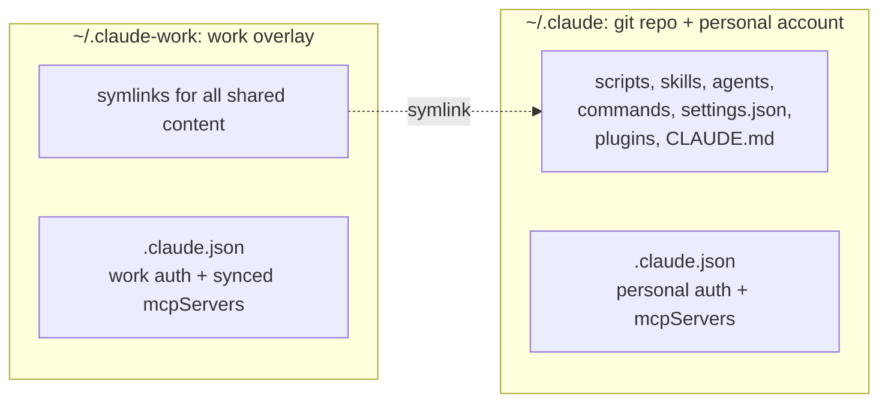
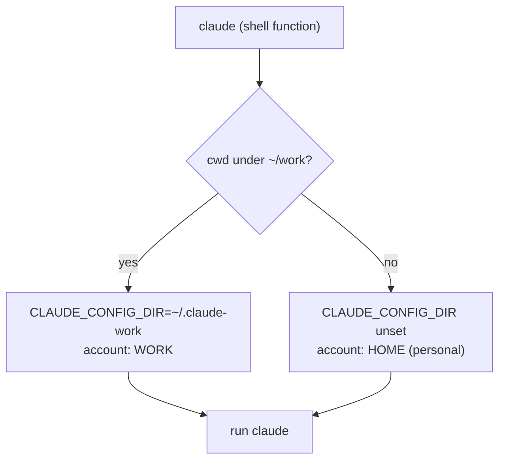

import DataGrid from '@site/src/components/DataGrid';


<style>{`
  article img:not(:first-of-type) {
    max-width: 700px;
    height: auto;
  }
`}</style>

If you run more than one Claude Code account on a machine (work and personal, two clients, a locked-down login next to a sandbox), you switch between them by hand. Claude Code holds one active login at a time, so forgetting to switch means running the wrong account. This post shows how to make the switch automatic: the right account loads from the directory you are in, with nothing to remember.

<!--truncate-->

## Why isolate the accounts

Compartmentalized accounts must not share an identity. Work and personal is the example below; the same reasons apply to any split:

- **Security and data.** Work credentials, session history, and connectors must stay out of personal chats, and personal experiments must not run against the work seat or land in its history. A spill either direction crosses a hard boundary.
- **Admin-managed settings.** An employer pushes an admin-controlled `settings.json` into the work account to enforce permissions and policy. Those rules must not govern a personal session, and a personal tweak must not override them on the work side.
- **Injected context.** A managed `CLAUDE.md` or system policy shipped with the work account must shape work sessions only. In personal sessions it is noise at best, a leak at worst.

## CLAUDE_CONFIG_DIR: one config directory per account

The supported way to do this is the [`CLAUDE_CONFIG_DIR`](https://docs.claude.com/en/docs/claude-code/settings#environment-variables) environment variable. By default Claude Code stores its entire config under `~/.claude`: auth, plugins, settings, and history. Set the variable and it reads from that path instead. Point it at a second directory and Claude builds a fully independent tree there, with its own `.claude.json` (auth and identity), plugins, settings, and session history. Verify this before building on it: [open bugs](https://github.com/anthropics/claude-code/issues/30538) show the variable is not honored in every corner of the tool.

Full isolation goes too far. Two copies of your skills, agents, and scripts drift apart. You want the *code* identical and only the *login* different.

## The overlay: shared config repo plus per-account auth

`~/.claude` is the git repo and the personal account's config. The work account lives in `~/.claude-work`, an overlay that symlinks shared content back to `~/.claude` and keeps only its own auth and history as real files.



Skills, local MCP servers, settings, hooks, and plugins are identical for both accounts. Only the login, with its sessions and history, differs, routed by folder.

What falls on each side:

<DataGrid
  columns={[
    { key: 'item', label: 'Item' },
    { key: 'side', label: 'Shared or isolated' },
    { key: 'why', label: 'Why' }
  ]}
  data={[
    { item: 'scripts, skills, agents, commands', side: 'Shared (symlink)', why: 'Account-agnostic. Same automation regardless of who is logged in.' },
    { item: 'settings.json, hooks, plugins, CLAUDE.md', side: 'Shared (symlink)', why: 'Same behavior and same installed tools for both accounts.' },
    { item: '.claude.json, .credentials.json', side: 'Isolated (real file)', why: 'Auth tokens and account identity. The whole point of the split.' },
    { item: 'projects/, sessions/, history.jsonl', side: 'Isolated (real file)', why: 'Per-account session data and memory should not cross over.' },
    { item: 'statsig/, caches, mcp-needs-auth-cache.json', side: 'Isolated (real file)', why: 'Per-account state that is meaningless to copy.' }
  ]}
/>

## Build the overlay with a denylist

Building the overlay means deciding which entries in `~/.claude` to share. An allowlist names what to share and skips the rest. A denylist is the inverse: name the few things to isolate (auth and data), share everything else.

Use a denylist. A generator script symlinks *everything* from `~/.claude` into the overlay except a short list of auth and data. The core is a few lines:

```bash
overlay=~/.claude-work
deny=".claude.json .credentials.json projects sessions statsig cache .git"
for entry in ~/.claude/*; do
  name=$(basename "$entry")
  case " $deny " in *" $name "*) continue ;; esac   # isolated: skip
  ln -sfn "$entry" "$overlay/$name"                 # shared: symlink
done
```

With an allowlist, every new skill, agent, or script needs an entry, and the day you forget is the day the work account silently loses a tool. With a denylist, anything new is shared by default; you touch the list only to *isolate* something. Adding shared content costs zero edits.

## Local MCP servers load only from .claude.json

Claude Code loads local stdio MCP servers from `.claude.json` only. Servers mirrored into `settings.json` are ignored, though it is natural to assume settings.json is the place, since so much else lives there.

`.claude.json` is isolated, so a freshly logged-in work account starts with *zero* local MCP servers. Every code-execution server and local tool is gone, with no error to point at it.

Because those servers are account-agnostic, the generator does one thing beyond symlinking: it copies the `mcpServers` block from the personal `~/.claude.json` into the overlay's `.claude.json` in an atomic write, preserving the overlay's own auth keys. Personal is the source for the server list; work derives from it. Add a server in personal, then rerun the generator to resync. The generator never touches auth, identity, projects, or credentials, so running it twice is safe.

## Routing and re-login

The paths are generic (`~/work`, `~/.claude-work`); swap in your own.

### Step 1: Pick the account from your shell

You do not need a launcher for this. The switch is a few lines in `~/.bashrc` or `~/.zshrc`, so it loads in every interactive shell with nothing to install.

The simplest version is a pair of aliases, one per account:

```bash
alias claude-work='CLAUDE_CONFIG_DIR=~/.claude-work claude'
alias claude-home='claude'   # personal: the default ~/.claude
```

That is explicit: you choose the account each time you launch. To remove the choice, set `CLAUDE_CONFIG_DIR` from the current directory instead, so a plain `claude` picks the right account on its own. Replace the aliases with a small function in the same file:

```bash
claude() {
  case "$PWD" in
    "$HOME/work"|"$HOME/work"/*) CLAUDE_CONFIG_DIR="$HOME/.claude-work" command claude "$@" ;;
    *)                           ( unset CLAUDE_CONFIG_DIR; command claude "$@" ) ;;   # personal default
  esac
}
```



Two details keep this from misfiring. Match the exact root, not a substring, so a personal repo containing a `work/` subdirectory stays personal. Treat the directory as the *sole* signal: the personal branch unsets `CLAUDE_CONFIG_DIR` in a subshell, so a value leaked from a parent shell cannot misroute a session. Because the function lives in your shell rc, every interactive shell inherits it, and a status line that reads the variable can show which account is active.

### Step 2: Resync after a re-login

Running `claude login` on the work account rewrites the overlay's `.claude.json` from scratch and drops the synced `mcpServers` block, so its local servers fall out of sync with personal. Rerun the generator on the overlay to relink new shared content and restore the server list. It is idempotent and non-destructive, so nothing else changes. To make this automatic, call it from the work branch of the function above, before `command claude`, so each work session resyncs itself.

## Caveats and edge cases

- **Claude Code updates can create new files in the config dir.** Anything new exists only in the account that created it until the generator runs again. The auto-resync in the work branch covers shells that go through the function; anything that calls the binary directly (a cron job, a keybinding hitting it by full path) skips the function and needs a manual run.
- **`settings.json` is shared, including its hook definitions.** A hook that should behave differently per account cannot live there; it needs `settings.local.json` or a cwd check inside the hook.
- **`CLAUDE_CONFIG_DIR` is not honored everywhere.** Open issues ([#30538](https://github.com/anthropics/claude-code/issues/30538), [#16899](https://github.com/anthropics/claude-code/issues/16899)) show corners where it is ignored. Verify isolation holds.

The overlay is disposable. If it gets into a bad state, delete it and regenerate; only a lost login needs a re-auth.

```bash
rm -rf ~/.claude-work
# rerun your generator to relink the overlay, then re-auth only if needed:
CLAUDE_CONFIG_DIR=~/.claude-work claude login   # only if the login was lost
```

A third account is the same recipe with a different folder, plus one edit to the routing predicate if it should auto-route.

## Resources

- [Claude Code settings docs](https://docs.claude.com/en/docs/claude-code/settings): `CLAUDE_CONFIG_DIR` and config layout
- [Open issue #30538](https://github.com/anthropics/claude-code/issues/30538) and [#16899](https://github.com/anthropics/claude-code/issues/16899): corners where `CLAUDE_CONFIG_DIR` is not yet honored
