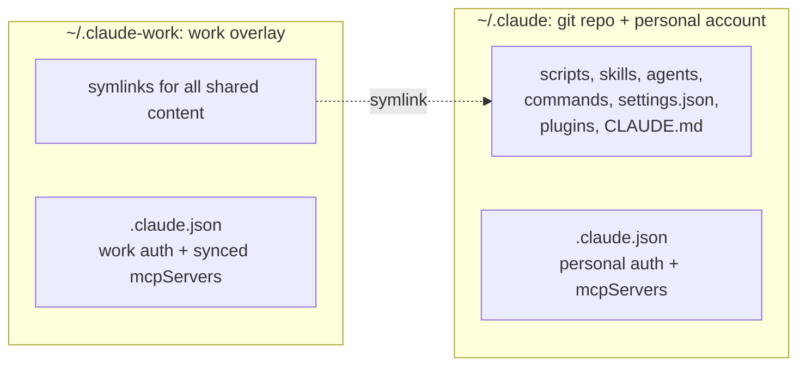
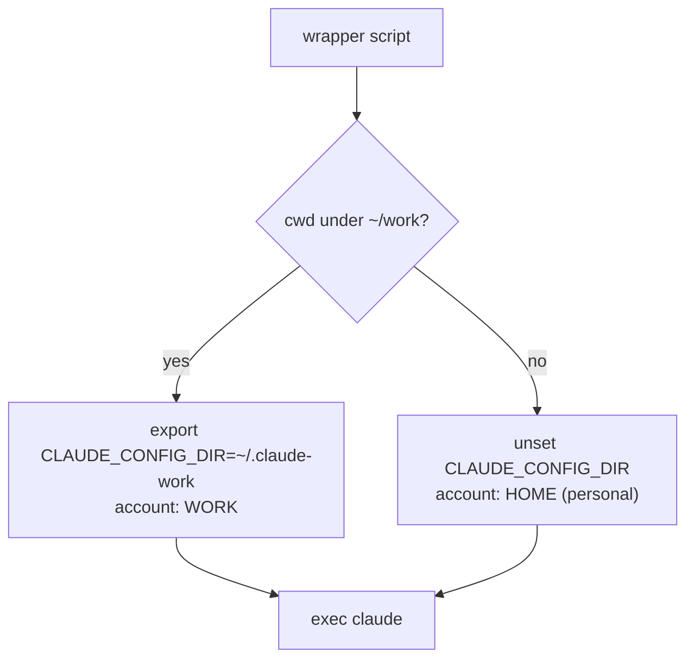

import DataGrid from '@site/src/components/DataGrid';


<style>{`
  article img:not(:first-of-type) {
    max-width: 700px;
    height: auto;
  }
`}</style>

I run two Claude Code logins on one laptop: a work account with its own seat, plugins, and connectors, and a personal one. Claude Code has no per-account scoping, so both logins shared a single config tree, and that tree could only describe one identity at a time. The result showed up as work-only plugins appearing on my personal account marked "needs authentication," and cloud connectors doing the same. I kept my accounts separated.

My setup keeps one git repo as the source of truth, adds a disposable overlay for the second account, and picks the right account from the current directory. The active login follows the folder I am in.

<!--truncate-->

## Why isolate the accounts

Work and personal should not share an identity, for reasons past tidiness:

- **Security and data.** Work credentials, work session history, and work connectors have no place in a personal chat, and personal experiments should never run against the work seat or land in its history. A spill in either direction crosses a boundary that should be hard.
- **Admin-managed settings.** An employer can push managed settings into the work account: an admin-controlled `settings.json` that enforces permissions and policy. Those rules are meant for work alone. They should never govern a personal session, and a personal tweak should never override them on the work side.
- **Injected context.** The same holds for context the org ships with the work account, like a managed `CLAUDE.md` or system policy. It should shape work sessions and stay out of personal ones, where it is noise at best and a leak at worst.

## The mechanism: a config directory per account

`CLAUDE_CONFIG_DIR` points Claude Code at a different config directory. Set it, and Claude builds an independent tree: its own `.claude.json` (auth and identity), its own plugins, settings, and session history. Separate login, separate everything. I verified the behavior before building on it, because [open bugs](https://github.com/anthropics/claude-code/issues/30538) show the variable is not honored in every corner of the tool.

Full isolation is too much, though. Two copies of my skills, agents, and scripts would drift apart. I want the *code* identical and only the *login* different.

## One repo, two accounts

The model: `~/.claude` stays the git repo and the personal account's config. The work account lives in `~/.claude-work`, an overlay that symlinks all the shared content back to `~/.claude` and keeps only its own auth and history as real files.



Everything local is shared; only the login and its data change, by folder. Skills, local MCP servers, settings, hooks, and plugins are the same for both accounts. The login, with its sessions and history, is the only thing that differs.

What falls on each side:

<DataGrid
  columns={[
    { key: 'item', label: 'Item' },
    { key: 'side', label: 'Shared or isolated' },
    { key: 'why', label: 'Why' }
  ]}
  data={[
    { item: 'scripts, skills, agents, commands', side: 'Shared (symlink)', why: 'Account-agnostic. Same automation regardless of who is logged in.' },
    { item: 'settings.json, hooks, plugins, CLAUDE.md', side: 'Shared (symlink)', why: 'Same behavior and same installed tools for both accounts.' },
    { item: '.claude.json, .credentials.json', side: 'Isolated (real file)', why: 'Auth tokens and account identity. The whole point of the split.' },
    { item: 'projects/, sessions/, history.jsonl', side: 'Isolated (real file)', why: 'Per-account session data and memory should not cross over.' },
    { item: 'statsig/, caches, mcp-needs-auth-cache.json', side: 'Isolated (real file)', why: 'Per-account state that is meaningless to copy.' }
  ]}
/>

## Share by default, isolate by exception

Building the overlay means deciding which entries in `~/.claude` to share and which to keep separate. There are two ways to express that. An allowlist names the things to share and skips the rest. A denylist is the inverse: name the few things to keep isolated (auth and data), and share everything else by default.

I use a denylist. A generator script symlinks *everything* from `~/.claude` into the overlay except a short list of auth and data, so it never has to enumerate what to share. The core is a few lines:

```bash
deny=".claude.json .credentials.json projects sessions statsig cache .git"
for entry in ~/.claude/*; do
  name=$(basename "$entry")
  case " $deny " in *" $name "*) continue ;; esac   # isolated: skip
  ln -sfn "$entry" "$overlay/$name"                 # shared: symlink
done
```

That direction is deliberate. With an allowlist, every new skill, agent, or script needs an entry telling the overlay to share it, and the day you forget is the day the work account silently loses a tool. With a denylist, anything new is shared by default and you touch the list only to *isolate* something. Adding shared content costs zero edits.

## Local MCP servers load only from .claude.json

This failure is silent and the cause is not obvious.

Claude Code loads local stdio MCP servers from `.claude.json` only. Servers mirrored into `settings.json` are ignored. I assumed settings.json was the place, since so much else lives there.

`.claude.json` sits on the isolated side, so a freshly logged-in work account starts with *zero* local MCP servers. Every code-execution server and local tool is gone, with no error to point at it. Those servers are account-agnostic; work has no reason to run a different set than personal.

So the generator does one thing beyond symlinking. It copies the `mcpServers` block from the canonical personal `~/.claude.json` into the overlay's `.claude.json`, preserving the overlay's own auth keys, in an atomic write. Personal is the canonical source for the server list; work derives from it. Add a server in personal, then rerun the generator to resync the overlay. The generator never touches auth, identity, projects, or credentials. It creates symlinks and rewrites that one `mcpServers` key, so running it twice is safe.

## Building it: a guided walkthrough

The design above is the *what*. This part is the *how*, in the order I would build it. The paths are generic (`~/work`, `~/.claude-work`); swap in your own.

### Step 1: Route the account by the current directory

Isolation is useless if switching accounts is a manual step you forget. The fix is the wrapper-script pattern: instead of running `claude` directly, launch it through a thin wrapper that sets `CLAUDE_CONFIG_DIR` from the current directory, then execs the real binary. It gives you one place to make the account decision.



The whole decision is one predicate over the current directory:

```bash
case "$PWD" in
  "$HOME/work"|"$HOME/work"/*) export CLAUDE_CONFIG_DIR="$HOME/.claude-work" ;;
  *)                           unset CLAUDE_CONFIG_DIR ;;   # personal default
esac
exec claude "$@"
```

Two details keep this from misfiring. Match the exact root, not a substring, so a personal repo that contains a `work/` subdirectory stays personal. And treat the directory as the *sole* signal: the non-work branch explicitly unsets `CLAUDE_CONFIG_DIR`, so a variable leaked from a parent shell cannot misroute a session.

Keep that predicate in one place. If more than one entry point needs it, put it in a shared function rather than copying the `case` statement around. Then changing what counts as "work" is a one-line edit and the rules cannot drift apart.

### Step 2: Cover the entry points the wrapper misses

The wrapper only routes sessions started through it. Many entry points skip it: a raw `claude` alias, resume and fork helpers, keybindings that hit the binary directly. A `chpwd` hook in the shell config closes that gap. It runs the same predicate and sets or unsets `CLAUDE_CONFIG_DIR` from `$PWD` on every `cd` and at shell start, so every launch path inherits the right account from the same rule.

A status line indicator (`WORK` or `HOME`) shows the active account.

### Step 3: Survive a work re-login

One sharp edge remains. Running `claude login` on the work account rewrites the overlay's `.claude.json` from scratch and drops the synced `mcpServers` block, so capabilities fall out of sync.

The wrapper guards against it: whenever `CLAUDE_CONFIG_DIR` is set, it runs the generator before Claude boots, relinking new shared content and resyncing the server list. The generator is idempotent and non-destructive, so the pre-flight costs nothing. Skills and servers stay identical to personal with no manual step.

## What to watch for

A few things will bite anyone copying this pattern:

- **Claude Code updates can create new files in the config dir.** Anything brand new exists only in the account that created it until the generator runs again. The resync-on-launch covers the routed path; an unrouted entry point would need a manual run.
- **`settings.json` is shared, including its hook definitions.** That is intentional here, but it means a hook you want to behave differently per account cannot live there; it would need `settings.local.json` or a cwd check inside the hook.
- **`CLAUDE_CONFIG_DIR` is not honored everywhere.** Open issues ([#30538](https://github.com/anthropics/claude-code/issues/30538), [#16899](https://github.com/anthropics/claude-code/issues/16899)) show corners where it is ignored. Verify isolation holds rather than assuming it.

The overlay is disposable by design. If it ever gets into a weird state, delete it and regenerate; only a lost login needs a re-auth.

```bash
rm -rf ~/.claude-work
# rerun your generator to relink the overlay, then re-auth only if needed:
CLAUDE_CONFIG_DIR=~/.claude-work claude login   # only if the login was lost
```

Adding a third account is the same recipe with a different folder, plus one edit to the routing predicate if it should auto-route.

## Resources

- [Claude Code settings docs](https://docs.claude.com/en/docs/claude-code/settings): `CLAUDE_CONFIG_DIR` and config layout
- [Open issue #30538](https://github.com/anthropics/claude-code/issues/30538) and [#16899](https://github.com/anthropics/claude-code/issues/16899): corners where `CLAUDE_CONFIG_DIR` is not yet honored
