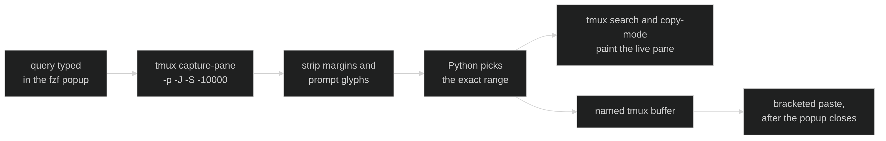

<style>{`
  article img:not(:first-of-type) {
    max-width: 700px;
    height: auto;
  }
`}</style>

The text you need next is usually already on your screen. A pod name three commands back, the error string you want to search for, a URL a tool printed, the long flag you typed twenty minutes ago. Getting it into your current prompt means reaching for the mouse, and the mouse gets it wrong: a soft-wrapped line comes back with a newline in the middle, and a newline in a shell paste runs the command. This post covers a tmux plugin that selects the range by the words you remember, shows you the selection in the real pane while you type, and pastes it without submitting it.

<!--truncate-->

## What the mouse and copy-mode each cost you

Mouse selection has no idea where a logical line begins. tmux wraps a long command across three display rows, you drag across all three, and you paste something with two line breaks in it. In a shell that is not a paste, it is three commands.

Copy-mode is precise and it takes you out of the pane. You press prefix, search backwards, move to the start, begin selection, move to the end, copy, quit, then paste. Every step is a keystroke you have to plan, and you are no longer looking at the prompt you were writing.

Shell history search only covers commands you typed. It cannot reach the output those commands produced, which is where most of the text you want to reuse lives.

## Typing the landmarks

You press `prefix + R`, a small popup opens, and you type the parts you remember. The selectors are regular expressions with a few shorthands for prose and terminal output.

| Query | Selection |
| --- | --- |
| `^word$` | Latest logical line containing `word` |
| `^start.*end` | From `start` downward through the first `end` |
| `^start$$` | From `start` through that logical line's last visible character |
| `^start.*end$$` | Through the last visible character on the ending line |
| `^start\ss` | Through the first `.`, `?`, or `!` |
| `^price\$` | A literal final dollar sign |

Up walks to an older occurrence, Down to a newer one. Enter or Tab pastes. Esc closes the popup and leaves the pane as it was.

## The feedback lives in the pane, not the popup

The popup shows your query and nothing else. The selection is painted in the source pane using tmux's own search highlight and copy-mode selection styles, so what you see is the real text in its real place, wrapped the way the terminal wrapped it.

That choice is what makes the range easy to trust. A preview inside the popup would be a copy of the text, reflowed to a different width, and you would have to decide whether it matched the thing you were looking at. Here the thing you are looking at is the answer.

The selection also survives refinement. Add another character to the query and the highlight moves rather than resetting, so you can narrow a range by watching it shrink.

## How it works

The script captures up to 10,000 lines with `tmux capture-pane -p -J -S -10000`. The `-J` is what joins tmux's soft wraps back into logical lines, so a command that occupies three display rows is one line to the matcher, and selecting it gives you one line back.

Captured text carries terminal decoration that no one wants in a paste. A cleanup pass strips leading margins, including bullet and arrow prefixes, and removes Unicode private-use characters with the space that usually follows them. Those are the glyphs a Nerd Font prompt draws, and without this pass a range starting at a prompt line would paste an invisible icon into your shell.

Python then matches against the cleaned text and computes the exact source range. Rendering that range is handed back to tmux: the plugin drives `send-keys -X` with tmux's native search and `begin-selection`, so the highlight is drawn by the same code that draws it when you search by hand.

## The paste that never submits

Accepting writes the match to a named tmux buffer and delivers it with `paste-buffer -p`. The `-p` is the whole point. Without it, tmux replays the buffer as keystrokes, and a multiline range means every newline arrives as Enter, which submits each line as a command. With it, the text is wrapped in bracketed-paste markers, and your shell or editor treats it as inserted text.

Delivery is also deferred by a fraction of a second, because the paste has to land after the popup closes and the target pane has focus again:

```sh
tmux run-shell -b "sleep 0.15; tmux paste-buffer -p -b '$buffer' -t '$target' -d"
```

The text arrives at your cursor. You still have to press Enter yourself, which is the correct default for anything assembled out of old output.

## Gotchas worth knowing

The first `.*` in a landmark range stops at the first viable ending locator, scanning downward. If you write `^ERROR.*retry` and the pane has three retries under that error, you get the range to the first one. Press Up to walk to an older occurrence of the whole match.

Matches are case-sensitive. That is a deliberate cost: terminal output is full of near-duplicate lines that differ only in case, and case-insensitive matching turns a precise landmark into a guess.

A straight apostrophe matches a smart one. Typing `don't` builds `don['’]t` internally, so prose copied from a rendered document still matches what you can type on a keyboard.

## Install

With TPM:

```tmux
set -g @plugin 'Piotr1215/tmux-pane-regex'
```

Or clone it and load it near the end of `.tmux.conf`:

```tmux
run-shell '~/.tmux/plugins/tmux-pane-regex/tmux-pane-regex.tmux'
```

It needs tmux, Python 3.10 or newer, and fzf.

## Configure

The key is read before the plugin binds it, so set it first:

```tmux
set -g @pane-regex-key 'P'
run-shell '~/.tmux/plugins/tmux-pane-regex/tmux-pane-regex.tmux'
```

The plugin publishes its own path as `@pane-regex-script`. An external text expander can read that option and call the script directly, passing its trigger length so the trigger characters get erased before the paste:

```sh
"$(tmux show-option -gqv @pane-regex-script)" 3
```

The tmux binding passes `--pane '#{pane_id}'` and needs no X11 focus detection. Only the global expander launcher depends on `xdotool`.

## Resources

- [tmux-pane-regex](https://github.com/Piotr1215/tmux-pane-regex)
