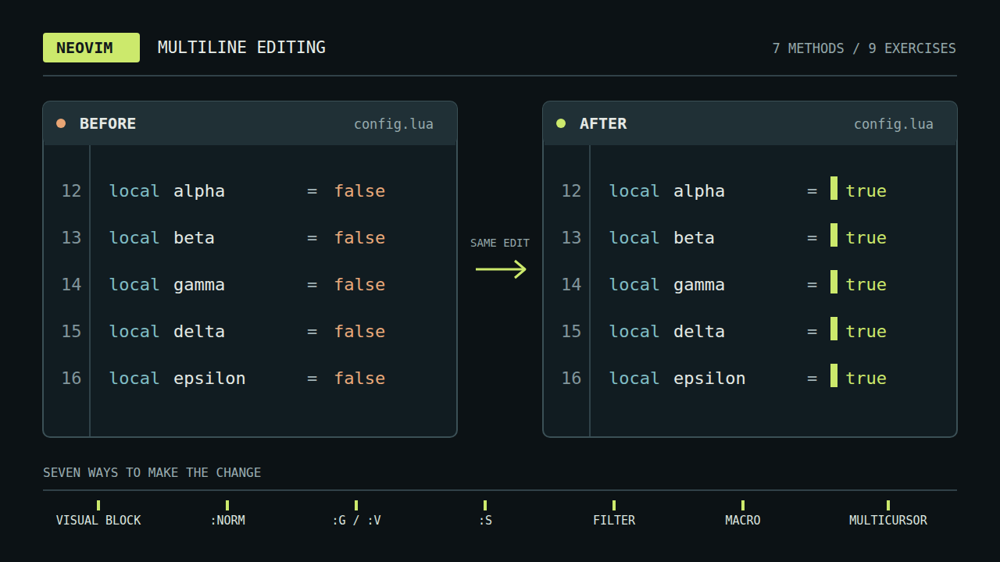

import ReactPlayer from 'react-player';



<style>{`
  article img:not(:first-of-type) {
    max-width: 700px;
    height: auto;
  }
`}</style>

Sooner or later you make the same small edit on line one, then line two, then line three. Neovim has had several ways to avoid that loop for years, and a newer one arrives with 0.13: built-in multicursor. This post walks through each method with a small example, covers multicursor in depth, and ends with a rule of thumb and a keystroke count for nine exercises. Multicursor is available only in nightly builds until Neovim 0.13 ships; every other method works in any Neovim, and in Vim.

The post goes with the video [Neovim Multi-Line Editing Overview, Multicursor Included](https://youtu.be/S5kfUZQNzhU), which plays three of the exercises live.

<!--truncate-->

<ReactPlayer
  controls
  src='https://youtu.be/S5kfUZQNzhU'
  style={{ width: '100%', height: 'auto', aspectRatio: '16 / 9' }}
/>

## The edit loop

Every multiline edit starts the same way: find the spot, make the edit, go to the next line.

```text
find the spot ──▶ make the edit ──▶ next line
     ▲                                  │
     └──────────────────────────────────┘
```

Each extra line is another trip around the loop. Ten lines are tolerable. A few hundred are a reason to look for another way.

## Targets and edit

Every multiline edit answers two questions: where the targets are (lines, search matches, or spots you pick by hand), and what the edit is (a set of keys, a command, a substitution). Each method below is one pair of answers.

The Vim grammar already helps with the second question. A motion finds its own target on every line. Take these two lines:

```text
[INFO] server started on port 8080
[ERROR 503] connection failed: timeout after 30s
```

`f]` stops at the `]` on each line, even though the two brackets sit in different columns. Replay the motion on each line and it finds that line's own bracket. Most methods below lean on that property.

## Two method families

The methods split by how you work.

Command methods describe the edit and run it: `:norm`, `:g` and `:v`, `:s`, `:!` external commands, and macros. You see the result and none of the individual keys.

Cursor methods make the edit on screen and let you watch it land: visual block and multicursor. You see every key take effect.

The two families combine. `:g/pat/normal! Q` lets a command pick the lines while you type the edit live, and later sections show how.

## Classic methods

Each of these predates multicursor. The examples come from nine exercises that appear again in the scoreboard.

### Visual block

`CTRL-V` selects a rectangle and `I` types into every row of it. To turn a list of tasks into bullets:

```vim
CTRL-V  G  I  - <Esc>
```

```text
Buy milk                                 - Buy milk
Call the dentist tomorrow morning   ──▶  - Call the dentist tomorrow morning
Fix bug                                  - Fix bug
```

Visual block fits the same column on every line. It does not fit targets that move from line to line, because the rectangle has fixed edges.

### Normal on a range

`:norm` runs normal-mode keys on each line of a range. To strip the brackets from log levels:

```vim
:%norm xf]D
```

Read it from the right: `D` deletes to the end of the line, `f]` jumps to the `]`, `x` deletes the `[`, and `%` is every line. You type it once on the command line and see only the result.

### Global command

`:g/pattern/cmd` runs `cmd` on lines that match. `:v/pattern/cmd` runs it on lines that do not. To prefix every line that has no colon:

```vim
:v/:/s/^/[ok] /
```

Here the target is a condition that no screen position can express.

### Substitution

`:s` rewrites every match of a pattern. To turn `snake_case` into `camelCase`:

```vim
:%s/\v_(.)/\u\1/g
```

`\v` is very magic mode, where `( )` group without backslashes. `_(.)` matches an underscore and the letter after it, `\u\1` writes that letter back in uppercase, and `g` applies to every match on the line. Substitution also combines with `:cdo` and `:argdo` to reach many files.

### External commands

`:{range}!cmd` pipes lines through a command-line tool and keeps what it prints.

```vim
:%!sort -u
:'<,'>!column -t
:%!jq .
```

These sort and deduplicate, align a selection into columns, and pretty-print JSON. Any tool that reads stdin and writes stdout becomes an edit.

### Macros

Record an edit once and replay it anywhere:

```vim
qq … +q
4@q
"qp
```

`qq` starts recording into register `q`, and ending the edit with `+` moves to the next line so each replay starts fresh. `4@q` replays four times. `"qp` pastes the macro as text so you can fix a typo, and the register keeps the macro for later, in any file.

## Multicursor

Built-in multicursor is the newest method. It sits beside the classics without replacing them. `:help mcursor` describes it as extra cursors that repeat operations at each cursor as you type. Unlike a macro, which is a stream of keys without context, multicursor replays actions semantically: it re-runs the command at each cursor.

Because it is a nightly feature until 0.13, check `nvim --version` before relying on any key below.

### Placing cursors

`Q` places cursors in four ways:

```vim
{Visual}Q     " a cursor on each selected line
Q             " toggle a cursor where you stand
[count]Q      " a cursor on every match of the last search
CTRL-click    " add a cursor with the mouse
```

After that you type, and the edit lands at every cursor as you go. A first example is the bullet list again:

```vim
VGQI- <Esc>
```

`V` selects the line, `G` extends to the last line, `Q` puts a cursor on each, and `I- <Esc>` inserts the prefix at all of them. Two details from the help are worth knowing. A Visual `Q` also enables follow mode (`q=`), where motions such as `w` and `f]` replay per cursor. And `[count]Q` uses the last search pattern, so `/_<CR>1Q` puts a cursor at every underscore, even several on one line.

### Scripted placement

`Q` is a normal-mode command, so any Ex command can place cursors:

```vim
:g/pat/normal! nQ         " on every match
:g/ERROR/normal! f]Q      " after the ] on ERROR lines only
:v/:/normal! Q            " on lines without a colon
:cdo normal! Q            " at each quickfix item
```

From Lua, `nvim_mcursor(0, {r, c})` places a cursor anywhere. A command picks the spots and you type the edit live. The `:g` and `:v` conditions from the classic section now drive cursor placement instead of a fixed edit.

### Command replay

Neovim replays the command at each cursor. It does not replay the raw keys.

```text
typed once      runs at every cursor
f]         ──▶  each line's own ]
dt=        ──▶  each line's own text, cut to its own register
@q         ──▶  the whole macro
u          ──▶  one undo for every cursor
```

This is why a motion that lands in a different column on each line still works, and why macros run at every cursor too. Undo is atomic: one `u` reverts the edits from all cursors at once. A cursor whose edit cannot start is removed, so `ct;` drops the cursor on any line with no `;`.

### Per-cursor registers

Each cursor reads and writes its own registers. Flipping an assignment shows it:

```vim
VGQ  dt=  A=<Esc>  p  0x
```

```text
name=john      ──▶  john=name
age=30         ──▶  30=age
city=london    ──▶  london=city
```

`dt=` cuts the text before the `=` into that cursor's own register, `A=<Esc>` appends an equals sign, `p` pastes each cursor's own text, and `0x` removes the leading `=`. When the session ends, the yanks join into one register, a line each. Paste with `p` after `A=<Esc>`: an `x` before the paste would overwrite each cursor's register.

### Session keys

A few more keys work while cursors are active:

```vim
q=          " follow mode: motions move every cursor
CTRL-L      " clear the cursors
gQ          " bring the last cursors back
]C  [C      " jump to the next or previous cursor
g CTRL-A    " number the cursors 1, 2, 3
u           " undo the last edit at every cursor
```

If `CTRL-L` is taken in your setup, clear the cursors by clearing the `nvim.multicursor` namespace, for example from a mapping on `<Esc>`. The help also notes that `]CQ` removes cursors one at a time.

### Limits

From `:help mcursor-limitations` and the cursor rules:

- Cursors live in one buffer. Edits across many files still need `:cdo`.
- `Q` is not allowed while a macro records or runs.
- The explicit clipboard registers `"+` and `"*` are global and shared by all cursors.
- `g-`, `g+`, and `:earlier` clear every cursor.
- Same-line cursors may be lost or misplaced by an edit that shifts columns, such as inserting text.
- Reloading or unloading a buffer clears its cursors.

## Rule of thumb

Ask from the top of the list. The first yes picks the method.

1. Is it a job a command-line tool already does? Use a `:%!` external command.
2. Is it across files, or too many lines to watch? Use `:s` or `:norm` with `:cdo`.
3. Is it an edit you will replay later? Record a macro.
4. Is it one column on adjacent lines? Use visual block.
5. Are the lines picked by a pattern? Use `:g` or `:v`.
6. Is it one fixed string swapped for another? Use `:s`.
7. Is it anything else that you can see on screen? Use multicursor.

Multicursor handles whatever the earlier questions leave. Visual block still wins the column prefix. `:v` wins the conditional prefix. An external command beats everything when a tool already exists.

## Keystroke golf

Nine exercises, each with a `.before` file and a `.solution` file. Every row was run on Neovim 0.13-dev nightly with `--clean`, with the cursor starting on line 1, column 1. The table lists the shortest non-multicursor method found for each exercise and the multicursor solution, in keys typed.

| Exercise | Shortest other method | Multicursor |
|----------|-----------------------|-------------|
| 01 add-prefix | visual block `<C-V>GI- <Esc>`, 6 keys | `VGQI- <Esc>`, 7 keys |
| 02 log-levels | macro `qqxf]D+q4@q`, 11 keys | `VGQxf]D`, 7 keys |
| 03 brackets-to-quotes | macro `qqr"f]r"+q4@q`, 13 keys | `VGQr"f]r"`, 9 keys |
| 04 first-field | :s `:%s/,.*<CR>`, 8 keys | `VGQf,D`, 6 keys |
| 05 add-semicolons | :s `:%s/$/;<CR>`, 8 keys | `VGQA;<Esc>`, 6 keys |
| 06 wrap-parens | macro `qqwi(<Esc>A)<Esc>+q4@q`, 14 keys | `VGQwi(<Esc>A)<Esc>`, 10 keys |
| 07 flip-assignment | macro `qqdt=A=<Esc>p0xjq4@q`, 16 keys | `VGQdt=A=<Esc>p0x`, 12 keys |
| 08 conditional-prefix | :v `:v/:/s/^/[ok] <CR>`, 15 keys | `/^\w*$<CR>1QI[ok] <Esc>`, 16 keys |
| 09 snake-to-camel | :s `:%s/\v_(.)/\u\1/g<CR>`, 18 keys | `/_<CR>1Qx~`, 7 keys |

Multicursor is shorter on seven of the nine. The two exceptions match the rule of thumb. Visual block takes the prefix in 01 by one key. In 08 the condition is the whole task, and `:v/:/` states it directly, while the multicursor version has to find the lines with a search pattern first.

A few notes on the counts:

- A macro that steps to the next line before `q` and replays with `4@q` costs its edit plus 7 keys. That beats `:norm` and `:s` on 02, 03, 06, and 07. `+` steps to the first word, and `j` keeps the column, which breaks 06 but suits 07, whose edit ends in column 1.
- The other methods for a few rows: `:%norm I- <CR>` (11) on 01, `:%s/ \zs.*/(&)<CR>` (15) on 06, `:%s/\v(.*)\=(.*)/\2=\1<CR>` (23) on 07, and `:v/:/norm! Q<CR>I[ok] <Esc>` (20) on 08.
- Exercise 09 puts several cursors on one line: `1Q` adds one at every `_` match.

Keys typed is one measure. A `:s` command shows only the result, and a macro replays from a register long after the session ends. The rule of thumb weighs those properties as well as the count.

## Getting started

Grab a nightly build from the [Neovim releases page](https://github.com/neovim/neovim/releases/tag/nightly), open `:help mcursor` for every key with examples, and run the exercises. The runner script checks each result against its `.solution` file, and the exercise files are in the repository linked below. Press `VGQ` on a few lines and type an edit to see it land at every cursor.

## Resources

- [Video: Neovim Multi-Line Editing Overview, Multicursor Included](https://youtu.be/S5kfUZQNzhU)
- [Discussion on r/neovim](https://www.reddit.com/r/neovim/comments/1x2akdv/neovim_multiline_editing_overview_multicursor/)
- [Presentation source](https://github.com/Piotr1215/youtube/blob/main/nvim-multi-line-editing/presentation.md)
- [The nine exercises](https://github.com/Piotr1215/youtube/tree/main/nvim-multi-line-editing/exercises)
- [Multicursor pull request, neovim/neovim#41587](https://github.com/neovim/neovim/pull/41587)
- `:help mcursor` in a nightly build
- [Multiple cursors in Neovim 0.13, Oli Morris](https://blog.olimorris.com/2026/09/02/multiple-cursors-in-neovim-0.13)
