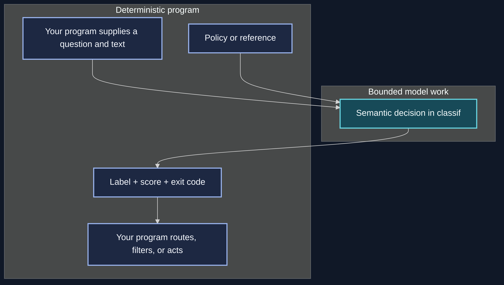
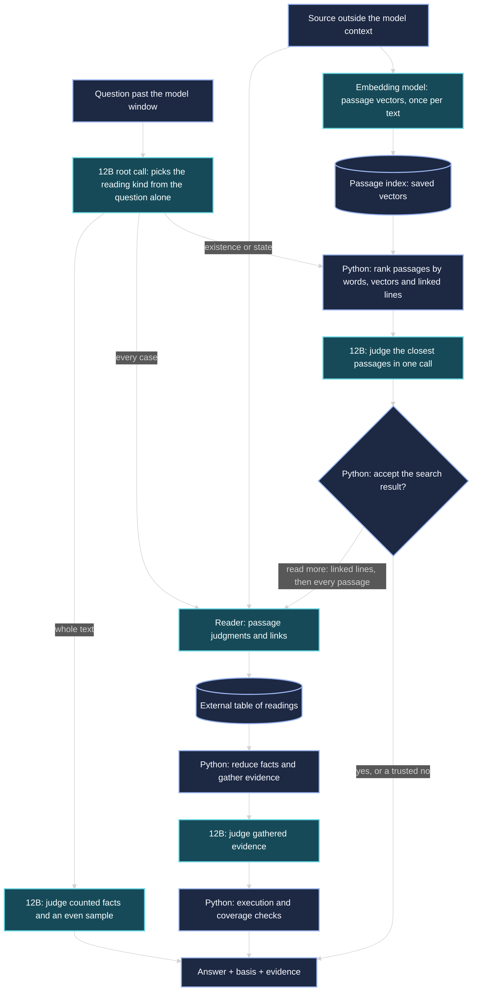
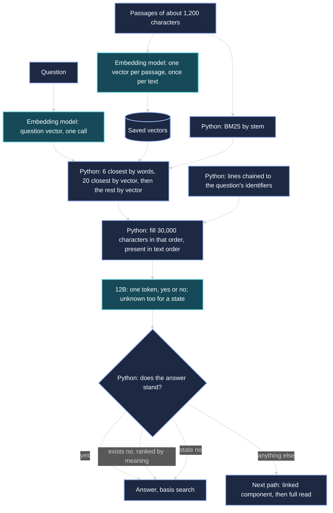

<style>{`
  article img:not(:first-of-type) {
    max-width: 700px;
    height: auto;
  }
  @media (max-width: 996px) {
    html.blog-post-page:has(img[alt="classif connects deterministic programs to bounded semantic decisions"]) .main-wrapper {
      width: 100% !important;
      max-width: 100% !important;
      margin: 0 !important;
      padding: 0 !important;
    }
    html.blog-post-page:has(img[alt="classif connects deterministic programs to bounded semantic decisions"]) .container.margin-vert--lg {
      width: calc(100% - 24px) !important;
      max-width: 100% !important;
      margin: 0 12px !important;
      flex-shrink: 0;
      padding: 36px 0 0 !important;
    }
    html.blog-post-page:has(img[alt="classif connects deterministic programs to bounded semantic decisions"]) main.col.col--7 {
      width: 100% !important;
      max-width: 100% !important;
      padding: 24px 16px !important;
    }
    html.blog-post-page:has(img[alt="classif connects deterministic programs to bounded semantic decisions"]) .markdown :is(pre, table) {
      max-width: 100%;
      overflow-x: auto !important;
    }
  }
`}</style>

You have a script that collects changes and a reviewer that inspects them. A gate decides which changes deserve review. A keyword such as `token` could refer to an API credential, a model's context budget, or a parser token.

[classif](https://github.com/Piotr1215/classif) takes a question and text, then returns a label, score, and exit code. A program can branch on meaning within its existing control flow.

<!--truncate-->

:::note Working draft
This post covers implementation and experiments through 3 October 2026. The long-input reader is still evolving. Timings describe recorded runs under the named model and cache conditions; they are not performance guarantees.
:::

## A semantic gate in a shell pipeline

Consider a local gate that sends security-related changes to a more expensive reviewer:

```bash
git diff --staged |
  classif -p "Does this change handle secrets, credentials or who may access what?" |
  ifne claude -p "Review this for security"
```

`git` supplies the staged diff. `classif -p` passes it unchanged when the first label, `yes`, wins; otherwise it emits nothing. `ifne`, from [moreutils](https://joeyh.name/code/moreutils/), starts the reviewer only when it receives input. A review queue could also consume the selected diff.

The question asks what the change does. It can detect an access change without the word `permission` and distinguish model tokens from credentials. Ordinary programs collect the input, manage pipes, run processes, and act on the result.

In a development trial on nine real dotfiles commits, classif selected two changes involving secret creation and backup transport over SSH and rejected seven others. Both runs used complete `git show` output, including commit descriptions, and returned the same labels.

I also tested the patch-only input used by the staged-diff pipeline:

| Change | Patch-only answer | Winning score |
| --- | --- | ---: |
| Add secret creation to a picker | `yes` | 0.974 |
| Send a backup over SSH | `yes`, nearly tied with `no` | 0.498 |
| Change an AI model's streaming configuration | `no` | 0.934 |

The third patch contains `token` seven times, all about model tokens. The expression `secret|token|credential|auth|permission` matches it; the semantic question rejects it. The pass-through check preserved the secret-picker patch byte for byte and emitted nothing for the model-token patch. These checks did not run the external reviewer.

These checks have no independently rated labels and do not establish accuracy. Including the backup commit's explanation raised its `yes` score from `0.498` to `0.699`. The command has no confidence floor. Adding `-t 0.8` would withhold that change; the script would need a separate route for uncertain results.

Inspect classif's exit status to distinguish negative answers from failed or incomplete decisions. All three emit an empty stream in this pipeline, and the last command's status does not preserve the classifier's decision.

## Origins

[Jev](https://docs.typesafe.ai/introduction) inspired classif by exposing semantic reasoning as decisions a program can use. [SemIf-OpenJev](https://github.com/TheoLeeCJ/SemIf-OpenJev) informed the one-token scoring approach. The shell helper grew into a reusable boundary between deterministic code and model judgments.

The first use was a relevance gate for AI sessions. Retrieval returned memories and repository snippets with similar words but little relevance to the question. A small local model judged whether each passage helped answer it; code kept or dropped the passage.

The [first implementation](https://github.com/Piotr1215/classif) appeared on 23 September as `class`. It replaced hand-built Ollama requests and manual sums of label probabilities with a reusable command.

Relevance, change categories, feedback policies, and long-document questions share one shape: interpret text, choose from a bounded set, and return the result to code. The public command became `classif`, combining classification with `if` and distinguishing it from its [SemIf inspiration](https://github.com/TheoLeeCJ/SemIf-OpenJev).

A semantic decision fits inside a program that already gathers data, keeps state, retries, and acts. The shell interface gives other tools a foundation for using model judgments as operations with explicit uncertainty.

My hope is that other tools can build on this foundation. The shell helper was the first step; a reusable semantic building block is where I want to take it.

## Four parts of a decision

The interface separates four things:

| Part | What you supply |
| --- | --- |
| Question | What the program needs to decide |
| Input | The material to judge: a diff, comment, log, or file |
| Output shape | The labels or options the program can handle |
| Context | A policy, reference, or rule the decision must follow |

For a category decision, options can carry descriptions that explain when to choose them:

```bash
printf '%s\n' 'Fix a startup crash.' |
  classif "What kind of change is this?" \
    -e "bug=repairs broken behavior" \
    -e "feature=adds a capability" \
    -e "chore=maintenance with no behavior change"
```

A local run with `winnow:12b-q4_K_M` returned `bug 1.00`. Descriptions guide the model; the script receives the option name. The interface accepts unquoted descriptions, though quoted values make shell parsing clearer.

The default labels are `yes`, `no`, and `unknown`. `unknown` means the text may not contain the answer. A navigation redesign says nothing about access checks unless the description addresses them. Missing evidence differs from evidence for `no`.

The exit codes make those choices usable:

| Exit | Meaning |
| --- | --- |
| `0` | The first label or option won |
| `1` | Another label or option won |
| `2` | The decision was unscored, for example because the model call failed |
| `3` | Evidence or coverage was insufficient, the deadline cut the work, or a supplied score floor was unmet |

For an enum, classif adds `none` when no supplied option fits. Consumers can route `none`, failed calls, and incomplete decisions to review.

## One-token decisions



For short input, [judge.py](https://github.com/Piotr1215/classif/blob/main/judge.py) sends one Ollama chat request with one predicted token, the thinking trace disabled, and top token log probabilities requested.

Code groups case and leading-space variants of each label, sums their probability mass, and normalizes across allowed answers. Short internal enum labels map to the supplied names. If allowed labels hold too little reported mass, the result is unscored.

classif formats the result, giving consumers a stable output shape for a probabilistic judgment.

Prompt evaluation can consume most of the time on large inputs. “One token” describes the answer budget, not constant-time execution.

A raw model can be confidently wrong. classif supports fitted temperature scaling of label log masses to soften probabilities without changing their order. Enum and label questions have separate fits; a calibration that helps one can hurt the other. The [reference](https://github.com/Piotr1215/classif/blob/main/docs/reference.md) records held-out measurements and their scope.

Code calibrates the response separately from Ollama's generation temperature. A score such as `0.95` measures neither severity nor understanding of every relevant passage.

## Long inputs and coverage

The configured window is 32,768 tokens. classif asks the server to reject overflow instead of silently truncating text. Only server-confirmed overflow starts the external-memory reader. Other errors remain failures.

Early experiments selected excerpts that let the judge answer confidently but omitted later statements that changed the answer. A higher confidence threshold could not recover unread information. Reading every passage addressed coverage, but a novel could still take several minutes and end without an answer.

The model judges the text it sees. Code records what it read and chooses between search, linked evidence, and a broader scan. The answer reports which path supplied its evidence.

## Recursive Language Models

[Recursive Language Models](https://arxiv.org/abs/2512.24601), by Alex L. Zhang, Tim Kraska, and Omar Khattab, treats a long prompt as part of an external environment. The model can inspect and decompose it programmatically, then make recursive model calls over selected portions. The whole source need not occupy one model context.

classif keeps the document and intermediate work outside the prompt and makes bounded semantic calls over them.

classif implements a constrained executor. Python supplies reading operations, tables, links, reductions, and checks. A root model call chooses a predefined reading kind. Reader and judge calls return bounded labels.

classif follows RLM's treatment of the source as external data and its decomposition into smaller model steps. The paper's results do not establish classif's accuracy or speed.

The root call also gives the executor the shape of a mixture of experts, in the sense of the [sparsely gated MoE layer](https://arxiv.org/abs/1701.06538) by Shazeer and colleagues: a gate reads each input and activates only the experts it picks, so an example pays for its path and not for every path. In classif the gate is one token over four reading kinds, and the experts are fixed programs over the same model rather than sub-networks trained with the gate. The order after the gate, search before linked component before full read, is an LLM cascade in the sense of [FrugalGPT](https://arxiv.org/abs/2305.05176): the cheap path answers first, and the expensive one runs only when code rejects that answer.

## The external-memory reader



The executor in [mem.py](https://github.com/Piotr1215/classif/blob/main/mem.py) works through several stages.

### Source spans

Code splits decoded text into spans with character offsets, starting with lines and splitting overlong lines further. An index tracks terms, names, identifiers, and dates. Search and ranking prioritize reads while retaining the original text.

Evidence output maps decoded-text offsets to files and line numbers, showing which lines supported the answer.

### Reading kinds

After overflow, a root call reads the question alone and selects a reading kind: a witness for existence, a counterexample for a claim about every case, broader reading for current state or counts, and counted facts plus an evenly spaced sample for whole-text questions.

Existence and state questions try search first. A root pick below 0.8 confidence also tries search as the kind on top; when that kind is every case or whole text, only a yes is accepted. When the root selects a claim about every case, the scanning path looks for a counterexample or reads every line. Callers supply the question, options, policy, and budget; classif chooses the reading plan.

Answers carry `basis: search` for retrieved passages, `basis: sample` for samples, or `basis: component` for linked evidence. These paths do not establish full-source coverage.

### Passage search

Code groups source spans into passages of about 1,200 characters. `embeddinggemma` converts them to vectors; classif saves the index for later questions on the same text. BM25 ranks the passages by shared words with simple stemming.

Selection takes six word matches, then twenty vector matches, then more vector candidates until the roughly 30,000-character budget fills. This gives exact names and identifiers priority over similar passages. Code prepends a bounded chain of lines connected to the question's identifiers and presents selected passages in source order.



One 12B call judges whether the selected evidence shows an existence claim. State questions also allow `unknown`. Negative existence results require both meaning-based and word-based ranking; negative state results can also use word-based retrieval alone. Unaccepted results fall through to the linked component, for state and unsure questions, and then to the full read.

Search answers report `scan_complete: false`. Negative results describe retrieved passages and cannot prove absence from the source. Retrieval can miss decisive statements or later corrections; the output distinguishes search from a full read.

### Passage readings

The scanning path uses 3,000-character passages for much of the read. Each semantic call labels the passage as fitting the claim, breaking it, related, or unrelated.

The reader dismisses unrelated passages and retains related passages without narrowing them. It splits and rechecks fitting or breaking passages to find smaller evidence. Facts spanning wrapped lines retain the smallest span that still expresses them.

Readings become rows in an external table. Code can count identifiers, compare dates, follow links, and gather support without carrying every reading in the prompt.

### Evidence and execution checks

A final bounded call judges the evidence. Code checks required reads and links, conflicting latest facts, budget limits, and deadlines before returning the answer.

A required scan remains incomplete until finished, regardless of score. If required evidence exceeds its judge budget, the executor returns `insufficient`. Search answers report the selected passages judged.

Coverage records processed spans, not the correctness of their labels. A reader can still dismiss decisive evidence and break the result.

## Reusable links and readings

Some facts depend on earlier facts. In a feedback thread, a report of a private attachment opening without a login may be followed by “we revoked those links; the retest now requires signing in.” The follow-up changes how you should interpret the earlier report.

Code links lines with shared recognized names or identifiers. A bounded model call tries to resolve backward references against up to eight preceding spans. These links are independent of the claim and can serve later questions about the source.

A question naming an object can first examine its linked graph component. Traversal treats common names, which can form large hubs, differently from specific anchors. The executor estimates linking cost and skips the graph when linking would cost more than reading every passage.

A judgment such as “this line refers to that earlier line” becomes an edge that code can store, traverse, and reuse.

The graph can miss references beyond its candidate window, unrecognized anchors, and exceptions elsewhere in the source. A component answer does not establish whole-source coverage, regardless of confidence.

Repeated claims can reuse saved reader scores for unchanged text. Cache keys include the exact prompt, labels, model identity and digest, context size, and policy text. Policy changes require new readings; changed source lines invalidate affected work. Stored raw log masses allow recalibration at lookup.

The vector index key includes the source, embedding model and digest, and passage size. Later questions reuse document vectors and embed only the question. Source changes build a new index. This cache is independent of claim-specific reader scores.

The final verdict is judged again when evidence is available. Different questions can reuse reference links but generally need new reader scores. Growing files reuse unchanged portions and read additions.

## What the design rests on

Each mechanism in classif has a published counterpart. The table names the paper, what classif takes from it, and where it departs. The papers ground the mechanisms; none of their results transfer to classif's accuracy or speed.

| classif mechanism | Paper | Taken | Departs |
| --- | --- | --- | --- |
| One-token decision, label variants summed | [Surface Form Competition](https://arxiv.org/abs/2104.08315), Holtzman and colleagues, 2021 | an answer's probability is split across its surface forms, so the top string is not the top answer | the forms are case and spacing variants of a fixed label, summed before comparing |
| Fitted temperature | [On Calibration of Modern Neural Networks](https://arxiv.org/abs/1706.04599), Guo and colleagues, 2017; [Calibrate Before Use](https://arxiv.org/abs/2102.09690), Zhao and colleagues, 2021 | temperature scaling fits one parameter and changes no winner; a language model leans toward some answers before it reads | fitted per model and per output shape on held-out decisions |
| Score floor and exit code 3 | [Selective Classification for Deep Neural Networks](https://arxiv.org/abs/1705.08500), Geifman and El-Yaniv, 2017 | a reject option trades coverage for risk; the caller sets the floor | the reject is also a code decision on what was read |
| Reading past the window in pieces | [Lost in the Middle](https://arxiv.org/abs/2307.03172), Liu and colleagues, 2023 | a long window is not a read: what sits in its middle is used worst | the window is refused past its size; the judge sees a small set in text order |
| Root call and external memory | [Recursive Language Models](https://arxiv.org/abs/2512.24601), Zhang, Kraska and Khattab, 2025 | the prompt as environment, sub-calls over slices, values kept outside the context | the program is fixed; the root call is one token |
| A model deciding how to read | [MemWalker](https://arxiv.org/abs/2310.05029), Chen and colleagues, 2023; [ReadAgent](https://arxiv.org/abs/2402.09727), Lee and colleagues, 2024 | the model navigates a long text by looking up what it needs | navigation is code over an index; the model picks only the kind |
| Code counts and gates, the model reads | [PAL](https://arxiv.org/abs/2211.10435), Gao and colleagues, 2022 | arithmetic and logic go to a program | the program is fixed; the model writes no code |
| Passage search | [Dense Passage Retrieval](https://arxiv.org/abs/2004.04906), Karpukhin and colleagues, 2020; [Sparse, Dense, and Attentional Representations](https://arxiv.org/abs/2005.00181), Luan and colleagues, 2020; [Retrieval-Augmented Generation](https://arxiv.org/abs/2005.11401), Lewis and colleagues, 2020; [EmbeddingGemma](https://arxiv.org/abs/2509.20354), 2025 | dual-encoder retrieval; sparse and dense rankers fail differently and a hybrid beats either; retrieve, then read | one text, not a corpus; one token over a bounded budget; code decides whether a no stands |
| Gate and cascade | [Sparsely gated mixture of experts](https://arxiv.org/abs/1701.06538), Shazeer and colleagues, 2017; [FrugalGPT](https://arxiv.org/abs/2305.05176), Chen, Zaharia and Zou, 2023 | run only the expert the gate picks; answer cheap first and let a scorer decide whether to go on | the experts are programs; the scorer is code |
| Judge over packed evidence | [Judging LLM-as-a-Judge](https://arxiv.org/abs/2306.05685), Zheng and colleagues, 2023 | a model judge shows position and verbosity bias | one token over lines in text order, told nothing of coverage |
| Link resolver | [End-to-end Neural Coreference Resolution](https://arxiv.org/abs/1707.07045), Lee and colleagues, 2017 | which earlier mention a span refers to | one call over eight earlier lines, no trained span model; edges saved per text |

## Failed shortcuts

A full scan of a roughly 150k-character fixture took 356 seconds across 2,201 lines. Passage reads reduced that case to tens of seconds. Stopping checks had to account for nearby corrections and linked contrary statements that could overturn a witness.

A smaller reader ran faster but dismissed evidence-bearing passages. The project retained the more capable reader.

Early versions asked callers to choose plans and graph modes without enough information to do so safely. The public command now chooses them; the developer executor retains experimental controls.

The performance target is a decision cheaper than a general LLM session. The design uses warm prompts, saved readings, graph cost estimates, and separate content judgments and execution checks to control large-file costs.

A smaller embedding model indexes the source; code ranks and packs evidence for the 12B judge. Embeddings supply a search representation, while the reader still judges passages. Rearranging full reads could not remove the cost of evaluating the whole novel.

## Recorded measurements

The architecture docs record these runs with `gemma4:12b` on one 12 GB GPU on 2 October:

| Work | Recorded time |
| --- | ---: |
| Short text, direct decision | 0.3 s |
| 153k characters, first whole-input question | 22 s |
| Same text, next question with a warm server prompt cache | 0.9 s |
| 306k characters, first full-read claim | 91 s |
| Same text and claim with saved readings | 0.8 s |
| A claim settled by a small linked component | 0.6 to 0.9 s |

A server prompt cache helps with another question on the same text. Saved reader rows help with the same claim. A graph reduces material for entity-specific questions. New text still requires prompt evaluation.

Before search, a question about whether Elizabeth marries Darcy in the 772 KB text of Pride and Prejudice took 248 seconds and returned `insufficient`, even after skipping the expensive graph path.

A matched comparison on 3 October used the same existence question about Elizabeth dying, piped from `curl`, on the same machine and model. The earlier run read all 11,882 lines in 259 passages, made 295 calls, and returned `insufficient` after 4 minutes 21 seconds. With `winnow:12b-q4_K_M` and the `embeddinggemma` index, it returned `no 0.99` in 17 seconds cold and 3.9 seconds with the saved index.

The saved long-input evaluation results show:

| Cases | Expected labels matched | Total wall time |
| --- | ---: | ---: |
| Original 26 cases, before search | 21 of 26 | 1,173 s |
| Same 26 cases, with search | 25 of 26 | 386 s |
| Nine questions on an altered novel, with search | 9 of 9 | 136 s |

The new run cleared the cache for every case. Search timings include building the index. Altered-novel cases took about 15 seconds each. They rename Darcy to Hollis and Jane to Odette, among other characters, and insert a death absent from the original book. One question asks whether Odette dies.

All nine checks matched expected labels after changes to the familiar book. These results cover those cases; they establish neither general accuracy nor freedom from prior knowledge.

The remaining miss was a universal claim that took roughly 174 seconds through the full-reading path and returned a wrong answer. Search helps questions that selected evidence can settle. Long-input decisions can still be slow or wrong.

## Local setup

The tool uses Python 3.12 and an Ollama server that supports log probabilities. The current default model is `winnow:12b-q4_K_M`.

[Winnow-12B](https://huggingface.co/EldanRing/Winnow-12B) is a Gemma 4 fine-tune for typed decisions. I published a [Q4_K_M GGUF quantization](https://huggingface.co/Piotr1215/Winnow-12B-GGUF), my first Hugging Face model repository. It avoids the larger BF16 download and a local quantization build. The model card records the source, quantization command, checksums, setup, and measured comparison.

The repository reports 8.0 GB loaded by Ollama in the tested setup. A 344-case comparison scored 329 correct against stock Gemma's 325; the paired interval includes no overall gain. The comparison covers those sets and establishes neither general superiority nor quantization loss against upstream BF16.

The [quick start](https://github.com/Piotr1215/classif#quick-start) supplies the Modelfile for Ollama's Gemma 4 renderer and describes library-model alternatives. Once the model is available:

```bash
git clone https://github.com/Piotr1215/classif.git
cd classif

./classif "Is this about Kubernetes?" "The pod keeps crashlooping."
```

The live run for this draft returned `yes 0.95`. JSON reported calibrated `p(yes)` of `0.955` against raw `1.0`. Run `./classif` from the checkout or add the command to `PATH` for the pipeline examples.

For the long-input vector index, install the embedding model too:

```bash
ollama pull embeddinggemma
```

Without the embedding model, classif reports the setup command and retains word-based search and the reading fallback. Short inputs use the direct 12B call.

For a policy-based decision, give the rule with `-c` and the material with `-i` or stdin:

```bash
./classif -j -c feedback-policy.txt -i discussion.txt \
  "Does this discussion contain an ongoing privacy exposure report?"
```

The policy precedes every reader and judge call, including on long input, and must fit alongside the bounded passage. Put large sources in input; each call carries the context file. Reference-resolution calls omit the policy because they answer a separate question about which line a statement refers to, and so does the root call, which reads the question alone.

`-d SECONDS` bounds the work. `-t P` imposes a score floor. `-w`, or `--why`, uses the line reader and prints source evidence, so even a short input can take longer and produce a different answer from the one-call path.

## Resources

- [classif repository and quick start](https://github.com/Piotr1215/classif)
- [Architecture, graph scope, and recorded costs](https://github.com/Piotr1215/classif/blob/main/docs/architecture.md)
- [CLI, scoring, calibration, and exit codes](https://github.com/Piotr1215/classif/blob/main/docs/reference.md)
- [Shell use cases](https://github.com/Piotr1215/classif/blob/main/docs/use-cases.md)
- [Recursive Language Models paper](https://arxiv.org/abs/2512.24601)
- [Sparsely gated mixture-of-experts layer](https://arxiv.org/abs/1701.06538)
- [FrugalGPT: LLM cascades](https://arxiv.org/abs/2305.05176)
- [Surface Form Competition](https://arxiv.org/abs/2104.08315)
- [On Calibration of Modern Neural Networks](https://arxiv.org/abs/1706.04599)
- [Calibrate Before Use](https://arxiv.org/abs/2102.09690)
- [Selective Classification for Deep Neural Networks](https://arxiv.org/abs/1705.08500)
- [Lost in the Middle](https://arxiv.org/abs/2307.03172)
- [MemWalker](https://arxiv.org/abs/2310.05029) and [ReadAgent](https://arxiv.org/abs/2402.09727)
- [PAL: Program-aided Language Models](https://arxiv.org/abs/2211.10435)
- [Dense Passage Retrieval](https://arxiv.org/abs/2004.04906), [Sparse, Dense, and Attentional Representations](https://arxiv.org/abs/2005.00181) and [Retrieval-Augmented Generation](https://arxiv.org/abs/2005.11401)
- [EmbeddingGemma](https://arxiv.org/abs/2509.20354)
- [Judging LLM-as-a-Judge](https://arxiv.org/abs/2306.05685)
- [End-to-end Neural Coreference Resolution](https://arxiv.org/abs/1707.07045)
- [Jev and typed decisions](https://docs.typesafe.ai/introduction)
- [SemIf-OpenJev](https://github.com/TheoLeeCJ/SemIf-OpenJev)
- [Upstream Winnow-12B](https://huggingface.co/EldanRing/Winnow-12B)
- [Winnow-12B Q4_K_M GGUF and provenance](https://huggingface.co/Piotr1215/Winnow-12B-GGUF)
