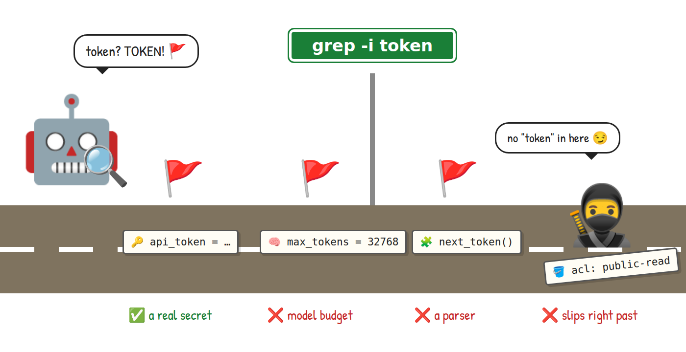
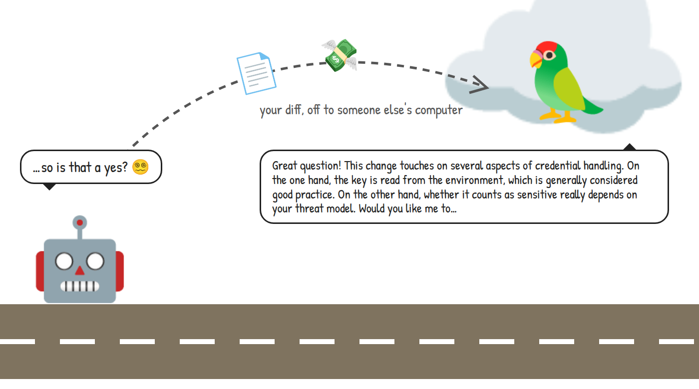
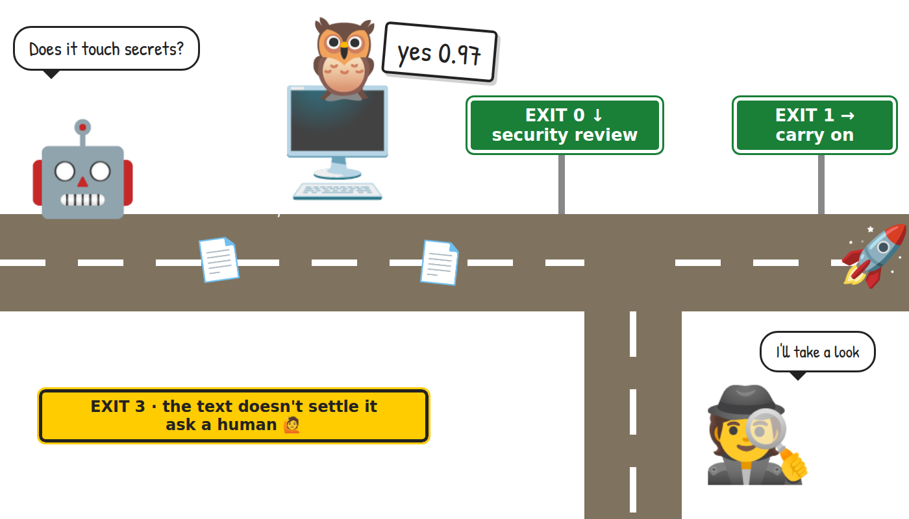
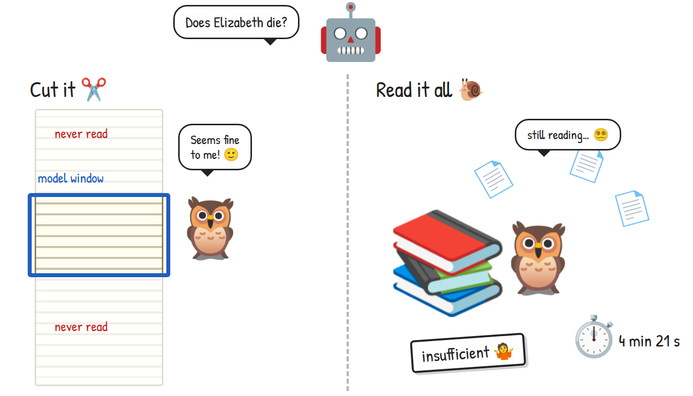
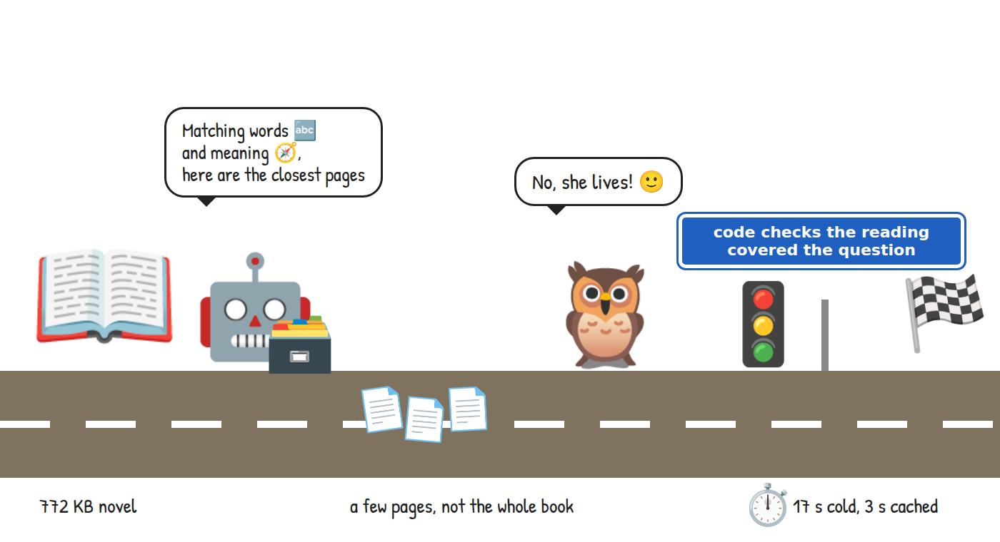
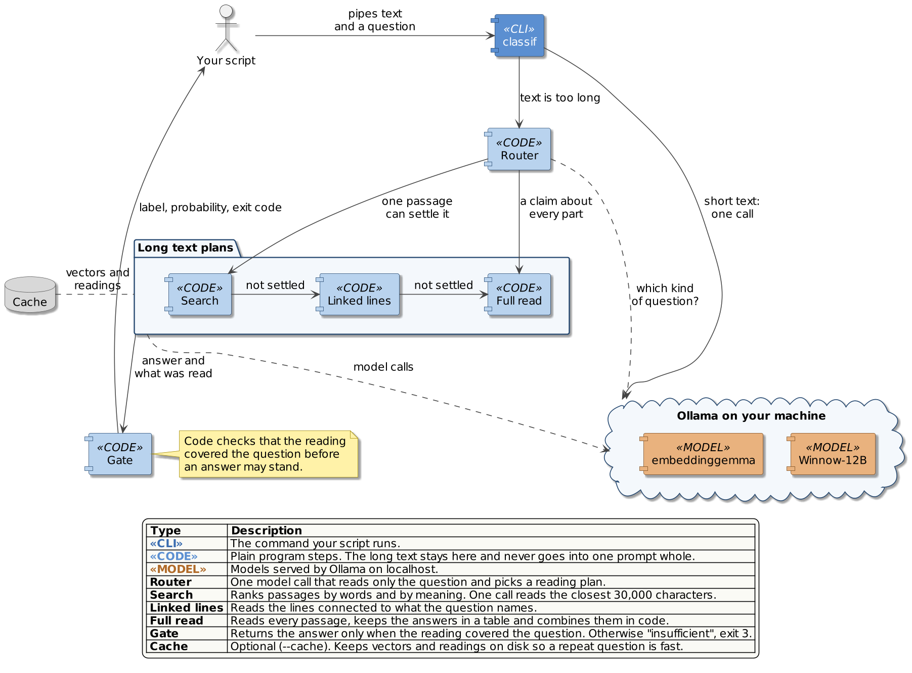

<style>{`
  article img:not(:first-of-type) {
    max-width: 700px;
    height: auto;
  }
  @media (max-width: 996px) {
    html.blog-post-page:has(img[alt="A bridge between deterministic code and semantic reasoning"]) .main-wrapper {
      width: 100% !important;
      max-width: 100% !important;
      margin: 0 !important;
      padding: 0 !important;
    }
    html.blog-post-page:has(img[alt="A bridge between deterministic code and semantic reasoning"]) .container.margin-vert--lg {
      width: calc(100% - 24px) !important;
      max-width: 100% !important;
      margin: 0 12px !important;
      flex-shrink: 0;
      padding: 36px 0 0 !important;
    }
    html.blog-post-page:has(img[alt="A bridge between deterministic code and semantic reasoning"]) main.col.col--7 {
      width: 100% !important;
      max-width: 100% !important;
      padding: 24px 16px !important;
    }
    html.blog-post-page:has(img[alt="A bridge between deterministic code and semantic reasoning"]) .markdown :is(pre, table) {
      max-width: 100%;
      overflow-x: auto !important;
    }
  }
`}</style>

## Introduction

In this blog, we will look at how programs make decisions about text, and how that changed once small language models started running on our own machines. Along the way, I will introduce [classif](https://github.com/Piotr1215/classif), a small command-line tool I built that lets a shell script ask a local model a question and act on the answer.

<!--truncate-->

A semantic decision is a question about what a piece of text means, asked by a program that needs a short answer it can act on. "Does this diff touch credentials?" is one. "Is this log line a real failure or just noise?" is another. Programs have always made decisions about text, but until recently they could only check which characters the text contains.

A few changes made semantic decisions practical:

- Open-weight models small enough to run on a gaming GPU
- Ollama, which serves those models locally and exposes the probability behind each answer
- Research on reading documents far bigger than a model can hold at once

### Who is this blog for?

If you write shell scripts, pipe logs and diffs from one tool to another, or run local models with Ollama, this article is for you. You don't need any machine learning background to follow along; I will explain the few model terms we need as we go.

By the end of this blog, you will have classif running on your machine and answering questions inside your own shell pipelines.

## Decisions about text: evolution

Let's look at how each wave changed the way programs decide things about text.

### #1 Matching text

For decades, a script that needed to decide something about text had one tool: pattern matching. `grep`, `sed`, `awk` and regular expressions are fast and predictable, and they cost nothing to run. They are also completely literal. Ask grep whether a diff touches secrets and the best it can do is look for words like `token` or `password`.

The trouble is that words carry more than one meaning. `token` appears in a change to an API client, but also in a change to how many tokens a model may read, and in a parser that splits text into tokens. grep flags all three. Meanwhile, a change that quietly makes a storage bucket public may never use any of those words, and grep lets it through.



### #2 Asking a chatbot

Then large language models arrived, and a program could finally ask about meaning. Send the diff to a chat API, ask "does this touch secrets?", and the model reads it. The `token` in a model budget no longer confuses anyone, and the bucket change gets noticed.

The catch is in the answer. A chat model replies the way it talks to people: a few friendly paragraphs, some caveats, maybe an offer to help further. Your script wanted a yes or a no, and now it has to dig one out of the prose. Ask the same question twice and the wording changes. You can ask for JSON, which helps, but the script still has no idea how sure the model was. On top of that, every diff you check travels to someone else's computer, and you pay for every word of the reply.



### #3 One-token answers on your own machine

Here comes the trick that makes this practical. A language model writes its reply one small piece at a time, and those pieces are called tokens. Before it picks each token, the model scores every candidate it could write next. Ollama can hand those scores back to us as log probabilities, or logprobs for short.

So instead of letting the model write a paragraph, we let it produce exactly one token and look at the scores of the answers we care about. If `yes` scores 0.97 and `no` scores 0.03, we have our answer and a measure of how sure the model is, from one short call. I first saw this approach in [SemIf-OpenJev](https://github.com/TheoLeeCJ/SemIf-OpenJev), and [Jev](https://docs.typesafe.ai/introduction) shaped the bigger idea of treating such decisions as building blocks inside programs.

An answer like that maps neatly onto something every shell already understands: an exit code. In classif, exit 0 means the first answer won (`yes` by default) and exit 1 means another answer won. Exit 3 means the text doesn't hold enough evidence to answer, and exit 2 means something went wrong before the model could be scored. A script branches on that with `if` or `&&`, exactly like it branches on `grep`. And because the model runs locally, the diff never leaves your machine.



### Almost perfect… so what is missing?

For short text, this picture is almost perfect… almost. So what is missing? Well, long text.

Every model has a context window, the amount of text it can read in one go. The model I use has a window of 32k tokens, which is roughly a hundred thousand characters of English. A novel, a long log file or a big man page doesn't fit.

There are two obvious ways around it, and neither is great. The first is to cut the text until it fits. Ollama does this by default, and it does it quietly, so the model ends up answering confidently about a text it has only partly seen. The second is to read everything: split the text into pieces, ask the model about each one, and combine the answers. That is thorough but slow. When I asked an early version of classif whether Elizabeth dies in *Pride and Prejudice*, a 772 KB novel, it read for 4 minutes and 21 seconds and then answered `insufficient`.



### Search first, read more only when needed

How do we keep the speed of the one-token answer and still read a whole book? The idea that unlocked it for me came from the [Recursive Language Models](https://arxiv.org/abs/2512.24601) paper by Zhang, Kraska and Khattab. Their approach keeps the long input outside the model's context and lets the model work through it in smaller steps. classif borrows that idea with one twist: a fixed program decides how to read the text, and the model only answers small, well-defined questions along the way.

For a question that one passage can settle, like "does she die?", classif searches first. Code cuts the book into short passages, ranks them by matching words and by meaning, and hands the model the closest ones, about 30,000 characters in total. The model reads those and answers with one token, as before. Code then checks whether that answer may stand. Only when the search can't settle the question does classif fall back to the slower, thorough read.

The Elizabeth question that used to take over four minutes now comes back in about 17 seconds, and in under 3 seconds once the passage index is cached. (She doesn't die, in case you were worried.)



_Before we move on to the architecture, a quick note on the cast. The robot is our code, which follows instructions to the letter, and the owl is the language model, which reads. I picked owls for their reputation as careful readers, and the cuteness level helped._

## classif architecture

What makes classif different from calling a model in a loop? Code decides how to read the text and whether an answer is good enough. The model's job stays narrow: read what it is given and pick one answer. That split keeps every model call small and every result something a program can check.

### Components

A word of warning: this part goes deeper than the rest of the blog. If you mostly want to try the tool, feel free to skip to the demo and come back later. The diagram below shows the main components and how they work together.

[](_media/diagrams/classif-components.png)

_[Open the diagram full size](_media/diagrams/classif-components.png)_

Your script runs `classif` with a question and some text. When the text fits the model's window, classif sends it in one call and reads the answer from that single token. This short path covers most everyday uses: commit messages, log lines, diffs, comments.

When the text is too long, classif finds out from Ollama itself. It switches off the quiet cut, so the server refuses an oversized request instead of trimming it, and that refusal hands the work to the Router. The Router asks the model one question about the question: is it about something that happens at least once in the text, about the latest state of something, about every case, or about the text as a whole? The answer picks a reading plan.

The plans run from cheap to thorough. Search reads the closest passages, as we saw with the novel. Linked lines follows names and identifiers through the text, for example from an invoice to its supplier and on to the supplier's city. Full read goes through every passage, keeps each answer in a table, and lets code count and compare them before the model makes the final call.

Finally, the Gate decides whether the answer may leave. If the reading didn't cover what the question needs, classif answers `insufficient` and exits with 3, so your script knows the text did not settle it. With `--cache`, the passage vectors and readings are saved on disk, so a second question about the same text skips the expensive indexing.

### A long question, step by step

Here is the same flow as a sequence, using the Elizabeth question from earlier.

[](_media/diagrams/classif-sequence.png)

_[Open the diagram full size](_media/diagrams/classif-sequence.png)_

Two steps are worth a closer look. In step 3, the server refuses the text, and that refusal is the only thing that sends classif down the long path; it never guesses token counts up front. In step 15, the Gate applies a simple rule: a `yes` stands because the model saw a passage that shows it, but a `no` stands only when the passages were ranked by meaning. If the embedding model is missing and the ranking used words alone, classif keeps reading.

To make sure the answers come from the text and not from the model remembering a famous book, I renamed the characters and wrote in a death that isn't in the original. The search answered all nine test questions correctly, at about 4 seconds each once the index was built.

## Demo scenario

The demo shows classif making decisions inside ordinary shell commands, from a two-line diff to a whole novel.

The scenario flow:

- pick out a staged change that needs a security review
- sort a change description into bug, feature or chore
- ask a question about a 772 KB novel, first building the passage index and then reusing it
- clean up

### Prerequisites

To follow along, you will need a Linux or macOS machine with a GPU that has about 12 GB of memory; the tested setup loads the model in about 8 GB. Ollama also runs on the CPU, but I haven't measured how classif performs there.

Locally installed you will need:

- [Ollama](https://ollama.com/), tested with version 0.34.3 and running at `localhost:11434`
- Python 3.12, with no extra packages
- git and curl
- `ifne` from moreutils, for the pipeline example

### Demo setup

Start by cloning the repository:

```bash
git clone https://github.com/Piotr1215/classif.git
cd classif
```

classif works with any Ollama model that returns logprobs. I use Winnow-12B, a Gemma 4 fine-tune trained for exactly this kind of typed decision, and I published a [quantized version on Hugging Face](https://huggingface.co/Piotr1215/Winnow-12B-GGUF) so you don't have to build one yourself. Create it in Ollama with this Modelfile:

```bash
cat > Modelfile <<'MODEL'
FROM hf.co/Piotr1215/Winnow-12B-GGUF:Q4_K_M
TEMPLATE {{ .Prompt }}
RENDERER gemma4
PARSER gemma4
PARAMETER temperature 1
PARAMETER top_k 64
PARAMETER top_p 0.95
MODEL
ollama create winnow:12b-q4_K_M -f Modelfile
```

The search on long text also needs a small embedding model, about 300M parameters:

```bash
ollama pull embeddinggemma
```

Check that everything works:

```bash
./classif "Is this about Kubernetes?" "The pod keeps crashlooping."
```

```
yes 0.95
```

The output is the winning answer and its probability. Your number may differ slightly; what matters is the label.

> If your GPU has less memory, `llama3.2:3b` works too. It is lighter and faster, but it scored worse on my test sets.

The demos run classif from other directories, so put it on your `PATH`. A symlink is enough, since classif finds its own modules through it:

```bash
mkdir -p ~/.local/bin
ln -s "$PWD/classif" ~/.local/bin/classif
export PATH="$HOME/.local/bin:$PATH"  # if ~/.local/bin is not on your PATH yet
```

### Observability

A few ways to see what is going on under the hood:

- `-j` prints the full result as JSON, with the score of every answer and, for long text, a report of what was read
- `--why` reads line by line and prints the lines the answer rests on
- `ollama ps` shows which models are loaded and how much memory they use

### Demo 1: Pick out changes for a security review

Let's start with the secrets example from the first wave. Create a throwaway repository with two small files:

```bash
mkdir /tmp/classif-demo && cd /tmp/classif-demo
git init -q
printf 'def api_headers():\n    return {"Content-Type": "application/json"}\n' > api.py
printf 'MAX_CONTEXT_TOKENS = 4096\n' > model.py
git add . && git commit -qm "baseline"
```

Now make a change that reads an API key from the environment and stage it:

```bash
cat > api.py <<'EOF'
import os

def api_headers():
    headers = {"Content-Type": "application/json"}
    api_key = os.environ["API_KEY"]
    headers["Authorization"] = f"Bearer {api_key}"
    return headers
EOF
git add api.py
```

Ask classif whether the staged change needs a security look:

```bash
git diff --staged |
  classif -p "Does this change handle secrets, credentials or who may access what?"
echo "exit $?"
```

With `-p`, classif passes its input through unchanged when the answer is `yes`, so the diff comes back out:

```
diff --git a/api.py b/api.py
index 73f1822..597fce8 100644
--- a/api.py
+++ b/api.py
@@ -1,2 +1,7 @@
+import os
+
 def api_headers():
-    return {"Content-Type": "application/json"}
+    headers = {"Content-Type": "application/json"}
+    api_key = os.environ["API_KEY"]
+    headers["Authorization"] = f"Bearer {api_key}"
+    return headers
exit 0
```

Now undo that change and stage one that contains the word "tokens" but has nothing to do with secrets:

```bash
git restore --staged --worktree api.py
printf 'MAX_CONTEXT_TOKENS = 8192\n' > model.py
git add model.py

git diff --staged |
  classif -p "Does this change handle secrets, credentials or who may access what?"
echo "exit $?"
```

```
exit 1
```

This time nothing comes through, and the exit code says the answer was another label. Both decisions took about 0.3 seconds on my machine. A `grep -i token` would have flagged the second change and missed the first.

Here is how I use it day to day. `ifne` from moreutils runs a command only when it receives input, so the expensive reviewer starts only for changes that need it:

```bash
git diff --staged |
  classif -p "Does this change handle secrets, credentials or who may access what?" |
  ifne claude -p "Review this change for security issues"
```

> One thing to keep in mind: in a pipeline, the shell reports the exit code of the last command, so classif's own exit code gets lost. When you want to send unsure answers somewhere else, run classif as its own step and check `$?`.

### Demo 2: Name the kind of change

Yes and no are only the default answers. With `-e`, you give classif your own options, each with a short description that tells the model when to pick it. The descriptions only guide the model; the output is the option name and its probability:

```bash
printf 'Fix a startup crash when the config file is missing.\n' |
  classif "What kind of change is this?" \
    -e "bug=repairs broken behavior" \
    -e "feature=adds a capability" \
    -e "chore=maintenance with no behavior change"
echo "exit $?"
```

```
bug 1.00
exit 0
```

`bug` is the first option, so it exits with 0; `feature` or `chore` would exit with 1. classif also adds a `none` option for text that fits none of yours. Add `--why` to see which lines the answer rests on:

```bash
printf 'Fix a startup crash when the config file is missing.\n' |
  classif "What kind of change is this?" \
    -e "bug=repairs broken behavior" \
    -e "feature=adds a capability" \
    -e "chore=maintenance with no behavior change" \
    --why
```

```
bug 1.00
  1: Fix a startup crash when the config file is missing.
```

With a one-line input there is not much to see, but on a long log it points you straight at the lines that mattered.

### Demo 3: Ask a question about a whole novel

Time for the long text. Download *Pride and Prejudice* from Project Gutenberg, all 772 KB of it:

```bash
curl -fsSL https://www.gutenberg.org/cache/epub/1342/pg1342.txt -o pg1342.txt
```

Ask the question from earlier, with `--cache` so the passage index is saved:

```bash
time classif "Does Elizabeth die in this book?" -i pg1342.txt --cache
```

```
no 0.99
```

The first run took 16.8 seconds on my machine, with the model already loaded and no saved index. Most of that time goes into cutting the book into passages and embedding each one. Run the same command again and the index comes from the cache:

```
no 0.99
```

The second run took 2.7 seconds. Both runs exited with 1, since `no` is not the first label.

Remember what a `no` from the search means: the passages closest to the question don't show Elizabeth dying. The answer rests on those passages, and a search can miss one. Add `-j` and the read report says so with `"plan": "search"`. A claim about every line, such as "is every entry in this log from the same day?", needs the full read, and that can take minutes.

### Exit codes cheat sheet

- `0`: the first answer won, `yes` by default
- `1`: another answer won, including `unknown` and `none`
- `2`: the answer could not be scored, for example when Ollama is not running
- `3`: not enough evidence, a deadline (`-d`) ran out, or the score fell below the `-t` floor

### Cleanup

Remove the demo files, the cache and the command link:

```bash
rm -rf /tmp/classif-demo pg1342.txt ~/.cache/classif
rm ~/.local/bin/classif
```

If you don't plan to keep using classif, remove the models too:

```bash
ollama rm winnow:12b-q4_K_M
ollama rm hf.co/Piotr1215/Winnow-12B-GGUF:Q4_K_M
ollama rm embeddinggemma
```

## Conclusion

classif gives shell scripts a way to branch on what text means, using the tools scripts already understand: exit codes, `if`, `&&` and pipes. It started as a small helper for my own dotfiles and grew one question at a time, until it could read a whole novel to answer one of them.

Benefits:

- A question in plain English replaces a growing pile of regular expressions
- Each answer comes with a probability, so a script can act only when the model is sure enough (`-t 0.8`)
- Everything runs on your machine, so diffs, logs and documents stay private
- Long text is read in full or searched, and an answer the reading can't support comes back as `insufficient`

Challenges:

- The tested setup needs a GPU with about 12 GB of memory
- My test sets are small (344 cases for short decisions), so treat the numbers as a good sign rather than a benchmark
- A claim about every line of a long text still needs a full read, which takes minutes and can still be wrong
- A probability tells you how sure the model is, which is different from being right
- A model can only judge what it is shown. I tried classif as a relevance filter for the context my coding agent retrieves and removed it again, because the filter saw the prompt but never the conversation around it

If you want to dig deeper, the [architecture document](https://github.com/Piotr1215/classif/blob/main/docs/architecture.md) covers the reading plans, the cache and the full measurements. And if you try classif in your own scripts, I would love to hear which questions you end up asking.
