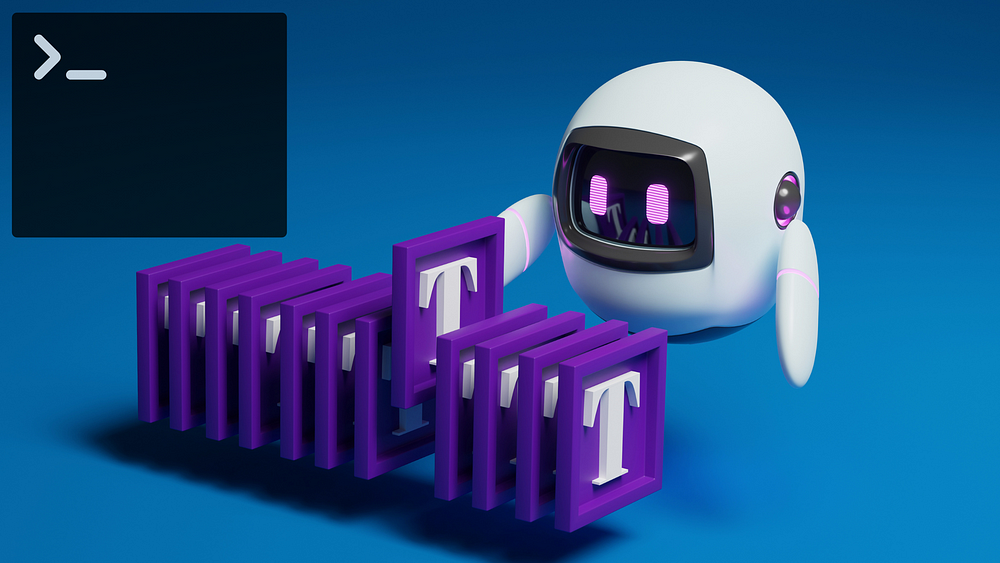
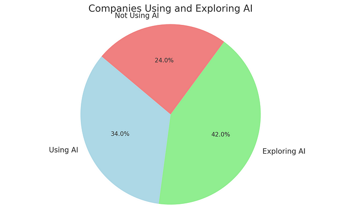
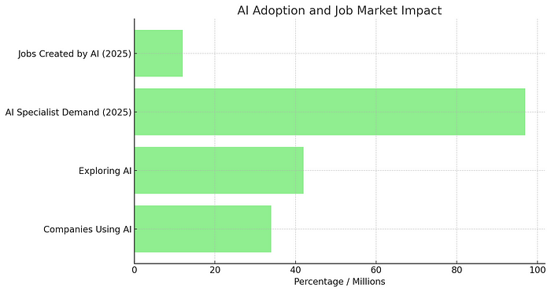
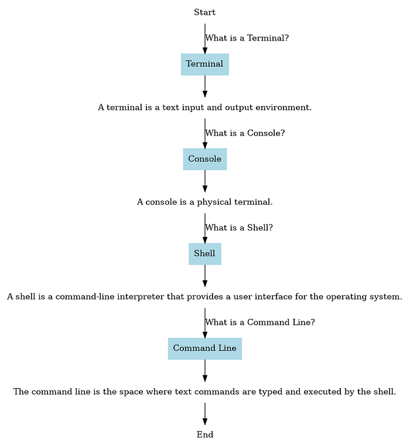
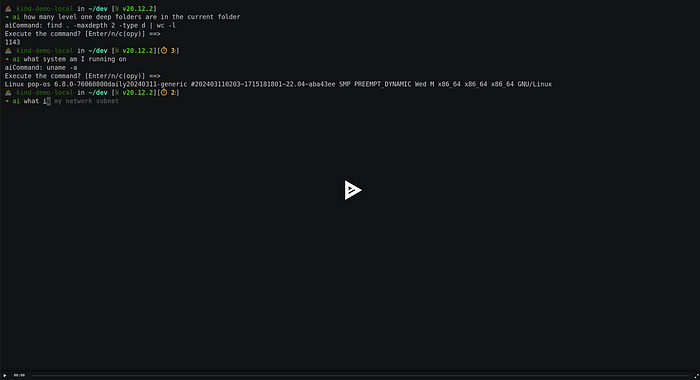

# 5 Must-Have Command Line AI Tools

## Terminal Friendly AI Projects

# Introduction

Artificial Intelligence (AI) is not just a buzzword; it’s a
transformative force reshaping industries across the globe. The U.S. AI
market alone is projected to reach approximately $594 billion by 2032,
growing at a robust CAGR of 19% from 2023. This staggering growth
underscores AI’s pivotal role in driving innovation and efficiency.

If you’re not leveraging AI in your workflows yet, you might be missing
out on significant opportunities. AI is rapidly becoming a critical
component in staying competitive, and those who adopt AI tools now are
positioning themselves at the forefront of technological advancement.

In this blog, I would like to show you 5 tools that improved my
productivity and. You don’t need to be a software developer or IT
professional to take advantage of the same efficiencty boost.

## Let’s look at some statistics

> The U.S. AI market is expected to reach approximately $594 billion by
> 2032, with a CAGR of 19% from 2023​ ([Statistics and Facts for 2024
> CompTIA](https://connect.comptia.org/blog/artificial-intelligence-statistics-facts))​.


> Approximately 34% of companies are currently using AI, with an
> additional 42% exploring AI technologies. This highlights a
> significant interest and ongoing integration of AI in business
> operations​ ([Statistics and Facts for 2024
> CompTIA](https://connect.comptia.org/blog/artificial-intelligence-statistics-facts))​.



> AI is projected to create 12 million more jobs than it will replace by
> 2025. The demand for AI specialists is anticipated to rise, with 97
> million positions needed in the industry by that time​ ([Statistics
> and Facts for 2024
> CompTIA](https://connect.comptia.org/blog/artificial-intelligence-statistics-facts))​.



## **Why the Terminal?**

You are probably familiar with ChatGPT or Claude web interfaces and
those are great first steps to try out generative AI. However, those web
UIs have important limitations; they are generic and not tailored to
specific needs. While convenient, they lack the flexibility to integrate
seamlessly with custom workflows and automate repetitive tasks.

The command line is a powerful interface that offers more control,
efficiency and flexibility than graphical interfaces. It allows for
scripting, automation, and quick access to powerful tools without the
overhead of a graphical interface.

> AI is revolutionizing the way we interact with technology. By
> integrating AI with command line tools, we can automate complex tasks,
> gain deeper insights from data, and improve overall productivity.

## **It’s Easier Than You Think**

Using AI tools in the terminal is straightforward. Many tools provide
simple installation commands and detailed documentation to help you get
started quickly.

Command line tools often offer more granular control over their
operation, allowing you to customize your workflows to suit your
specific needs.

## Better Automation

Terminal-based AI tools excel at automation. They can be easily
integrated into shell scripts, scheduled with cron jobs, and used in
combination with other command line utilities to create powerful
automated workflows.

# Tools

Before we jump into the tooling overview, let’s make sure we are on the
same page, defining what’s what in the terminal universe. Put simply:



## Ollama

A command-line tool developed my Meta, that allows you to run AI models
locally, enabling seamless and secure interactions with various LLMs
directly from your terminal. Chat or interact with AI models through
APIs on your local machine or a remote server in home network or
somewhere else.

- ollama/ollama: Get up and running with Llama 3, Mistral, Gemma, and other large language…

🎥 See `ollama` in action on asciinema: https://asciinema.org/a/664871


## Fabric

An open-source framework designed to augment human capabilities using
AI. It offers a modular system for solving specific problems through a
crowdsourced set of AI prompts, known as Patterns.

Fabric enables users to integrate AI into their daily tasks seamlessly,
from summarizing content to generating social media posts. It emphasizes
usability with a command-line interface and clear Markdown-based
patterns. The tool also supports creating personal AI infrastructures,
making it a versatile choice for both simple and complex AI
applications.

- danielmiessler/fabric: fabric is an open-source framework for augmenting humans using AI…

However, we can do better than this and let `fabric` speak for itself
using its `— agent` flag:

```bash
echo "research the https://github.com/danielmiessler/fabric repository and summarize what the tool does" \
      | fabric --agents | summarize
```

This gives us the following response:

**ONE SENTENCE SUMMARY:**  
The fabric tool enhances productivity by automating tasks, integrating
with software, and offering features to streamline user workflows.

**MAIN POINTS:**  
1\. The fabric tool is designed to improve productivity and streamline
tasks.  
2\. It focuses on automation and simplification of repetitive tasks.  
3\. Offers seamless integration with other software or services.  
4\. Provides a suite of features aimed at enhancing process
efficiency.  
5\. Direct consultation of the GitHub repository is recommended for full
potential leverage.  
6\. The repository contains a comprehensive README file for detailed
insights.  
7\. Additional documentation is available, prepared by the repository’s
owner.  
8\. In-depth insights into the tool’s purpose and features are
provided.  
9\. Setup instructions and practical use cases are included in the
documentation.  
10\. Effective utilization requires exploring the GitHub repository for
maximum utility.

**TAKEAWAYS:**  
1\. The fabric tool is pivotal for enhancing productivity through
automation and integration.  
2\. Direct exploration of the GitHub repository is essential for
understanding its full capabilities.  
3\. The README file and additional documentation are key resources for
users.  
4\. The tool offers significant benefits in streamlining and improving
efficiency of tasks.  
5\. Understanding and applying the tool’s features requires consulting
the provided documentation.

**Extract Transcript from YouTube Videos**

Fabric can also extract transcript from youtube videos and pass it
through any prompt(s). Let’s extract some ideas from one of my recent
videos

```bash
yt --transcript https://www.youtube.com/watch\?v\=EK_ivK8HlNo | create_micro_summary
```

**ONE SENTENCE SUMMARY:**  
\- Kubernetes development challenges are mitigated by MirrorD for faster
feedback loops and seamless remote environment testing.

**MAIN POINTS:**  
\- Kubernetes excels in production but complicates development and
testing.  
\- Fast feedback loops are crucial for efficient Kubernetes
development.  
\- MirrorD enables local processes to run in a remote Kubernetes
context.

**TAKEAWAYS:**  
\- Development on Kubernetes requires innovative tools for efficiency.  
\- MirrorD shortens the feedback loop significantly.  
\- Local and remote environment synchronization is key for developers.

The summary is pretty spot on\!\!

## Shell Automation

There are so many commands with flags and options that it’s impossible
to remember… thinking about you `ffmpeg` . To make this easier for
myself, I have created a tool that helps me with various commands.

- Piotr1215/aicmdtools: GoAI is a Go library and command line for interacting with OpenAI…

🎥 Check out this `asciinema` recording to see what it can do:
https://asciinema.org/a/TFJABWbNochPWuuBFhiHDHBLF



## Terminal Chat

Terminal chat apps are similar to `ollama` but allow for talking to
various LLM providers such as OpenAI, Claude and more. Here are two I’ve
experimented with and can recommend.

However, I usually use AI chats through `neovim`, more on it later in a
bonus section\!


- sigoden/aichat: All-in-one AI CLI tool that integrates 20+ AI platforms, including OpenAI…


- ekkinox/yai: Your AI powered terminal assistant.


## Aider — Programming Support

If you are a programmer, aider is absolutely amazing. While it’s not
perfect, it’s the closest I know to GitHub Copilot (with chat function)
and it’s completely free\!

Let’s see if fabric can help us capture the main strengths of aider.
Let’s paste the content or aider’s repo README.md and let fabric
summarize it.

```bash
xclip -o -sel clipboard | summarize
```

**ONE SENTENCE SUMMARY:**  
Aider is an AI-powered pair programming tool that enhances coding
productivity by integrating with local git repositories and various
LLMs.

**MAIN POINTS:**  
1\. Aider facilitates pair programming with AI, specifically designed
for local git repositories.  
2\. Compatible with leading LLMs like GPT-4o and Claude 3 Opus, offering
versatile AI assistance.  
3\. Installation and setup are straightforward, requiring only a few
commands to start.  
4\. Supports editing multiple files simultaneously for comprehensive
code modifications.  
5\. Automatically commits changes to git with appropriate commit
messages, streamlining version control.  
6\. Compatible with a wide range of programming languages, including
Python, JavaScript, and more.  
7\. Utilizes a complete map of your git repository for better context
understanding in larger projects.  
8\. Allows for voice commands and adding images or URLs in chat for
enhanced interaction.  
9\. Achieved the top score on SWE Bench, indicating superior performance
in solving real GitHub issues.  
10\. Offers extensive documentation, tutorials, and a supportive Discord
community for users.

**TAKEAWAYS:**  
1\. Aider significantly boosts coding efficiency by automating tasks and
providing intelligent suggestions.  
2\. Its compatibility with major LLMs ensures a flexible and powerful
coding assistant experience.  
3\. The tool’s ability to understand and navigate large codebases makes
it suitable for complex projects.  
4\. Community feedback highlights Aider’s impact on productivity and its
user-friendly design.  
5\. Aider’s recognition in benchmarks underscores its effectiveness in
addressing real-world coding challenges.

# Bonus for NeoVim Nerds

If you happen to use the best editor known to mankind… `neovim` btw, you
are in for a treat. Neovim plugins ecosystem, due to adopting `lua` as
plugins programming language, is very strong and versatile. Here are two
plugins that I use almost daily when coding, creating documentation or
chatting with `LLMs`.

## Gen.nvim

Let’s us use locall ollama models as a neovim copilot.

## Gp.nvim

Provides rich chat experience and copilot-like functionality in the
editor.

Ok, we went through a lot of tools, let’s summarize:

| Tool       | Category               | Description                                                    | URL                                                |
|------------|------------------------|----------------------------------------------------------------|----------------------------------------------------|
| Ollama     | Local AI Models        | Run AI models locally and interact with them through terminal. | [Ollama GitHub](https://github.com/ollama/ollama)  |
| Fabric     | AI Framework           | Modular framework for solving problems using AI prompts.       | [Fabric GitHub](https://github.com/danielmiessler/fabric) |
| Shell Automation | Command Line Automation | Tool to simplify various commands and automate tasks.           | [Shell Automation GitHub](https://github.com/Piotr1215/aicmdtools) |
| AIChat     | Terminal Chat          | Integrates multiple AI platforms for chat via terminal.        | [AIChat GitHub](https://github.com/sigoden/aichat) |
| Yai        | Terminal Assistant     | AI-powered assistant for terminal commands and tasks.          | [Yai GitHub](https://github.com/ekkinox/yai)       |
| Aider      | AI Pair Programming    | AI tool for pair programming with local git integration.       | [Aider GitHub](https://github.com/paul-gauthier/aider) |
| gen.nvim   | Neovim Plugin          | Generate text using LLMs with customizable prompts in Neovim.  | [gen.nvim GitHub](https://github.com/David-Kunz/gen.nvim) |
| gp.nvim    | Neovim Plugin          | ChatGPT sessions and copilot functionality in Neovim.          | [gp.nvim GitHub](https://github.com/Robitx/gp.nvim) |

# Closing Thoughts

Most of the tools mentioned can work with proprietary models such as
OpenAI, Claude but also with open source models like the ones provided
by `ollama`.

Integrating AI with command line tools not only boosts productivity but
also transforms how we interact with technology. The tools mentioned
here, from Ollama to Fabric, offer powerful capabilities right at your
fingertips, enhancing automation, insight, and efficiency.

Ready to supercharge your terminal? Let me know which tool is your
favourite, did I miss some that you use and find valuable?

Thanks for taking the time to read this post. I hope you found it
interesting and informative.

🔗 **Connect with me on**
[**LinkedIn**](https://www.linkedin.com/in/piotr-zaniewski/)

🌐 **Visit my** [**Website**](https://cloudrumble.net/)

📺 **Subscribe to my** [**YouTube
Channel**](https://www.youtube.com/@cloud-native-corner)

