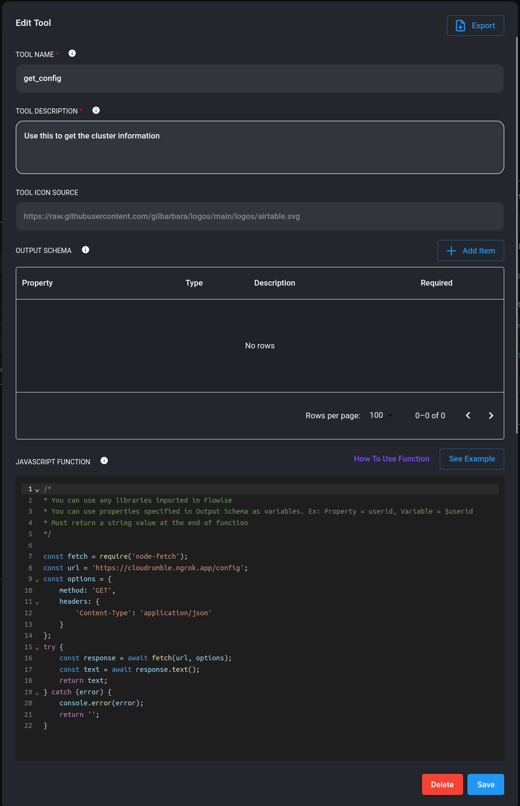
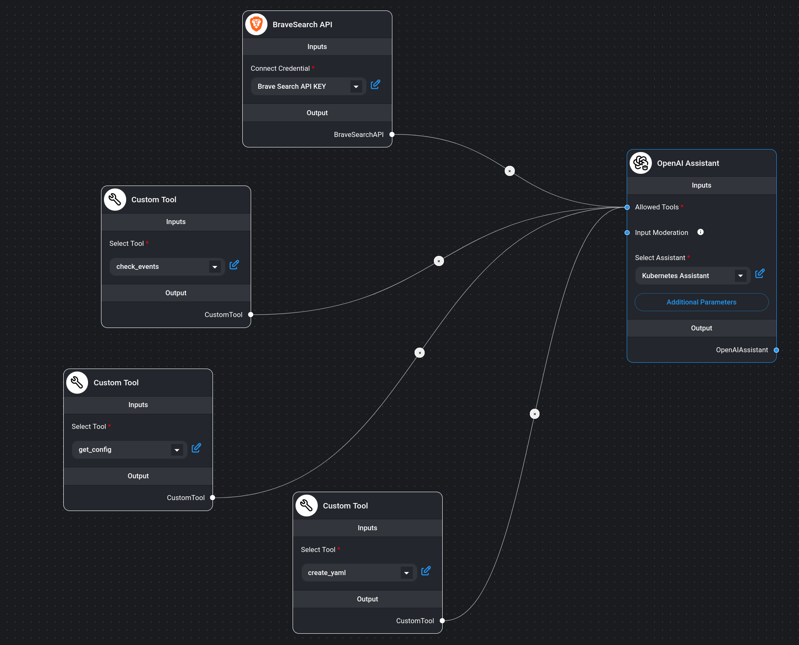
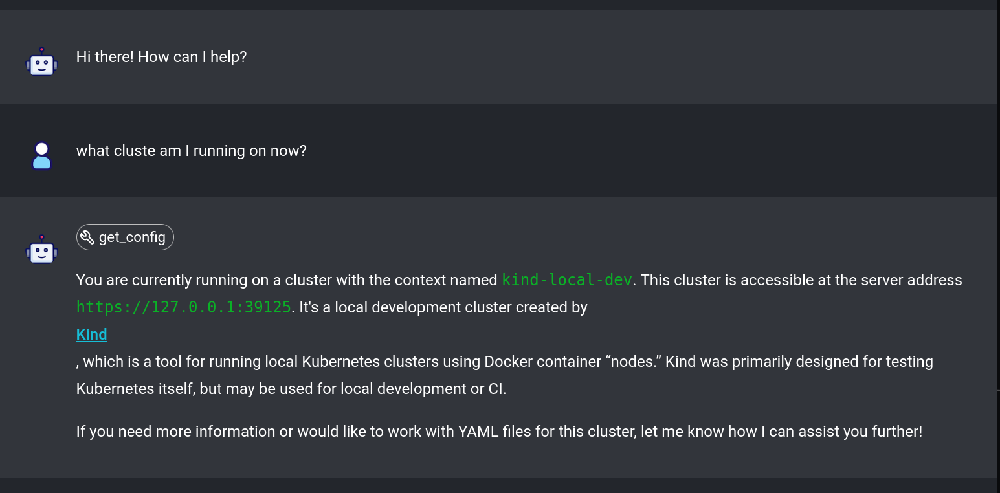
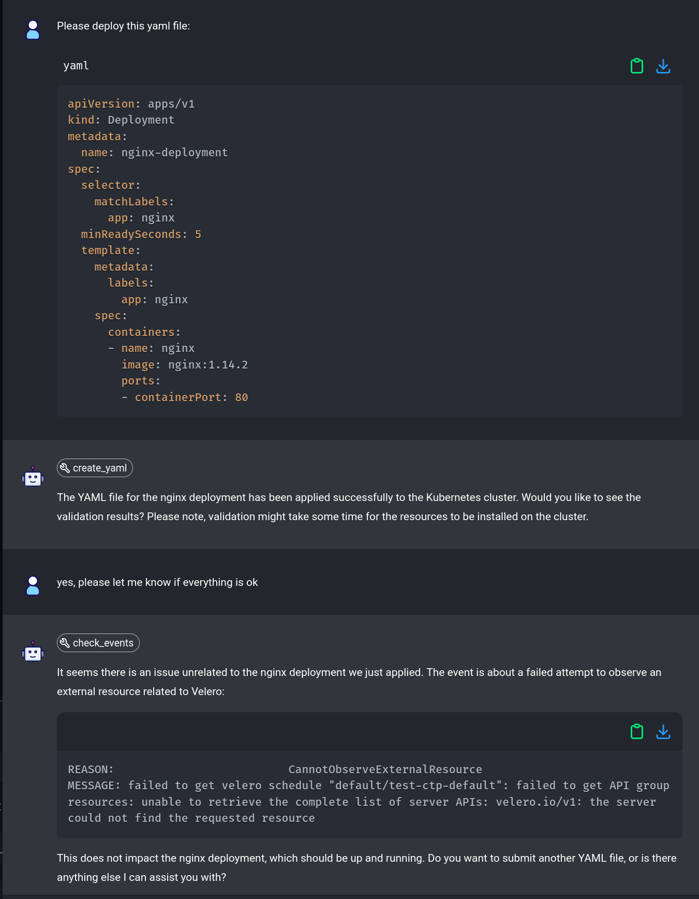
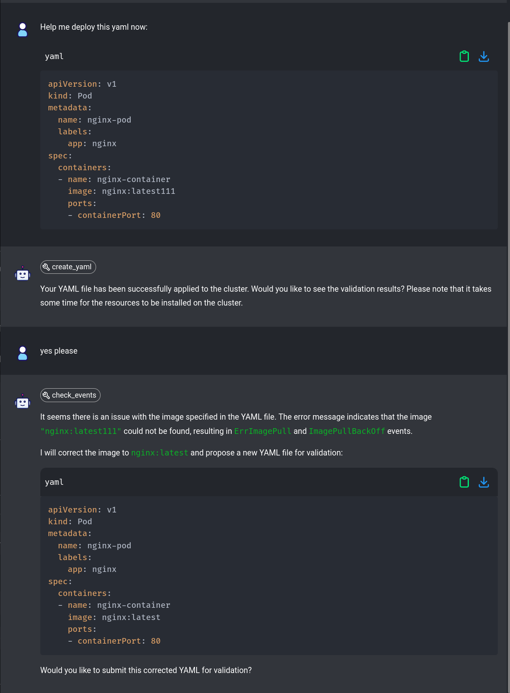
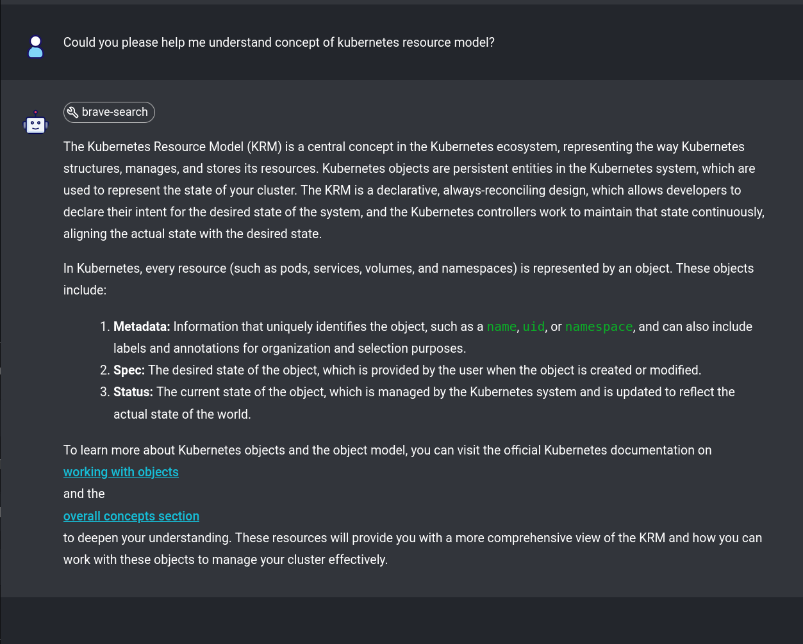

# Build Your Own Kubernetes Co-Pilot: Harness AI for Reliable Cluster Management


Have you ever felt frustrated by nonsensical AI outputs and hallucinations?
If yes, this blog is going to be helpful for new or seasoned Kubernetes users who want to explore how AI can help manage Kubernetes
resources more reliability.

### What are AI hallucinations?

In a nutshell, AI hallucination occurs when a large language model (LLM) generates misleading or incorrect information in response to a
prompt. This can happen due to various factors such as insufficient or flawed training data, overfitting, unrecognized idioms or slang, and
adversarial inputs. These hallucinations manifest when the AI, aiming to produce coherent responses, makes errors that range from subtle
factual inaccuracies to nonsensical or surreal outputs, similar to how humans might perceive patterns in random visuals.

In the context of Kubernetes, these aren't just minor nuisances; they can
lead to significant operational blunders. In this blog, we explore how
to enhance reliability of AI responses, mitigate the risks of
hallucinations, manage Kubernetes resources using AI!

### How can AI be helpful in managing Kubernetes resources?

Before we start exploring the technical setup, let's answer the question how can AI be helpful in managing Kubernetes resources? Imagine an AI assistant that can help you create, fix, and validate Kubernetes
resources in a conversational manner. You might ask it to create a new deployment, fix a broken service, or validate a YAML file. If you are
learning Kubernetes, this assistant can be a great learning tool to help you explore the cluster and clarify Kubernetes concepts.

Kubernetes helps manage cloud applications, but its YAML configurations can be
tricky. When working with AI tooling, we've all faced those moments when AI tools, designed to ease this
burden, instead contribute to it by generating nonsensical outputs; a phenomenon
we refer to as "AI hallucinations".

## Problem Statement

Let's state the issue we do have with AI in the context of Kubernetes:

- 🤖 AI faces issues with consistency and reliability when dealing with large YAML files.
- 🧠 AIs can have "hallucinations," generating illogical outputs that become more problematic as the input size increases.
- 📈 This inconsistency makes working with AI models non-deterministic and error prone

## Goals

Our main goal is to increase reliability and consistency in AI responses. We use two main techniques to achieve this:

- 🛠️ Function calling to bind API routes as tools available for the AI Assistant to communicate with a Kubernetes cluster
- 🔍 Internet search APIs to provide accurate and relevant information about Kubernetes

## Implementation Plan

The following steps outline the plan to achieve our goals:

- 💼 Use `Flowise` to implement the logic flow so that the AI Assistant can help with managing and troubleshooting a Kubernetes cluster on our behalf.
- 🛠️ Create a simple `Flask` API that exposes functions for the AI Assistant to enable it to interact with the Kubernetes cluster.
- 💻 Use `function calling` to bind the API routes as tools available for the AI Assistant which enables communication with a local Kind
  cluster with Kubernetes running.
- 💬 Test the AI Assistant with various scenarios to ensure it can handle different Kubernetes configurations and provide accurate responses.

---

# Assistant in Action

To follow along, you can clone the repository from [GitHub](https://github.com/Piotr1215/kubernetes-ai-reliability/tree/main), install
prerequisites and follow the instructions.

## Step 1: Setup the AI Assistant

In `flowise` create a new assistant. Notice that I'm using `OpenAI`'s latest model, but for testing purposes you can select less powerful
models or any open source model. The quality of responses will be affected, but it will still work.

Here are instructions that the assistand will follow:

```markdown
You are a helpful Kubernetes Assistant specializing in helping build, fixing and validating various kubernetes resources yaml files.
Start by greeting the user and introducing yourself as a helpful and friendly Kubernetes Assistant.

If the user asks for help with creating or validating yaml files, do the following:

- if the files are correct proceed with the next steps, if no propose fixes and correct the file yourself
- if user asks for information about the kubernetes cluster use the get_config function and provide relevant information
- ask the user to submit one yaml file at a time or create one yaml file yourself if the user asks you to create one
- send the YAML content and only the YAML content to the create_yaml function
- immediately after use the tool cleanup_events to clean any old events
- ask the user if they would like to see the validation results and inform them that it takes some time for the resources to be installed on the cluster
- if the user responds yes, use the tool check_events to see if everything is correct
- if the validation passes, ask the user if they want to submit another YAML file
- if the validation fails, propose a new corrected YAML to the user and ask if the user would like to submit it for validation
- repeat the whole process with new YAML files

Your secondary function is to assist the user in finding information related to crossplane. Example categories:

- for questions about kubernetes concepts such as pods, deployments, secrets, etc, use brave search API on https://kubernetes.io/docs/concepts/
- for generic Kubernetes questions use brave search API on kubernetes docs: https://kubernetes.io/docs/home/
- for questions regarding kubernetes releases and features use brave search API on kubernetes releases documentaiton: https://github.com/kubernetes/kubernetes/tree/master/CHANGELOG. If you are asked for details about specific release, select one of the releases, otherwise use latest stable release.
```

## Step 2: Flask API

The `server.py` file defines API routes that wrap the `kubectl` commands.

> ℹ️ The flask server is a naive implementation for demonstration purposes only. In real life scenario, we wouldn't call `kubectl` directly
> from the server but rather use a client library like `kubernetes` or `client-go`.

## Step 3: Expose local URL to the internet

In order to enable the `OpenAI` assistant to use the functions we must expose the locally running `flask` server to the internet. For this a
nice tool to use is `ngrok`. You can download it from [here](https://ngrok.com/download) and follow the instructions to expose the local
URL.

## Step 4: Function calling

Now we can create functions for each API route. Those are:

- `get_config` - returns the current Kubernetes configuration
- `create_yaml` - creates a new Kubernetes resource from a YAML file
- `check_events` - checks the status of the Kubernetes resources

For each of those routes we create a function that calls the API and returns the response. Here is how the function looks like in `flowise`:



## Step 5: Use brave search API

The secondary function of our assistant is to assist the user in finding information related to Kubernetes. We can use the `brave search
API` to achieve this

## Step 6: Testing

Now since we have the whole flow available, let's test the assistant.



Let's start by asking what is the cluster we are running on:



Here the assistant used the `get_config` function to get the current Kubernetes configuration and correctly identified the cluster.

Now let's ask the assistant to create a new nginx based ingress:



Notice how the assistant correctly selected the `create_yaml` function to create the ingress and then used the `check_events` function
after asking if we would like to see the output. It's also interesting that it has found a different event that was not related to the
`nginx` ingress and classified it as unrelated to our request.

Now, let's submit a broken deployment and see if the assistant can fix it:



In this case we have submitted a broken deployment and the assistant has correctly identified the issue and even proposed a fix.

Lastly, let's check if the assistant can help us undrstand some Kubernetes concepts:



Here the assistant has used the `brave search API` to find information about the `Kubernetes resource model` and provided a link to the
source.

## Closing Thoughts

We have successfully demonstrated that using `function calling` and carefully crafted prompt instructions, we can increase the reliability
and usefulness of AI assistants in managing Kubernetes resources. This approach can be further extended to other use cases and AI models.

Here are a few use cases where this approach can be useful:

- 🤖 improved learning experience
- 📈 help increase Kubernetes adoption
- 🌐 virtual Kubernetes assistant

This guide demonstrates using function calling and carefully crafted prompt instructions to enhance the reliability and usefulness of AI assistants in Kubernetes management. These strategies can be extended to other use cases and AI models

## Next Steps

Give it a try, build your own AI powered Kubernetes management today:

- **Clone the Repository**: Visit [GitHub](https://github.com/Piotr1215/kubernetes-ai-reliability/tree/main) to get the necessary files.
- **Set Up Your Assistant**: Follow the instructions setup prerequisites and start building your Kubernetes Co-Pilot.
- **Engage with the Community**: Share your experiences and solutions, there setup is very much proof of concept and can be improved in many
  ways.

---

Thanks for taking the time to read this post. I hope you found it interesting and informative.

🔗 **Connect with me on [LinkedIn](https://www.linkedin.com/in/piotr-zaniewski/)**

🌐 **Visit my blogs on [Medium](https://medium.com/@piotrzan)**
