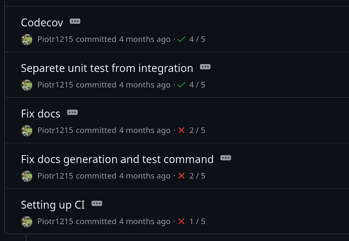
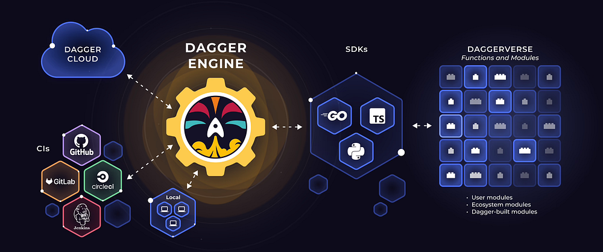
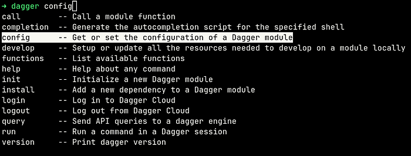
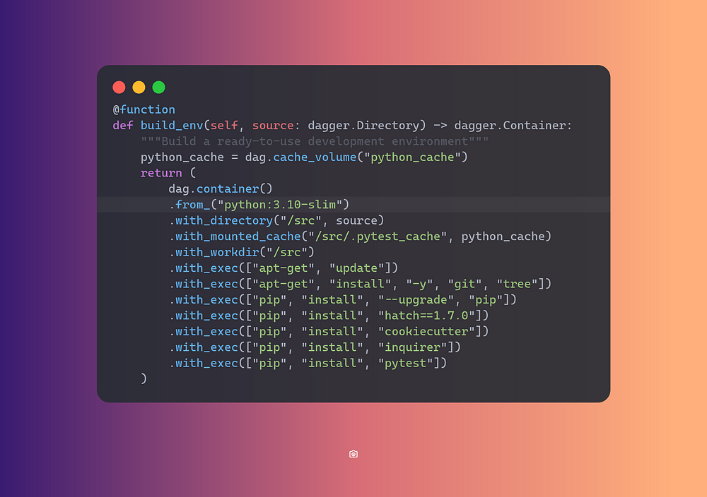
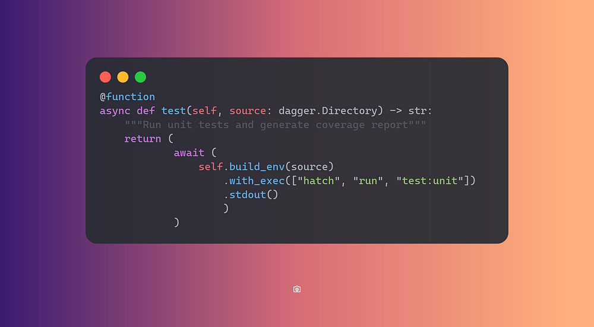
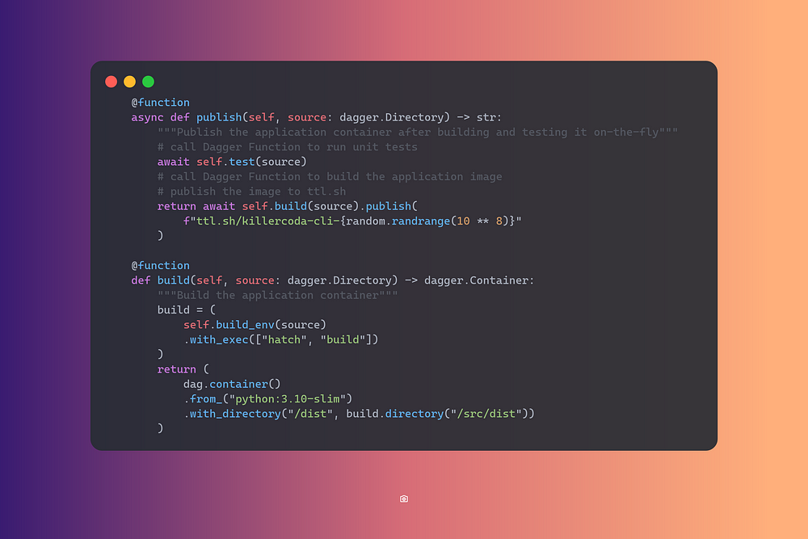
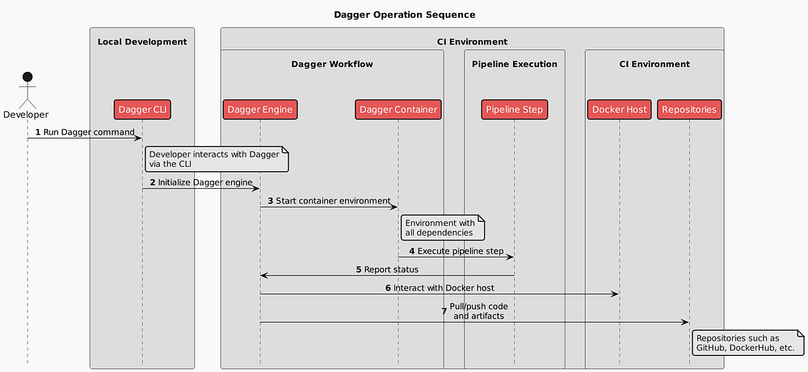

# Why is Building Pipelines Different from Software Development?

## It Doesn’t Have to Be\! Simplify Your CI/CD Workflow with Dagger

# Introduction

CI/CD pipelines are essential for automating the process of software
integration and deployment, ensuring that code changes are automatically
tested, integrated, and deployed to production with minimal manual
intervention or ideally in a fully automated way.

However, building and managing pipelines is not easy. In this blog, we
will look into addressing some of the most common pinpoints of pipelines
development and see how to improve.

This content will be valuable for Developers, Architects, DevOps
Specialists, or anyone curious about how to improve building and
maintaining CI/CD pipelines.

## Challenges of building and running a CI/CD pipeline

The main challenge comes from the fact that CI/CD pipelines development
and lifecycle management is treated differently from software
development practices.

Nowadays, pipelines are mostly written in YAML. Large configuration
files instruct pipeline runners hosted on services like GitLab or GitHub
how to interpret a pipeline workflow file and what actions should
happen.

> 👉 [Read more about YAML file structure using Azure DevOps as an
> example.](https://medium.com/itnext/azure-explained-deep-enough-azure-devops-210629b5480e)

Individual actions are wrapped with YAML tasks or steps which are in
turn often bash scripts executed in the runner’s environment. Here is an
example build job with multiple steps. Actions are used to call
specialized steps and by default, the runner will execute commands
provided in the `run` block.

```bash
  build:
    runs-on: ubuntu-22.04
    steps:
      - name: Checkout
        uses: actions/checkout@v4

      - name: Setup Python
        uses: actions/setup-python@v5
        with:
          python-version: ${{ env.PYTHON_VERSION }}

      - name: Setup Hatch
        run: pipx install hatch==1.7.0

      - name: Set Default PyPI Project Version
        if: env.PYPI_VERSION == ''
        run: echo "PYPI_VERSION=v0.0.0+$(date -d@$(git show -s --format=%ct) +%Y%m%d%H%M%S)-$(git rev-parse --short=12 HEAD)" >> $GITHUB_ENV

      - name: Set PyPI Project Version
        run: hatch version ${{ env.PYPI_VERSION }}

      - name: Build Sdist and Wheel
        run: hatch build

      - name: Upload Sdist and Wheel to GitHub
        uses: actions/upload-artifact@v4
        with:
          name: dist
          path: "dist/*"
          if-no-files-found: error
          retention-days: 1
```

The main issue is that the commands can be executed locally, however
there is no guarantee that the same commands will execute in the same
way in the runner’s environment.

> In other words, we cannot guarantee fully **reproducibility** of the
> pipeline.

Since reproducibility does not work, testing happens in the runner’s
environment. The only way to debug the workflow is to add print
statements or log to a file and dig in the runner’s log file to see what
went wrong (spoiler alert, most of the time it’s missing comma or
something equally trivial).

This typically results in commit history like this where pipeline
doesn’t work but the only way to be sure it will work is to let it run
and check errors.



## What if pipelines could be… just code

Good news is that they can\! Pipelines can be just code working in a
standardized way, who knows maybe even using `docker` under the hood,
but more on that later.

Why would we want pipelines to be written in a programming language?

- creating and running tests with _actual_ testing
  frameworks
- locally debugging and testing each pipeline
  step
- pipeline code versioning and releases
- linting and code support (including various
  copilots) inside and IDE or text editor
- using all the more programming languages facilities;
  async calls, functions, data structures, and more

## What’s the deal with docker

I mention earlier that having `docker` could be nice. This is because
when running pipelines we are bound to the proprietary runners offered
to us by 3rd party vendors such as GitHub, GitLab, but also tools like
Jenkins mandate their own syntax and integration points.

Wouldn’t it be cool if we could run the whole pipeline **anywhere** with
reproducibility guarantees? For this to happen we need a standard way of
executing pipeline jobs and steps/tasks. Here is where `docker` comes
in.

Instead of running **all** pipeline steps in a proprietary runner
format, we just need to run **one** step to hook into the runner’s
execution environment and let the containerized environment do the rest.

## What is dagger and how it can help

Sadly, [dagger](https://dagger.io/) has nothing to do with beautiful
blades but more do to with
[DAG](https://en.wikipedia.org/wiki/Directed_acyclic_graph) (Directed
acyclic graph).

So less of a:


on
[Unsplash](https://unsplash.com/?utm_source=medium&utm_medium=referral)](_media/image5.jpg)

And more like:



> Transform your Messy CI Scripts into **Clean Code**
>
> Powerful, programmable **open source** CI/CD engine that runs your
> pipelines in containers — pre-push on your local machine and/or
> post-push in CI

# Let’s convert a pipeline

We are going to convert an actual python pipeline of one of my projects
[killercoda-cli](https://github.com/Piotr1215/killercoda-cli) which is a
simple Python CLI helping with writing killercoda.com scenarios. The
goal is to convert just the right amount of steps and introduce dagger
gradually to the project.

The pipeline builds the CLI, runs tests and enables manual push to PyPi
registry.

https://github.com/Piotr1215/killercoda-cli/blob/main/.github/workflows/ci.yml

## First things first; prerequisites

Before we start, we need to [install dagger
CLI](https://docs.dagger.io/quickstart/cli) and
[docker](https://www.docker.com/get-started/) (podman and nerdctl would
work too).

I’m using Linux, so `curl` will do just fine (with modified path to save
the binary to):

```bash
curl -L https://dl.dagger.io/dagger/install.sh | BIN_DIR=/usr/local/bin sh
```

The installation script instructs me how to add completion; executing

```bash
dagger completion zsh > /usr/local/share/zsh/site-functions/_dagger
```

and after reloading `zshrc` tab completion works just fine:



## Adding dagger to the project

Running `dagger init --sdk=python` pulled dagger image, created a
_dagger_ directory and _dagger.json_ file.

```bash
dagger
├── pyproject.toml
├── requirements.lock
├── sdk
│   ├── codegen
│   │   ├── pyproject.toml
│   │   ├── requirements.lock
│   │   └── src
│   │       └── codegen
│   │           ├── cli.py
│   │           ├── generator.py
│   │           ├── __init__.py
│   │           └── __main__.py
│   ├── LICENSE
│   ├── pyproject.toml
│   ├── README.md
│   └── src
│       └── dagger
│           ├── client
│           │   ├── base.py
│           │   ├── _core.py
│           │   ├── gen.py
│           │   ├── _guards.py
│           │   ├── __init__.py
│           │   └── _session.py
│           ├── _config.py
│           ├── _connection.py
│           ├── _engine
│           │   ├── conn.py
│           │   ├── download.py
│           │   ├── __init__.py
│           │   ├── progress.py
│           │   ├── session.py
│           │   └── _version.py
│           ├── _exceptions.py
│           ├── __init__.py
│           ├── log.py
│           ├── _managers.py
│           ├── mod
│           │   ├── _arguments.py
│           │   ├── cli.py
│           │   ├── _converter.py
│           │   ├── _exceptions.py
│           │   ├── __init__.py
│           │   ├── _module.py
│           │   ├── _resolver.py
│           │   ├── _types.py
│           │   └── _utils.py
│           ├── py.typed
│           └── telemetry
│               ├── attributes.py
│               └── __init__.py
└── src
    └── main
        └── __init__.py

12 directories, 42 files
```

```bash
{
  "name": "killercoda-cli",
  "sdk": "python",
  "source": "dagger",
  "engineVersion": "v0.11.7"
}
```

## Build Environment Container

Let’s add a function to the `src->main->__init__.py` to create a
development environment to build and test our project.



This function builds an environment with all the dependencies required
by my application.

We can run it `dagger call build-env — source=.` and build an image.

> 💡Notice the kebab-case naming convention in the CLI, `build_env`
> becomes `build-env`

Earlier, we discussed local **debugging** and **testing**. Well, this is
a container, so we should be able to drop into it with a shell\!

```bash
➜ dagger call build-env --source=. terminal --cmd=bash
root@grt1fshu1uc6c:/src# ls -lah
total 2.1M
drwxr-xr-x 14 root root 4.0K Jun 13 16:21 .
drwxr-xr-x  1 root root 4.0K Jun 13 16:23 ..
-rw-rw-r--  2 root root 1.3M May 26 20:39 .aider.chat.history.md
-rw-rw-r--  2 root root  23K May 26 20:39 .aider.input.history
drwxr-xr-x  2 root root 4.0K May 26 20:39 .aider.tags.cache.v3
-rw-r--r--  2 root root  52K Jun 13 14:00 .coverage
-rw-rw-r--  2 root root  116 Feb 10 19:36 .coveragerc
drwxrwxr-x  9 root root 4.0K Jun 13 16:21 .git
drwxrwxr-x  3 root root 4.0K Feb 10 11:44 .github
-rw-rw-r--  2 root root 3.4K Feb 10 11:34 .gitignore
drwxr-xr-x  6 root root 4.0K Jun 13 12:55 .pytest_cache
drwxrwxr-x  4 root root 4.0K Jun 13 13:58 .venv-test
-rw-rw-r--  2 root root 1.1K Feb 10 11:39 LICENSE.txt
-rw-rw-r--  2 root root 5.4K Jun 13 16:17 README.md
drwx------  2 root root 4.0K Jun 13 14:51 _media
drwxrwxr-x  2 root root 4.0K May 31 11:38 assets
-rw-rw-r--  2 root root    0 Jun 13 14:44 costam.log
-rw-rw-r--  2 root root 6.4K May 26 14:42 coverage.xml
drwxr-xr-x  4 root root 4.0K Jun 13 14:45 dagger
-rw-r--r--  2 root root  102 Jun 13 12:40 dagger.json
drwxrwxr-x  2 root root 4.0K Feb 10 20:21 dist
drwxrwxr-x  3 root root 4.0K May 31 11:32 killercoda_cli
-rw-rw-r--  2 root root 686K Jun 13 14:47 output.txt
-rw-rw-r--  2 root root 2.5K Jun 13 14:15 pyproject.toml
drwxrwxr-x  2 root root 4.0K May 31 11:08 temp_template
drwxrwxr-x  4 root root 4.0K Jun 13 14:03 tests
root@grt1fshu1uc6c:/src#
```

Being able to locally check the container is a game changer. Remember,
the same will run on a remote runner VM.

## Running Tests

One more function for running tests, notice how we execute the
`build_environment` function before running tests.



```bash
➜ dagger call test --source=.
Current directory: /tmp/test_generate_assets/killercoda-assets
Source directory: /tmp/test_generate_assets/killercoda-assets
Generating assets from template: https://github.com/Piotr1215/cookiecutter-killercoda-assets
Output directory: /tmp/test_generate_assets
Assets generated successfully.
```

Tests pass however outpout is a bit sparse, earlier we have setup tab
completion, let’s see if there are any flags that can help us `dagger
call test — source=. <TAB>`

```bash
➜ dagger call test --source=. --debug
--debug     -- show debug logs and full verbosity
--json      -- Present result as JSON
--mod       -- Path to dagger.json config file for the module or a directory containing that file. Either local path (e.g. "/path/to/some/dir") or a github repo (e.g. "github.com/dagger/dagger/path/to/some/subdir")
--output    -- Path in the host to save the result to
--progress  -- progress output format (auto, plain, tty)
--silent    -- disable terminal UI and progress output
--verbose   -- increase verbosity (use -vv or -vvv for more)
```

The debug option gives us full run logs with max verbosity, great\!

## Build & Publish

The last two functions are `publish` and `build`. Publish is going to
use the awesome [ttl.sh](http://ttl.sh/) service, which allows for
publishing short-lived images (max 24h) and is great for testing. Build
will perform a multistaged build and get our application ready for
deployment.



```bash
➜ dagger call publish --source=.
ttl.sh/killercoda-cli-15186746@sha256:6d2e22543154fff996e3d829450953981c60aba6f161477e5aa3e00d3faaa2cb
```

## Integrate with GitHub Actions

The [integration with GitHub
Actions](https://github.com/marketplace/actions/dagger-for-github) is
easy, just add the action to YAML workflow and call any dagger function

```bash
- name: Hello
  uses: dagger/dagger-for-github@v5
  with:
    verb: call
    args: call publish --source=.
```

# Closing Thoughts

Integrating dagger into my GitHub Actions workflow wasn’t super easy,
but it was way easier than dealing with pure YAML. The ability to
**adapt** only parts of the workflow is great, no need for
all-or-nothing rewrites; small, incremental steps are just fine.

From a high level, the below diagram shows working with dagger locally
and in a remote environment.



A bit win, in my opinion, is that if tomorrow I will decide to move to
GitLab, I can do it much easier. Instead of migrating the whole
pipeline, I keep it as is and migrate only the **entry-point**.

With the right amount of abstractions and clever reuse of the docker
engine, dagger is a very strong choice for any pipeline. The community
can collaborate on functions and capture best practices, which are
available on [**daggerverse**](https://daggerverse.dev/).

Give dagger a try and let me know what are your experiences.

Thanks for taking the time to read this post. I hope you found it
interesting and informative.

🔗 **Connect with me on**
[**LinkedIn**](https://www.linkedin.com/in/piotr-zaniewski/)

🌐 **Visit my** [**Website**](https://cloudrumble.net/)

📺 **Subscribe to my** [**YouTube
Channel**](https://www.youtube.com/@cloud-native-corner)
