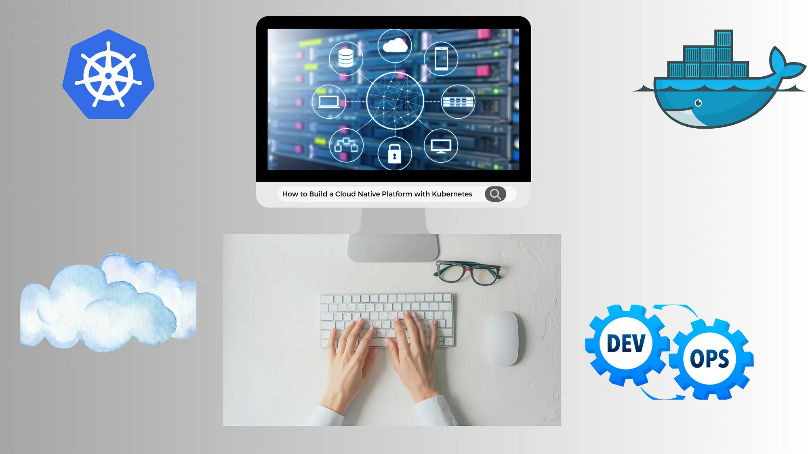
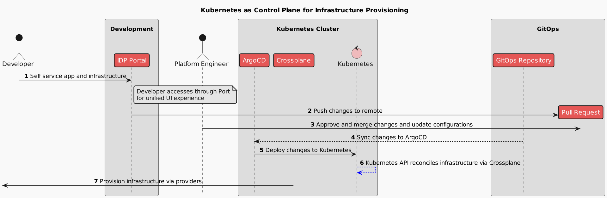

import Gist from 'react-gist';
import ReactPlayer from 'react-player';

# How to Build Cloud Native Platforms with Kubernetes

### Developer Portals, GitOps, Best Practices

## Introduction

Platform Engineering focuses on empowering developers and organizations by creating and maintaining internal software products known as platforms. In this blog, we will explore what platforms are, why they are important, and uncover best practices for creating and maintaining well-architected platforms.

This content will be valuable for Platform Engineers, Architects, DevOps Specialists, or anyone curious about how platforms can drive innovation and efficiency in development.

### Understanding Platform Categories: Mapping the Terrain

Similar to DevOps, Platform Engineering struggles to define a platform concisely. A good way to understand what a platform is, is to list various kinds of platforms and their characteristics.

*Platform Types*

* **Business as a Platform:**
Consider Uber, the entire product is a platform that connects users and drivers. This platform creates an ecosystem where businesses operate, users engage, and interactions happen seamlessly.

* **Domain-Specific Platforms:**
These platforms provide cross-cutting functionality for other applications. An example could be a geolocation API that is consumed by web frontend, mobile app and other services.

* **Domain-Agnostic Platforms:**
These platforms serve as foundational building blocks for developers, offering essential tools like database management, cloud storage, and user authentication. Cloud platforms like AWS or Azure provide the infrastructure and services that countless digital products rely on and are a good mental model to have when designing our own cloud native platform.

The platform landscape is vast and varied. From business-centric models to specialized domain platforms and versatile tools for developers, each plays a pivotal role in the digital ecosystem.

In this blog, we will focus on **domain-agnostic platforms** providing infrastructure.

### The Case for Cloud-Native Platforms
> # Cloud-native is about how applications are created and deployed, not where. — Priyanka Sharma

Cloud-native platforms provide a foundation that allows applications to be designed with flexibility, largely making them environment agnostic. A well-architected platform offers several key benefits:

* **Simplified infrastructure management:**
Infrastructure provisioning and management are abstracted in a way that enables developers to move faster without compromising security and compliance requirements.

* **Increased development efficiency:**
A well-designed platform should increase developers productivity, improving metrics like lowering **time to first commit**, improving the **incidents-to-resolution** or reducing **time to onboard** new developers.

* **Built-in scalability and reliability:
**A successful platform brings to the table elements that are not part of core development efforts, but are crucial for product success. Those are: observability, scalability, automated rollbacks, integrated authentication and more.

*Building Blocks of Cloud-Native Platforms*

### Self-service portal

A self-service portal is a user-friendly interface that allows users to access and manage resources independently, empowering developers and users to create, configure, and deploy resources without IT support. This streamlines workflows, accelerates project timelines, and enhances productivity.

Examples like [Backstage](https://backstage.io/), developed by Spotify, and [Port](https://getport.io/) provide customizable interfaces for managing developer tools and services, ensuring efficient and consistent interactions. These portals embody the essence of self-service, enabling quick, autonomous actions that reduce bottlenecks and foster agility in development processes.

### Programmatic APIs

Programmatic APIs are the backbone of cloud-native platforms, enabling seamless interaction with platform services and functionalities. These APIs allow developers to automate tasks, integrate different services, and build complex workflows, enhancing efficiency and consistency across environments.

APIs provide programmatic access to essential platform features, allowing developers to automate repetitive tasks and streamline operations. They support various transport mechanisms such as [REST](https://restfulapi.net/), [HTTP](https://developer.mozilla.org/en-US/docs/Web/HTTP), and [gRPC](https://grpc.io/), offering flexibility in how services communicate. For instance, API based on [Kubernetes Resource Model](https://cloud.google.com/blog/topics/developers-practitioners/build-platform-krm-part-2-how-kubernetes-resource-model-works) enables developers to manage containerized applications, while [AWS SDKs](https://aws.amazon.com/tools/) facilitate interactions with a wide range of cloud resources. By leveraging programmatic APIs, platforms ensure that developers can efficiently build, deploy, and manage applications, driving productivity and innovation.

### Automated Workflows

Automated workflows are crucial for provisioning and deployment processes in cloud-native platforms. They ensure tasks are executed consistently and efficiently, minimizing human error and enhancing productivity.

Key to these workflows are CI/CD pipelines, which automate the build, test, and deployment stages of application development. Tools like [Argo CD](https://argoproj.github.io/cd/) and [Flux](https://fluxcd.io/) enable [GitOps](https://opengitops.dev/) practices, where infrastructure and application updates are managed through Git repositories. By leveraging automated workflows, platforms can ensure rapid, reliable deployments, maintain consistency across environments, and accelerate the overall development process.

### Monitoring and Observability

Monitoring and observability tools provide crucial insights into the performance and health of cloud-native platforms. These tools help detect issues early, understand system behavior, and ensure applications run smoothly.

Prominent tools include [Prometheus](https://prometheus.io/) for collecting and querying metrics, [Grafana](https://grafana.com/) for visualizing data and creating dashboards, and [OpenTelemetry](https://opentelemetry.io/) for tracing and observability. Together, they enable proactive management of resources, quick resolution of issues, and comprehensive visibility into system performance. By integrating these tools, platforms can maintain high availability and performance, ensuring a seamless user experience.

### Security and Governance Controls

Integrated security and governance controls are vital for maintaining compliance and protecting sensitive data in cloud-native platforms. These controls ensure that platform operations adhere to security policies and regulatory requirements.

Tools like [OPA GateKeeper](https://github.com/open-policy-agent/gatekeeper), [Kyverno](https://kyverno.io/), and [Falco](https://falco.org/) play a crucial role in enforcing security policies, managing configurations, and detecting anomalies. OPA GateKeeper and Kyverno help in policy enforcement and compliance, while Falco specializes in runtime security and intrusion detection. By incorporating these tools, platforms can ensure robust security, maintain compliance, and mitigate risks effectively.

### Ever Evolving
> # The only constant in technology is change. — Marc Benioff

Developer platforms are constantly evolving to meet the changing needs of developers and users alike. This continuous evolution ensures that platforms remain relevant, efficient, and capable of supporting the latest innovations and best practices. By staying adaptable and forward-thinking, platforms can provide the tools and features necessary to drive ongoing success and innovation.

## Embracing Kubernetes Resource Model APIs
> *Application Programming **Interface**, is a set of rules and protocols for building and **interacting** with software.*

The Kubernetes Resource Model API is the industry standard for managing resources in a cloud-native environment. Kubernetes acts as a universal control plane, continuously reconciling the desired state with the actual state of the system. Standardizing on this model offers several key benefits:

1. **Industry-Wide Standardization:** Kubernetes has become the de facto standard for cloud-native infrastructure management. Its API-driven approach is widely adopted, ensuring compatibility and ease of integration with various tools and services.

1. **Universal Control Plane:** Kubernetes serves as a universal control plane, providing a centralized management interface for infrastructure and applications. This centralization simplifies operations and enforces consistency across environments.

1. **Continuous Reconciliation:** The Kubernetes API supports declarative management, where the desired state of resources is defined, and Kubernetes continuously reconciles this state. This automated reconciliation reduces manual intervention and ensures system reliability.

1. **Separation of Concerns:** Platform engineers can configure infrastructure and policies, while developers interact with higher-level APIs. This separation enhances automation and self-service capabilities, empowering developers without compromising security or compliance.

1. **Scalability and Extensibility:** Supporting transport mechanisms like REST, HTTP, and gRPC, the Kubernetes API is adaptable and scalable. It integrates seamlessly with a wide range of tools, facilitating the growth and evolution of the platform.

By leveraging Kubernetes Resource Model APIs, organizations can build robust, scalable, and efficient platforms that meet the dynamic needs of modern development environments​.

### Platform as a Product: A New Perspective

Adopting a product approach to platform engineering is crucial for creating successful internal platforms. This means focusing on delivering continuous value to users — developers and the organization. It involves understanding user needs, designing and testing solutions, implementing them, and gathering feedback for continuous improvement.

Cloud hyperscalers like AWS, Google Cloud, and Microsoft Azure exemplify this approach. They have built user-centric platforms that are constantly updated with new features, driven by user feedback and accessible via standardized APIs. This ensures they remain relevant and valuable.

For internal platforms, roles such as **product owners** and **project managers** are essential. They help ensure the platform evolves in response to developer needs, maintaining usability and effectiveness. By treating your internal platform as a product, you create a sustainable resource tailored to your organization’s unique needs.

*Platform as a Product*

### Delivering Value Through Cloud-Native Platforms

<ReactPlayer 
  playing={false} 
  controls 
  url='https://youtu.be/l3JWYaTaEQY' 
  style={{ maxWidth: '100%', margin: '0 auto' }} 
  width="100%" 
  height="400px"
/>

In our demo video, we showcase how to build a platform that embodies key cloud-native principles. This practical example demonstrates the immense value that a well-architected cloud-native platform can deliver. Here’s a brief overview of what you can expect:

* **Empowering Developers:** See how the platform provides developers with the tools and autonomy they need to innovate and deliver faster.

* **Cloud-Native Principles:** Watch as we leverage containerization, microservices, and other cloud-native practices to build a robust, scalable platform.

* **API-Driven Approach:** Discover how using programmatic APIs streamlines operations, enhances automation, and ensures seamless integration between services.

* **GitOps Workflow:** Learn how the platform employs GitOps practices to manage infrastructure as code, enabling more efficient and reliable deployments.

Watch the video to see these principles in action and understand how they come together to create a powerful, developer-centric platform.

### Essential Tools

In the demo, you can see a range of tools that form the backbone of cloud-native platforms, each serving a critical role. From Kubernetes as the control plane orchestrator to GitHub for managing API calls via pull requests, these tools collectively ensure efficient, scalable, and secure infrastructure management.

<Gist id="14c26346edbca950f7076d1a4a14f261" />

### Recap: Platform Components in Action

Let’s recap what we’ve learned about using Kubernetes as a control plane for infrastructure provisioning:

1. **Self-Service Portal:** The Developer accesses the IDP Portal for a unified UI experience to manage applications and infrastructure.

1. **Push Changes:** The Developer pushes changes to the GitOps Repository via a pull request.

1. **Approval and Merge:** The Platform Engineer reviews, approves, and merges the pull request, updating configurations.

1. **Sync Changes:** The GitOps Repository syncs the changes to ArgoCD.

1. **Deploy Changes:** ArgoCD deploys the changes to the Kubernetes API.

1. **Reconcile Infrastructure:** The Kubernetes API reconciles the infrastructure via Crossplane.

1. **Provision Infrastructure:** Crossplane provisions the infrastructure via various providers.

This sequence ensures a streamlined, automated process for managing and provisioning infrastructure using Kubernetes and GitOps principles.

## Closing Thoughts

Cloud-native platforms are revolutionizing how we develop and manage applications by providing robust, scalable, and secure environments. They empower developers with self-service portals, streamline operations with programmatic APIs, and ensure reliability through automated workflows and comprehensive monitoring tools. By embracing these platforms, organizations can accelerate innovation, enhance productivity, and maintain high standards of security and compliance.

Treating platforms as products ensures continuous improvement and alignment with user needs, making them indispensable tools in today’s fast-paced tech landscape. Whether you’re a Platform Engineer, Architect, or DevOps Specialist, leveraging cloud-native platforms can drive significant value, fostering a culture of efficiency and agility. Stay ahead of the curve, explore the potential of cloud-native platforms, and watch your organization thrive.

Thanks for taking the time to read this post. I hope you found it interesting and informative.

🔗 **Connect with me on [LinkedIn](https://www.linkedin.com/in/piotr-zaniewski/)**

🌐 **Visit my [Website](https://cloudrumble.net/)**

📺 **Subscribe to my [YouTube Channel](https://www.youtube.com/@cloud-native-corner)**
