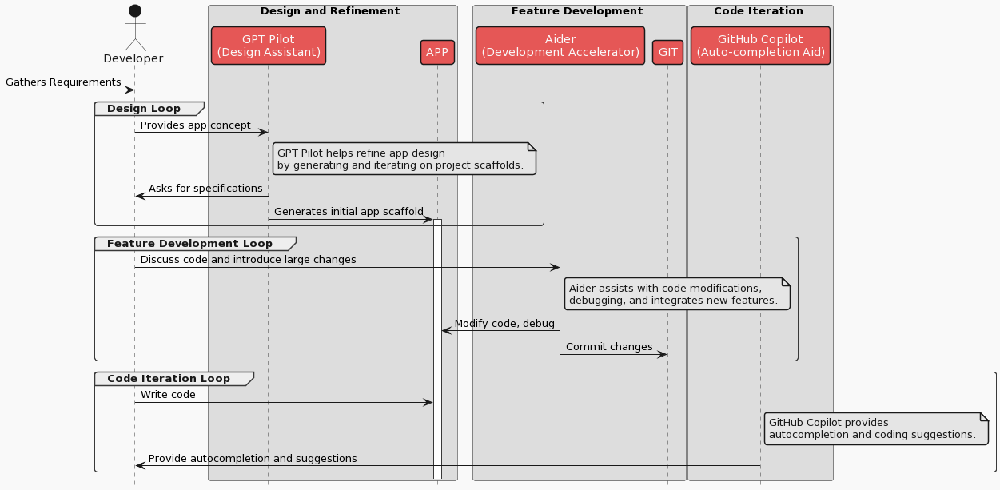
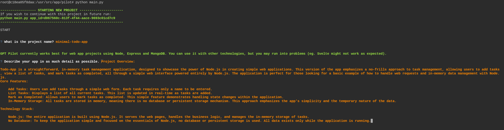
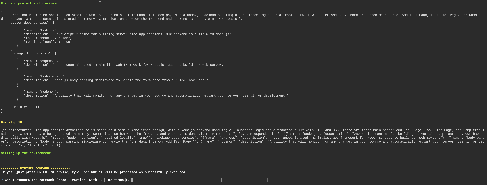
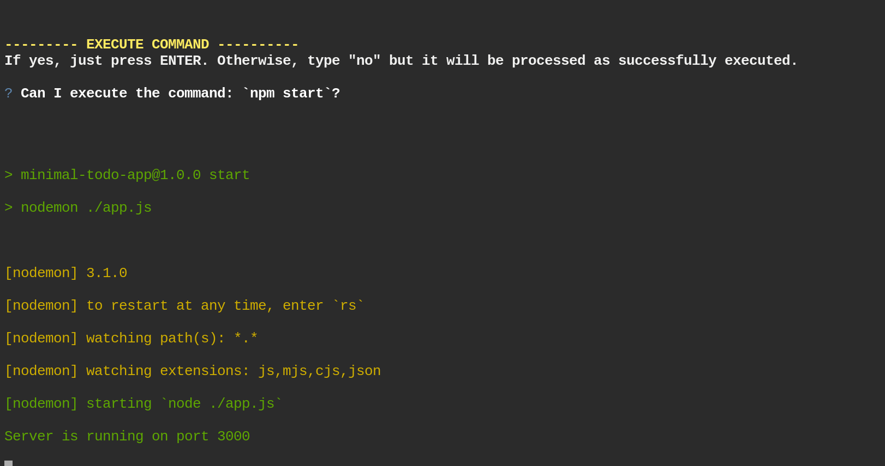
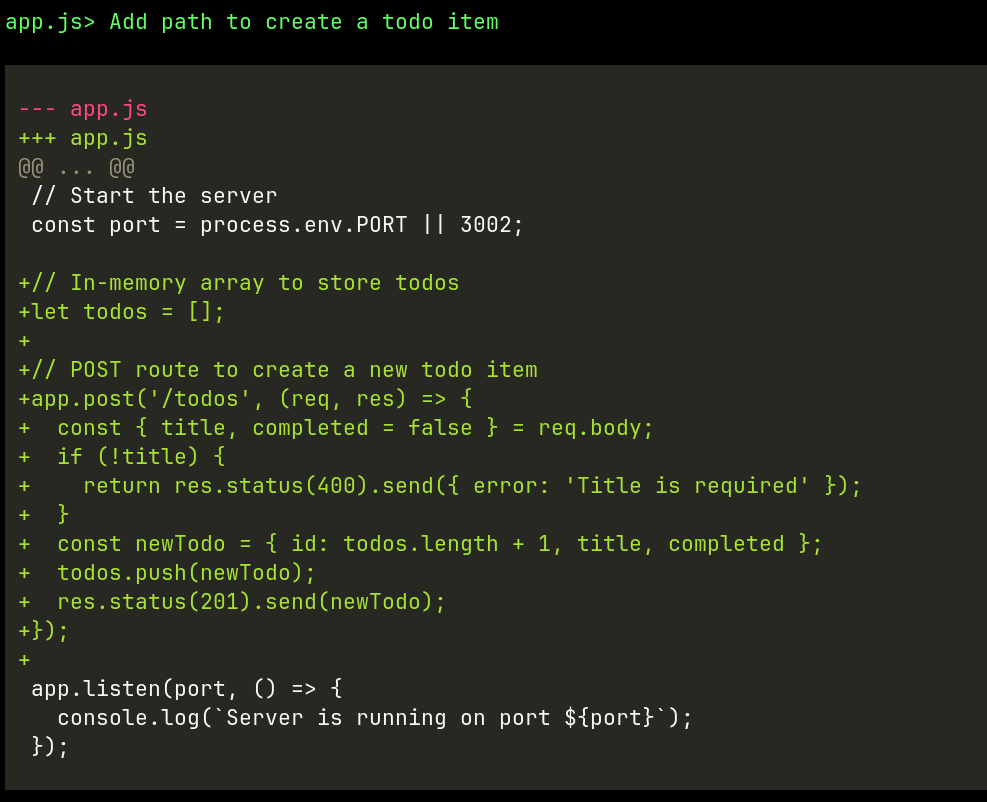
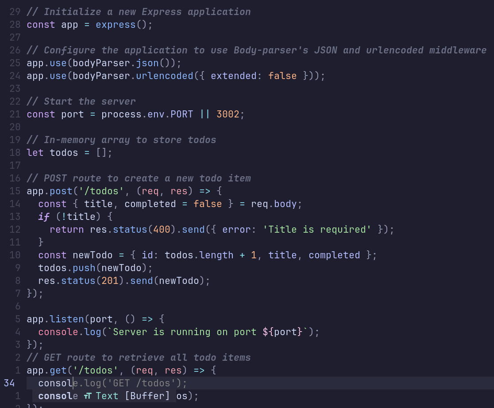
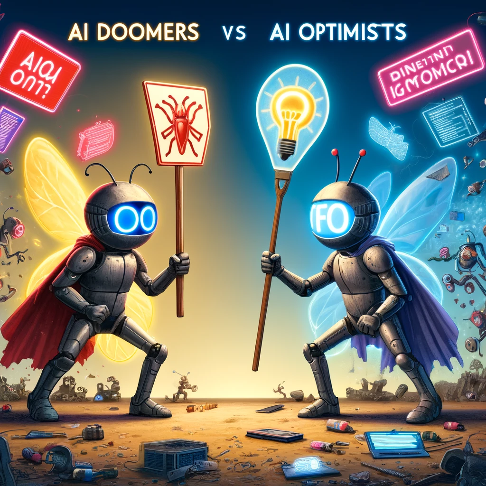

# Development with AI: the GAG Stack


## Introduction

Are developers going to be replaced by AI? What is the future of software development? Those questions are asked again and again as the
software development landscape is evolving rapidly.

Viewpoints are polarized and generate heated debates and discussions. There is enough debate to fill a book, but in this article, I would
like to explore practical applications of AI in software development. We are operating under the assumption that **AI is here to stay** and
evolve, but at the end of the day, it is a tool that can be used to **enhance our capabilities**.

## The GAG Stack

The GAG Stack is a bit of a tongue-in-cheek term that I came up with to describe a workflow that I have been experimenting with. It stands
for **GPT Pilot**, **Aider**, and **GitHub Copilot**. These are three AI tools that exemplify well the stages of software development.

Communication and collaboration between people is at the heart of software development. For as long as this stays the case, AI tools will be
used to help us model this process. This is how it could look like using the GAG Stack:



We will still have to gather requiremetns, design, refine, test, retest, fix bugs, debug and deploy. The paradigm doesn't change much, the
tools however do. The tools evolved to help us with the process.

## Example Workflow

Let's take a look at how the GAG Stack could be used in practice. We will use a simple example of building a to-do list app.

### Setup the environment

I'm using neovim and linux for my development workflow, yours might be different. Refer to the installation instructions for all the tools
to setup on your machine.

For me the `gtp-pilot` runs via `docker-compose`, `aider` is installed via `pip` and `GitHub Copilot` as a neovim plugin.

### Design and Refinement

We start by gathering requirements for our to-do list app. We want to have a simple app that allows us to add, remove and edit tasks. Let's
start by providing this concept to GPT Pilot.

The Docker image has only node installed, so we are going to use it. It should be simple to add new tools to the image or use local setup.
Here is initial prompt for a simple todo app:



The main value of this tool is the ability to refine and iterate on the desing. GPT Pilot will ask for specifications and generate an
initial scaffolding:



As a result of this back and forth, GTP Pilot generated app in a local folder (mounted via volume in docker-compose):

```bash
~/gpt-pilot-workspace/minimal-todo-app🔒 [ v16.15.1]
➜ tree -L 3 -I node_modules
.
├── app.js
├── package.json
└── package-lock.json

0 directories, 3 files
```

After a few iterations, we have a simple app running:


with the following code:

```node
// Require Express and Body-parser modules
const express = require("express");
const bodyParser = require("body-parser");

// Initialize a new Express application
const app = express();

// Configure the application to use Body-parser's JSON and urlencoded middleware
app.use(bodyParser.json());
app.use(bodyParser.urlencoded({ extended: false }));

// Start the server
const port = process.env.PORT || 3002;

app.listen(port, () => {
  console.log(`Server is running on port ${port}`);
});
```

### Feature development

Now we can use Aider to help us with the development of the app. Aider is a development accelerator that can help with code modifications
and features development.

Aider interface:

```bash
➜ aider
Aider v0.27.0
Model: gpt-4-1106-preview using udiff edit format
Git repo: .git with 4 files
Repo-map: using 1024 tokens
Use /help to see in-chat commands, run with --help to see cmd line args
```

Now we can generate feature for adding a new TODO item:



We can keep iterating by adding new features and testing. For example:


### Code Iteration

Finally, we can use GitHub Copilot to help us with the code iteration. GitHub Copilot is an autocompletion aid that can provide suggestions.

For example, here I want to log the GET request to the console, so I start typing:



And get autocomplete suggestions:

## Conclusion

Obviously, the GAG stack is not the only set of tools, and the ones I've chosen might or might not have something to do with the resulting
acronym. There is Devin, an open-source equivalent, Devina, that claims to be `the first AI software engineer`. There is `Codeium`, a free
`Copilot` alternative. There are many other tools in this category, and the landscape is evolving rapidly.

Keen readers might have noticed that the underlying models used are OpenAI's GPT-3 and GPT-4. However, this is not a requirement. The tools
can work with both local and remote models, paid and free. The choice of the model is up to the user.

So, are developers going to be replaced by AI? Are doomers or accelerationists right?



I think the answer is more nuanced. AI tools are here
to stay, and they will be used to enhance our capabilities. The GAG stack is just one example of how AI can be utilized to assist us with
software development.

As long as software development relies on human communication and creative collaboration, we will be talking about
augmenting software development with AI rather than replacing it.
