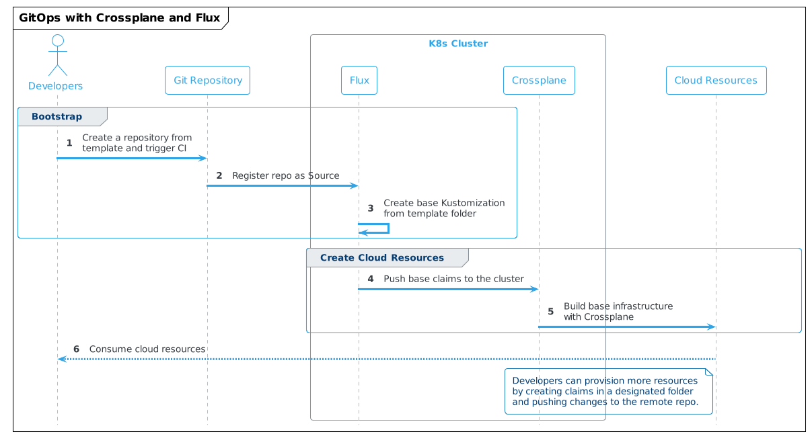
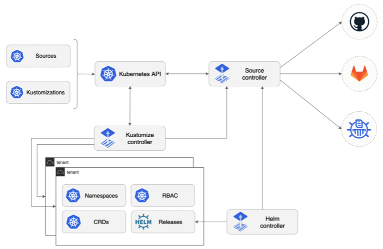
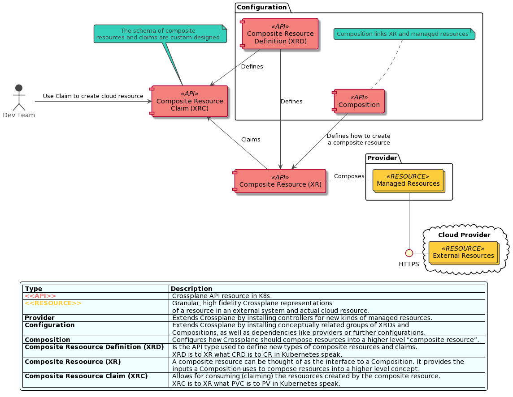
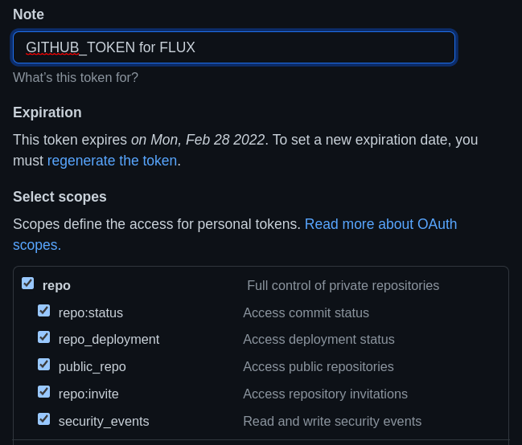
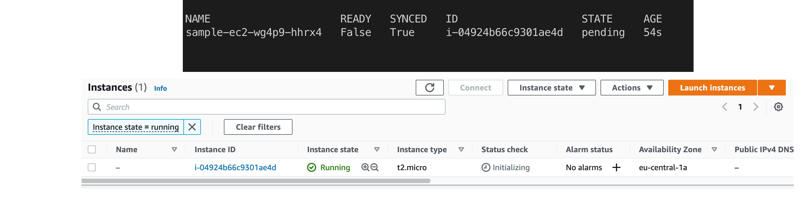
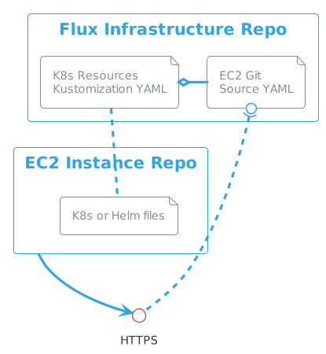

# GitOpsify Cloud Infrastructure with Crossplane and Flux

In this article we are going to learn how to automate the provisioning of cloud resources via Crossplane and combine it with GitOps practices.

You will most benefit from this blog if you are a Platform or DevOps Engineer, Infrastructure Architect or Operations Specialist.

> If you are new to GitOps, read more about it in my blog [GitOps with Kubernetes](https://itnext.io/gitops-with-kubernetes-740f37ea015b)

Let's set the stage by imagining following context. We are working as a part of a Platform Team in a large organization. Our goal is to help Development Teams to onboard get up to speed with using our Cloud Infrastructure. Here are a few base requirements:

- Platform Team doesn't have resources to deal with every request individually, so there must be a very high degree of **automation**
- Company policy is to adopt the **principle of least privilege**. We should expose the cloud resources only when needed with the lowest permissions necessary.
- Developers are not interested in managing cloud, they should only **consume cloud resources** without even needing to login to a cloud console.
- New Teams should get **their own** set of cloud resources when on-boarding to the Platform.
- It should be **easy** to provision new cloud resources on demand.

## Initial Architecture

The requirements lead us to an initial architecture proposal with following high level solution strategy.

- create template repositories for various types of workloads (using [Backstage Software Templates](https://backstage.io/docs/features/software-templates/software-templates-index) would be helpful)
- once a new Team is on boarded and creates first repository from a template, it will trigger a CI pipeline and deploy common infrastructure components by adding the repository as Source to Flux infrastructure repo
- once a Team wants to create more cloud infrastructure, they can place the Crossplane claim YAMLs in the designated folder in their repository
- adjustments to this process are easily implemented using Crossplane Compositions

> In real world scenario we would manage Crossplane also using Flux, but for demo purposes we are focusing only on the application level.

The developer experience should be similar to this:



## Tools and Implementation

Knowing the requirements and initial architecture, we can start selecting the tools. For our example, the tools we will use are [Flux](https://fluxcd.io/) and [Crossplane](https://crossplane.io/).

> We are going to use Flux as a GitOps engine, but the same could be achieved with ArgoCD or Rancher Fleet.

Let's look at the architecture and use cases that both tools support.

### Flux Architecture Overview

Flux exposes several components in the form of Kubernetes CRDs and controllers that help with expressing a workflow with GitOps model.
Short description of 3 major components. All those components have their corresponding CRDs.


source: https://github.com/fluxcd/flux2

1.  [Source Controller](https://fluxcd.io/docs/components/source/)
    Main role is to provide standardized API to manage sources of the Kubernetes deployments; Git and Helm repositories.

        ```yaml
        apiVersion: source.toolkit.fluxcd.io/v1beta1
        kind: GitRepository
        metadata:
          name: podinfo
          namespace: default
        spec:
          interval: 1m
          url: https://github.com/stefanprodan/podinfo
        ```

2.  [Kustomize Controller](https://fluxcd.io/docs/components/kustomize/)
    This is a CD part of the workflow. Where source controllers specify sources for data, this controller specifies what artifacts to run from a repository.

        > This controller can work with kustomization files, but also plain Kubernetes manifests

        ```yaml
        apiVersion: kustomize.toolkit.fluxcd.io/v1beta2
        kind: Kustomization
        metadata:
          name: webapp
          namespace: apps
        spec:
          interval: 5m
          path: "./deploy"
          sourceRef:
            kind: GitRepository
            name: webapp
            namespace: shared
        ```

3.  [Helm Controller](https://fluxcd.io/docs/components/helm/)
    This operator helps managing Helm chart releases containing Kubernetes manifests and deploy them onto a cluster.

        ```yaml
        apiVersion: helm.toolkit.fluxcd.io/v2beta1
        kind: HelmRelease
        metadata:
          name: backend
          namespace: default
        spec:
          interval: 5m
          chart:
            spec:
              chart: podinfo
              version: ">=4.0.0 <5.0.0"
              sourceRef:
                kind: HelmRepository
                name: podinfo
                namespace: default
              interval: 1m
          upgrade:
            remediation:
              remediateLastFailure: true
          test:
            enable: true
          values:
            service:
              grpcService: backend
            resources:
              requests:
                cpu: 100m
                memory: 64Mi
        ```

### Crossplane Architecture Overview

Let’s look how the Crossplane component model looks like. A word of warning, if you are new to Kubernetes this might be overwhelming, but there is value in making an effort to understand it. The below diagram shows the Crossplane component model and its basic interactions.


Source: Author based on Crossplane.io

> Learn more about Crossplane in my blog "[Infrastructure as Code: the next big shift is here](https://itnext.io/infrastructure-as-code-the-next-big-shift-is-here-9215f0bda7ce)"

## Demo

If you want to follow along with the demo, clone [this repository](https://github.com/Piotr1215/crossplane-gitops-model), it contains all the scripts to run the demo code.

### Prerequisites

In this demo, we are going to show how to use Flux and Crossplane to provision an EC2 instance directly from a new GitHub repository.
This simulates a new team on boarding to our Platform.

To follow along, you will need AWS CLI configured on your local machine.

> Once you obtain credentials, configure default profile for AWS CLI following [this tutorial](https://docs.aws.amazon.com/cli/latest/userguide/cli-configure-quickstart.html#cli-configure-quickstart-config).

Locally installed you will need:

- Docker Desktop or other container run time
- WSL2 if using Windows
- kubectl

Run `make` in the root folder of the project, this will:

> If you are running on on Mac, use `make setup_mac` instead of `make`.

- Install [kind](https://kind.sigs.k8s.io/) (Kubernetes IN Docker) if not already installed
- Create kind cluster called crossplane-cluster and swap context to it
- Install crossplane using helm
- Install crossplane CLI if not already installed
- Install flux CLI if not already installed
- Install AWS provider on the cluster
- Create a temporary file with AWS credentials based on default CLI profile
- Create a secret with AWS credentials in crossplane-system namespace
- Configure AWS provider to use the secret for provisioning the infrastructure
- Remove the temporary file with credentials so it's not accidentally checked in the repository

Following tools need to be installed manually

- [GitHub CLI gh](https://github.com/cli/cli#installation)

> IMPORTANT: The demo code will create a small EC2 Instance in eu-centra-1 region. The instance and underlying infrastructure will be removed as part of the demo, but please make sure all the resources were successfully removed and in case of any disruptions in the demo flow, be ready to remove the resources manually.

### Setup Flux Repository

- create a new kind cluster with `make`, this will install Crossplane with AWS provider and configure secret to access selected AWS account
  > Flux CLI was installed as put of the Makefile scrip, but optionally you can configure shell completion for the CLI `. <(flux completion zsh)`
  >
  > Refer to the [Flux documentation](https://fluxcd.io/docs/installation/#install-the-flux-cli) page for more installation options
- create [access token](https://github.com/settings/tokens) in GitHub with full repo permissions.
  
- export variables for your GitHub user and the newly created token
  - `export GITHUB_TOKEN=<token copied form GitHub>`
  - `export GITHUB_USER=<your user name>`
- use flux to bootstrap a new GitHub repository so flux can manage itself and underlying infrastructure
  > Flux will look for GITHUB_USER and GITHUB_TOKEN variables and once found will create a private repository on GitHub where Flux infrastructure will be tracked.

```bash
    flux bootstrap github  \
        --owner=${GITHUB_USER} \
        --repository=flux-infra \
        --path=clusters/crossplane-cluster  \
        --personal
```

### Setup Crossplane EC2 Composition

Now we will install a [Crossplane Composition](https://Crossplane.io/docs/v1.6/concepts/composition.html#configuring-composition) that defines what cloud resources to crate when someone asks for EC2 claim.

- setup Crossplane composition and definition for creating EC2 instances

  - `kubectl crossplane install configuration piotrzan/crossplane-ec2-instance:v1`

- fork repository with the EC2 claims
  - `gh repo fork https://github.com/Piotr1215/crossplane-ec2`
    > answer <kbd>YES</kbd> when prompted whether to clone the repository

### Clone Flux Infra Repository

- clone the flux infra repository created in your personal repos

  `git clone git@github.com:${GITHUB_USER}/flux-infra.git`

  `cd flux-infra`

### Add Source

- add source repository to tell Flux what to observe and synchronize

  > Flux will register this repository and every 30 seconds check for changes.

- execute below command in the flux-infra repository, it will add a Git Source

  ```bash
  flux create source git crossplane-demo \
     --url=https://github.com/${GITHUB_USER}/crossplane-ec2.git \
     --branch=master \
     --interval=30s \
     --export > clusters/crossplane-cluster/demo-source.yaml
  ```

- the previous command created a file in clusters/crossplane-cluster sub folder, commit the file

  - `git add .`
  - `git commit -m "Adding Source Repository"`
  - `git push`

- execute `kubectl get gitrepositories.source.toolkit.fluxcd.io -A` to see active Git Repositories sources in Flux

### Create Flux Kustomization

- setup watch on the AWS managed resources, for now there should be none

  `watch kubectl get managed`

- create Flux Kustomization to watch for specific folder in the repository with the Crossplane EC2 claim

  ```bash
  flux create kustomization crossplane-demo \
    --target-namespace=default \
    --source=crossplane-demo \
    --path="./ec2-claim" \
    --prune=true \
    --interval=1m \
    --export > clusters/crossplane-cluster/crossplane-demo.yaml
  ```

  - `git add .`
  - `git commit -m "Adding EC2 Instance"`
  - `git push`

- after a minute or so you should see a new EC2 Instance being synchronized with Crossplane and resources in AWS



Let's take a step back and make sure we understand all the resources and repositories used.



The first repository we have created is what Flux uses to manage itself on the cluster as well as other repositories.
In order to tell Flux about a repository with Crossplane EC2 claims, we have created a `GitSource` YAML file that points to HTTPS address of the repository with the EC2 claims.

The EC2 claims repository contains a folder where plain Kubernetes manifest files are located. In order to tell Flux what files to observe, we have created a `Kustomization` and linked it with `GitSource` via its name. `Kustomization` points to the folder containing K8s manifests.

### Cleanup

- to cleanup the EC2 Instance and underlying infrastructure, remove the claim-aws.yaml demo from the crossplane-ec2 repository
  - `rm ec2-claim/claim-aws.yaml`
  - `git add .`
  - `git commit -m "EC2 instance removed"`
- after a commit or timer lapse Flux will synchronize and Crossplane will pick up removed artefact and delete cloud resources
  > the ec2-claim folder must be present in the repo after the claim yaml is removed, otherwise Flux cannot reconcile

### Manual Cleanup

> In case you cannot use the repository, it's possible to cleanup the resources by deleting them from flux.

- deleting Flux kustomization `flux delete kustomization crossplane-demo` will remove all the resources from the cluster and AWS
- to cleanup the EC2 Instance and underlying infrastructure, remove the ec2 claim form the cluster `kubectl delete VirtualMachineInstance sample-ec2`

### Cluster Cleanup

- wait until `watch kubectl get managed` output doesn't contain any AWS resources
- delete the cluster with `make cleanup`
- optionally remove the `flux-infra` repository

## Summary

GitOps with Flux or Argo CD and Crossplane offers a very powerful and flexible model for Platform builders.
In this demo, we have focused on applications side with Kubernetes clusters deployed some other way, either with Crossplane or Fleet or Cluster API etc.

What we achieved on top of using Crossplane’s Resource Model is the fact that we do not interact with kubectl directly any longer to manage resources, but ratter delegate this activity to Flux. Crossplane still runs on the cluster and reconciles all resources. In other words, we've moved the API surface from kubectl to Git.
