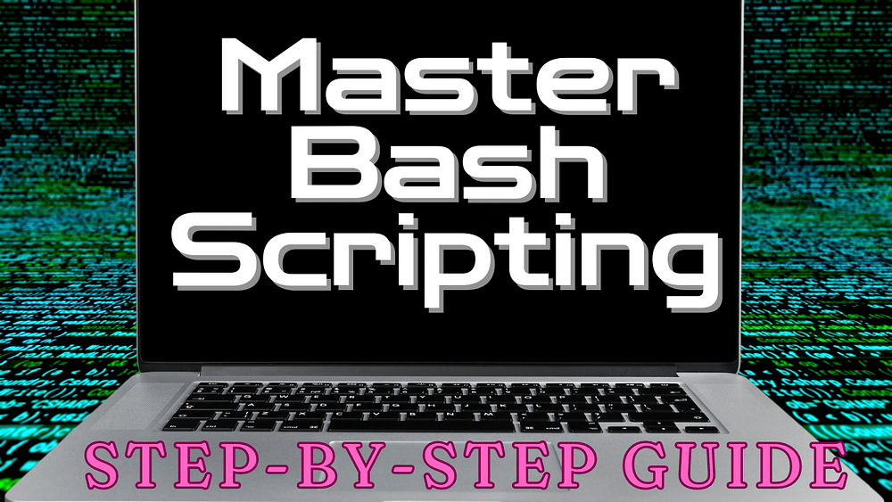

# Automate, Customize, Solve: An Introduction to Bash Scripting

## Bash Scripting 101: Foundational Concepts for Linux and Mac Users

# Introduction

Imagine having a magic wand that could automate repetitive tasks on your
computer, create powerful tools with just a few lines of text, and give
you a deeper understanding of how your system works. That’s what bash
scripting offers to users of Linux and Unix-like systems\!

Bash (which stands for Bourne Again Shell) is both a command-line
interface and a scripting language. As a scripting language, it allows
you to write a series of commands in a file and run them as a program.
This is incredibly powerful for several reasons:

1.  **Automation**: You can automate repetitive tasks,
    saving time and reducing errors.
2.  **Customization**: Create your own command-line
    tools tailored to your specific needs.
3.  **System Understanding**: Writing bash scripts helps
    you understand how your operating system works at a deeper
    level.
4.  **Problem Solving**: Bash scripting enhances your
    ability to solve complex problems using simple commands.

In this guide, I’ll walk you through the essential concepts of bash
scripting. You’ll build a simple script step by step, learning key ideas
along the way. By the end, you’ll have a solid foundation in bash
scripting and be ready to create your own scripts.

Remember, the goal here isn’t to create a specific tool, but to
understand the building blocks of bash scripting. Each concept
introduced will be a stepping stone to more complex and powerful scripts
you might write in the future.

# Getting Started with Basic Script Structure

Now that you understand why bash scripting is valuable, let’s dive into
creating your first script. We’ll start with the most basic structure
and explain each component.

First, open your favorite text editor. This could be something like Nano
or Vim if you’re working directly in the terminal, or a graphical editor
like Visual Studio Code or Sublime Text. Create a new file and name it
`my_first_script.sh`. The `.sh` extension isn’t required, but it’s a
common convention that helps identify bash script files.

Here’s what you should type into your new file:

```bash
#!/usr/bin/env bash
# Set strict mode
set -euo pipefail
# -e: Exit immediately if a command exits with a non-zero status.
# -u: Treat unset variables as an error when substituting.
# -o pipefail: The return value of a pipeline is the status of
#    the last command to exit with a non-zero status, or zero if
#    no command exited with a non-zero status.
```

Let’s break this down line by line:

1.  `#!/usr/bin/env bash` - This is called a “shebang”
    or “hashbang”. It’s always the first line of a bash script. It tells
    the system that this script should be executed by the bash
    interpreter. The `env` part makes the script more portable across
    different systems.
2.  The lines starting with `#` are comments. Bash
    ignores these lines when running the script, but they’re crucial for
    humans reading your code. Always comment your code to explain what
    it does\!
3.  `set -euo pipefail` - This enables strict mode,
    which helps catch errors early and makes your script more
    robust.

Now, let’s make your script executable and run it:

1.  Save your file and exit the text editor.
2.  In the terminal, navigate to the directory where you
    saved your script.
3.  Make the script executable with this command (you
    might need `sudo` depending on your system configuration):

<!-- end list -->

  - `chmod +x my_first_script.sh`

Run your script:

  - `./my_first_script.sh`

Congratulations\! You’ve just written and executed your first bash
script.

In the next sections, we’ll build upon this basic structure, introducing
more bash commands and concepts. Remember, every complex script starts
from these simple beginnings. You’re on your way to mastering bash
scripting\!

# Adding Functions to Our Script

Functions are a fundamental building block in bash scripting. They allow
you to group commands together, give them a name, and reuse them
throughout your script. This makes your code more organized, readable,
and maintainable.

Let’s add a simple function to our script:

```bash
# Function definition
print_header() {
    echo "==== $1 ===="
}
# Functions allow you to group commands and reuse code
```

```bash
# Call the function
print_header "Welcome"
echo "Hello, ${name}! Welcome to our bash script."
```

Here’s what’s happening in this script:

1.  We define a function called `print_header` using the
    syntax `function_name() { commands; }`.
2.  Inside the function, we use `echo` to print a header
    with the argument passed to the function.
3.  We call the function with “Welcome” as the
    argument.

When you run this script, you’ll see a welcome message with a formatted
header.

Functions in bash can do much more than this simple example. They can
take multiple arguments, perform complex operations, and even return
values (though in a different way than other programming languages).

Remember, functions should be defined before they are called in the
script. It’s good practice to define all your functions at the beginning
of your script, after any initial variable declarations.

As you continue to write more complex scripts, you’ll find functions
invaluable for breaking down your code into manageable, reusable pieces.

# Handling Command-Line Arguments and Basic Error Handling

Command-line arguments allow users to pass information to your script
when they run it. This makes your scripts more flexible and interactive.
Let’s modify our script to handle a command-line argument and add some
basic error handling:

```bash
# Assign command line arguments to variables
name="${1:-}"
# We quote variables to prevent word splitting and glob expansion
# ${1:-} means use $1 if set, otherwise use empty string
```

```bash
# Basic error handling
if [[ $# -eq 0 ]]; then
    echo "Error: Name is required."
    echo "Usage: $0 <name>"
    exit 1
fi
# $# is a special variable that holds the number of arguments
# [[ ]] is a bash keyword for conditional expressions, more powerful than single []
# Exit codes: 0 means success, any non-zero value indicates an error
```

Let’s break this down:

1.  `name="${1:-}"` stores the first argument in a
    variable called `name`.
2.  `if [[ $# -eq 0 ]]` checks if the number of
    arguments (`$#`) is equal to zero.
3.  If no argument is provided, we print an error
    message and the correct usage.
4.  `exit 1` terminates the script with a non-zero
    status, indicating an error.

To run this script, you would type:

```bash
./myscript.sh John
```

This script demonstrates basic error handling by checking for the
required argument and exiting with a helpful message if it’s not
provided. As your scripts become more complex, robust error handling
becomes increasingly important for creating user-friendly and reliable
tools.

# Getting User Input and Validation

Interactive scripts often need to get input from users during execution.
Bash provides several ways to do this, with the `read` command being the
most common. Let’s modify our script to ask for user input and add some
basic validation:

```bash
# Input with validation
while true; do
    read -p "How many files do you want to create? (0-5): " num_files
    if [[ "$num_files" =~ ^[0-5]$ ]]; then
        break
    else
        echo "Please enter a number between 0 and 5."
    fi
done
# =~ tests against a regular expression
# This loop continues until valid input is received
```

Let’s break this down:

1.  We use a `while` loop to keep asking for input until
    valid input is received.
2.  The `read` command prompts the user and stores their
    input in the `num_files` variable.
3.  We use a regular expression (`=~`) to check if the
    input is a number between 0 and 5.
4.  If the input is valid, we `break` out of the
    loop.
5.  If the input is invalid, we print an error message
    and the loop continues.

This script demonstrates how to get user input, validate it, and use it
in your script. Input validation is crucial for creating robust,
user-friendly scripts that can handle unexpected input gracefully.

# Using Case Statements for Conditional Logic

Case statements in bash provide a clean and efficient way to handle
multiple conditions for a single variable. They’re especially useful
when you have several possible values to check against. Let’s examine
the case statement from our script:

```bash
# Conditional operators and case statement
case $num_files in
    0)
        echo "No files will be created."
        ;;
    [1-3])
        echo "Creating a few files..."
        ;;
    [4-5])
        echo "Creating many files..."
        ;;
esac
# Case statements are useful for multiple conditions on a single variable
```

Let’s break this down:

1.  The case statement begins with `case $num_files in`.
    This tells bash that we’re checking the value of the `$num_files`
    variable.
2.  Each possible value or range of values is followed
    by a `)` and the commands to execute for that case.
3.  `0)` matches exactly 0, `[1-3])` matches any number
    from 1 to 3, and `[4-5])` matches 4 or 5.
4.  The `;;` marks the end of each case.
5.  The entire case statement ends with `esac` (“case”
    spelled backwards).

This case statement provides different outputs based on how many files
the user chose to create. It’s more readable and efficient than an
equivalent if-else chain would be.

Case statements in bash can also use wildcards and multiple values per
case. For example:

```bash
case $variable in
    pattern1|pattern2)
        commands
        ;;
    *)
        default commands
        ;;
esac
```

The `*)` acts as a catch-all for any input that doesn’t match the
specified cases.

Case statements are particularly useful for:

  - Menu-driven scripts
  - Parsing command-line options
  - Handling different types of input
  - Executing different code paths based on a single
    variable’s value

By using case statements, you can make your scripts more readable and
maintainable, especially when dealing with multiple conditions for a
single variable.

# Creating Files Using Loops and Arrays


on
[Unsplash](https://unsplash.com/?utm_source=medium&utm_medium=referral)](_media/582140_image7.jpg)

In this section, we’ll explore how to use loops and arrays in bash to
create files dynamically. This demonstrates powerful scripting
techniques that allow you to perform repetitive tasks efficiently.

```bash
# Array and loop for file creation
files=()
for ((i = 1; i <= num_files; i++)); do
    filename="file_$i.txt"
    echo "This is file number $i" > "$filename"
    files+=("$filename")
done
# Arrays can store multiple values
# This loop uses C-style syntax, common in many programming languages
```

```bash
# String manipulation
print_header "Created Files"
for file in "${files[@]}"; do
    echo "${file##*/}" # Remove path, show only filename
done
# ${files[@]} expands to all array elements
# ${file##*/} is parameter expansion, removing everything up to the last '/'print_header "Script Completed"
```

Let’s break this down:

1.  `files=()` initializes an empty array to store our
    filenames.
2.  The `for` loop uses C-style syntax `for ((i = 1; i <= num_files; i++))`. This is a compact way to iterate a specific
    number of times.
3.  Inside the loop, we create a filename using string
    interpolation: `filename="file_$i.txt"`.
4.  We use `echo` with output redirection (`>`) to
    create a file with some content.
5.  `files+=("$filename")` appends each filename to our
    array.
6.  After creating the files, we use another loop to
    print the filenames.
7.  `"${files[@]}"` expands to all elements of the
    array. The quotes ensure that filenames with spaces are handled
    correctly.
8.  `${file##*/}` is a parameter expansion that removes
    everything up to the last ‘/’. This effectively extracts just the
    filename without any path.

This script section demonstrates several important bash concepts:

  - Using C-style for loops for precise iteration
  - Working with arrays to store and manipulate
    collections of data
  - String manipulation and parameter expansion for
    filename handling
  - Using command substitution to capture command
    output

Arrays in bash are powerful tools for handling lists of items, like
filenames. They allow you to store multiple values and operate on them
collectively. The parameter expansion `${file##*/}` is just one example
of the many ways bash allows you to manipulate strings and variables.

By combining loops, arrays, and string manipulation, you can create
scripts that handle complex file operations with ease.

# Debugging Bash Scripts with `-x`


on
[Unsplash](https://unsplash.com/?utm_source=medium&utm_medium=referral)](_media/582140_image8.jpg)

Debugging is an essential skill in programming, and bash scripting is no
exception. One of the most powerful tools for debugging bash scripts is
the `-x` option. This option enables a mode called “print debugging” or
“tracing”, which helps you see exactly what’s happening in your script
as it runs.

Here’s how you can use it:

```bash
bash -x your_script.sh
```

Alternatively, you can add the following line at the beginning of your
script to enable debugging for the entire script:

```bash
#!/bin/bash -x
```

Or, if you want to debug only a specific part of your script, you can
use `set -x` to turn on debugging and `set +x` to turn it off:

```bash
set -x  # Turn on debugging
# Your code to debug
set +x  # Turn off debugging
```

When you run a script with `-x`, bash will print each command to the
terminal before executing it. The output is prefixed with `+`, making it
easy to distinguish from regular output.

Let’s look at an example using a part of our script:

```bash
#!/bin/bash -x
```

```bash
print_header() {
    echo "==== $1 ===="
}name="${1:-}"if [[ $# -eq 0 ]]; then
    echo "Error: Name is required."
    echo "Usage: $0 <name>"
    exit 1
fiprint_header "Welcome"
echo "Hello, ${name}! Welcome to our bash script."
```

If you run this script with `bash -x`, you might see output like this:

```bash
+ name=John
+ [[ 1 -eq 0 ]]
+ print_header Welcome
+ echo '==== Welcome ===='
==== Welcome ====
+ echo 'Hello, John! Welcome to our bash script.'
Hello, John! Welcome to our bash script.
```

This output shows you:

1.  The value assigned to `name`
2.  The condition being checked in the `if`
    statement
3.  The function call to `print_header`
4.  Each `echo` command as it’s executed

This level of detail can be incredibly helpful when trying to understand
why a script isn’t behaving as expected. You can see exactly which
commands are being executed, in what order, and with what values.

Some tips for effective debugging:

1.  Use `-x` when you’re not sure why a script is
    failing.
2.  For more complex scripts, use `set -x` and `set +x`
    to focus on specific sections.
3.  Remember that `-x` will show all commands, including
    those in functions and subshells.
4.  If you’re debugging a script that processes
    sensitive information, be careful about using `-x`, as it will
    display all data to the terminal.

By mastering the use of `-x`, you’ll be able to diagnose and fix issues
in your bash scripts much more efficiently.

# Resources

Bash scripting is a powerful skill that can significantly enhance your
productivity and ability to automate tasks in Unix-like environments. As
you continue to develop your scripting skills, here are some additional
resources and tools to help you along the way:

**Man Pages**: The built-in manual pages in Unix-like systems are an
invaluable resource for learning about bash and other command-line
tools. You can access them by typing `man bash` in your terminal. This
will provide comprehensive documentation on bash, including syntax,
built-in commands, and more.

**TLDR Pages**: For quick reference and examples, the `tldr` (Too Long;
Didn’t Read) pages are extremely useful. They provide concise, practical
examples for common uses of command-line tools. You can install the
`tldr` client and use it to quickly look up syntax and usage examples
for bash constructs like `for` loops, `if` statements, and `case`
statements.

  - Official website: https://tldr.sh/
  - GitHub repository:
    https://github.com/tldr-pages/tldr

**ShellCheck**: This is a static analysis tool for shell scripts. It
provides warnings and suggestions for bash/sh shell scripts. You can use
it to catch common errors and potential issues in your scripts before
running them. You can run ShellCheck from the command line or integrate
it with your text editor for real-time feedback.

  - Official website:
    https://www.shellcheck.net/
  - GitHub repository:
    https://github.com/koalaman/shellcheck

**Online Resources**: Websites like Bash Hackers Wiki, Greg’s Wiki, and
the official GNU Bash manual are excellent resources for deeper dives
into bash scripting concepts.

  - Bash Hackers Wiki:
    https://flokoe.github.io/bash-hackers-wiki/
  - Greg’s Wiki (aka Greg’s Bash FAQ):
    https://mywiki.wooledge.org/BashFAQ
  - GNU Bash Manual:
    https://www.gnu.org/software/bash/manual/

These resources provide a wealth of information and tools to help you
continue learning and improving your bash scripting skills.

# Closing Thoughts

Congratulations\! You’ve successfully created a bash script that
demonstrates several key concepts:

1.  Greeting the user
2.  Handling command-line arguments
3.  Validating user input
4.  Using conditional logic with case statements
5.  Creating files using loops and arrays

Remember, bash scripting is a skill that develops over time. Each script
you write is an opportunity to learn something new and refine your
techniques. Don’t be afraid to experiment with new concepts and
commands. The more you practice, the more proficient you’ll become.

Bash scripting opens up a world of possibilities for automation and
system management. Whether you’re a system administrator, a developer,
or just someone who wants to be more efficient with their computer use,
the skills you’ve learned here will serve you well.

If you would like to get some ideas for your next bash script, check out
my scripts repository on GitHub: [scripts in
dotfiles](https://github.com/Piotr1215/dotfiles/tree/master/scripts).

As you continue your journey in bash scripting, remember that the
community is vast and supportive. Don’t hesitate to seek help when you
encounter challenges, and consider sharing your knowledge as you gain
experience. Every expert was once a beginner, and your unique
perspective might help someone else on their learning journey.

Thanks for taking the time to read this post. I hope you found it
interesting and informative.

🔗 **Connect with me on**
[**LinkedIn**](https://www.linkedin.com/in/piotr-zaniewski/)

🌐 **Visit my** [**Website**](https://cloudrumble.net/)

📺 **Subscribe to my** [**YouTube
Channel**](https://www.youtube.com/@cloud-native-corner)

