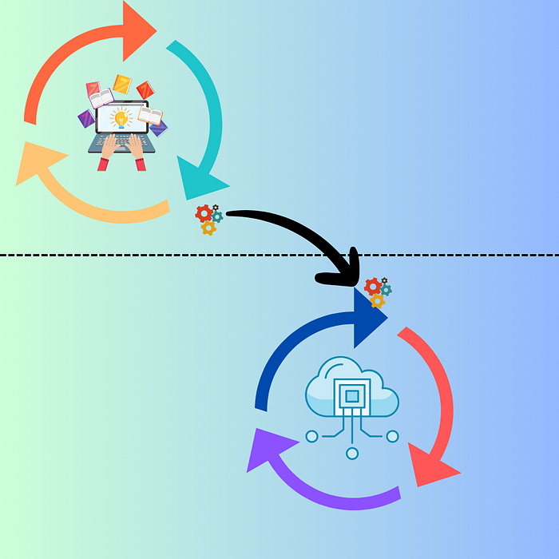

# Why Fast Feedback Loops Matter When Working with Kubernetes

## Debugging and Testing Made Easy with `mirrord`

# Introduction

In software development, fast, iterative feedback loops — known as dev
loops — are essential for rapid prototyping and innovation. However, the
complexity and disparity between local and remote execution environments
can make this process challenging. Instead of staying in a flow state
and quickly moving from idea to prototype, developers often have to deal
with adjacent issues: building, deploying, and managing CI/CD pipelines.

Overlaying Kubernetes on top of an already complex process can turn
development into a slow and painful experience. This complexity is why
so many attempts have been made to solve this problem. Today, we will
explore one of the most promising solutions.

> The key to fast development cycles is reducing feedback time. The
> quicker you can test and debug, the faster you can iterate and
> improve.

## Who Is This Content For?

This blog is for developers, DevOps engineers, and tech leads who work
with Kubernetes and are tired of slow development cycles. If you’re
looking for ways to improve your productivity and streamline your
workflow, this is for you.

## The Pain of Slow Dev Loops

Working with Kubernetes typically involves:

  - **Creating Containers**: This step can be
    time-consuming, especially when dealing with complex
    applications.
  - **Pushing Images**: Uploading images to a registry
    can take a significant amount of time, depending on the size of the
    image and the network speed.
  - **Deploying to the Cluster**: Waiting for the
    Kubernetes cluster to pull the image and start the containers adds
    to the delay.
  - **Waiting for Feedback**: Once the application is
    running, developers need to wait for logs and test results, which
    can take several minutes or more.

Each of these steps contributes to a slow development cycle, making it
difficult to quickly test and debug changes. This can be particularly
frustrating when trying to resolve critical issues or implement new
features under tight deadlines.

By the end of this blog, you’ll learn strategies to speed up your
development loop, reduce waiting times, and make debugging and testing
more efficient.

# Fast Feedback = Rapid Prototyping

What if we could integrate development loops so that the inner loop
(code, test, build/run) seamlessly extends into the outer loop (build,
test, scan, deploy, release)?



This would result in much faster feedback and iteration, leading to
increased innovation. However, the development environment on my laptop
or in a remote containerized service like Gitpod differs from the
execution environment where the deployment is running.

What are the options?

  - **Recreate the Kubernetes environment locally?**  
    Viable for some workloads.
  - **What about recreating a cloud environment
    locally?**  
    Possible with [LocalStack](https://www.localstack.cloud/) with AWS
    or [TestContainers](https://testcontainers.com/), but only to some
    extent.

## The lowest common denominator

An interesting question to ask would be: *is there something that both
environments share?* They do share the same container, but that’s not
what I develop; it’s just a packaging mechanism. Digging deeper… how
about a **process 💡?**

A process executing code runs on my machine the same way a process
executing code runs in a containerized environment in the cloud.

## Execution context matters

When executing code locally, everything needs to be set up on the local
machine, including **environment variables, file access, and
networking**. This setup ensures that the code can run as expected
within the local environment. However, the context changes significantly
when moving to a remote environment, such as a public or private cloud.

In a remote environment, which often includes a Kubernetes cluster
running in the cloud, the infrastructure is more complex. Environment
variables might be managed through cloud services or orchestration
tools, file access could involve distributed storage systems, and
networking might include virtual networks, load balancers, and security
groups. Additionally, the context may include various integrated
services such as databases, message queues, and other networking
components.


on
[Unsplash](https://unsplash.com/?utm_source=medium&utm_medium=referral)](_media/980839_image3.jpg)

A piece of code that works perfectly on a local machine might fail in
the cloud due to missing environment variables, incorrect network
configurations, or issues accessing remote databases and queues. This
discrepancy forces developers to replicate the remote environment
locally or debug issues that only appear in the cloud, slowing down the
development cycle.

## Testing Locally with Remote Environment

So far we have established that in order to combine the two development
loops and make prototyping faster, we need to run our local process in
the context of its remote environment.

This is the recipe for success; **run my local process in the context of
a remote environment.**


Here is where `mirrord` can help\!

# Mirrord

Does exactly what we need:

> mirrord is an open-source tool that lets developers run **local
> processes** in the **context of their cloud environment**. It makes it
> incredibly easy to test your code on a cloud environment (e.g.
> staging) without actually going through the hassle of Dockerization,
> CI, or deployment, and without disrupting the environment by deploying
> untested code

https://mirrord.dev/docs/overview/introduction/

## Running App In Local Context

A simple `nodejs` app connects to [Azure Storage
Account](https://learn.microsoft.com/en-us/azure/storage/common/storage-account-overview)
and displays file content. As a developer, my task is to test my app.
Let’s run it locally by executing those 2 `justfile` recipes:

```bash
start_server:
 nodemon server.js

browser: start_server 
 browser-sync start - proxy "localhost:3000" - files "server.js" "public/**/*"
```

> If you want to learn more about `justfile`:

[](https://itnext.io/master-command-orchestration-16f4a117ce05?source=post_page-----58b8d2cb8e8e--------------------------------)

## Master Command Orchestration

### Transform Your Projects with Just

itnext.io


Right, that’s not going to help us test a new version of my app. With
`mirrord`, we can connect my local process to a remote execution
environment and my app running in a pod.

This results in the **traffic, environment variables, and file
operations** being mirrored into my locally running process. Whew,
that’s a mouthful. Let’s run `mirrord`:

```bash
# Run mirrord on deployment, this resolves to a single pod
mirrord:
  @mirrord exec --target-namespace devops-team \
   --target deployment/foo-app-deployment \
   nodemon server.js
```

```bash
✗ just mirrord
New mirrord version available: 3.106.0. To update, run: `"curl -fsSL https://raw.githubusercontent.com/metalbear-co/mirrord/main/scripts/install.sh | bash"`.
To disable version checks, set env variable MIRRORD_CHECK_VERSION to 'false'.
When targeting multi-pod deployments, mirrord impersonates the first pod in the deployment.
Support for multi-pod impersonation requires the mirrord operator, which is part of mirrord for Teams.
You can get started with mirrord for Teams at this link: https://mirrord.dev/docs/overview/teams/
* Running binary "nodemon" with arguments: ["server.js"].
* mirrord will target: deployment/foo-app-deployment, no configuration file was loaded
* operator: the operator will be used if possible
* env: all environment variables will be fetched
* fs: file operations will default to read only from the remote
* incoming: incoming traffic will be mirrored
* outgoing: forwarding is enabled on TCP and UDP
* dns: DNS will be resolved remotely
⠖ mirrord exec
    ✓ Update to 3.106.0 available
    ✓ ready to launch process
      ✓ layer extracted
      ✓ operator not found
      ✓ agent pod created
      ✓ pod is ready
    ✓ config summary                                                    [nodemon] 3.1.0
[nodemon] to restart at any time, enter `rs`
[nodemon] watching path(s): *.*
[nodemon] watching extensions: js,mjs,cjs,json
[nodemon] starting `node server.js`
Listing all containers and their first blob:
Server running on port 3000
Container: sample-blob
```

Notice that now all environmental variables are fetched from the remote
execution environment (Kubernetes cluster).

```bash
* env: all environment variables will be fetched
```

Now we should be able to navigate to localhost:3000 and see that the
connection was successful:


> What we have achieved is that calls from our local process are as if
> they were made by the remote process and calls to the remote process
> are mirrored to our local process.

## How does `mirrord` work

Simplifying, `mirrord` operates in an agentless mode, using `kubectl` to
connect to a cluster and create a temporary pod for mirroring. The key
components include the **mirrordAgent**, a Rust binary running as a
Kubernetes job that proxies local processes by sniffing network traffic
and accessing the file system of the target pod. The **mirrordLayer**, a
dynamic library, hooks into the local process to relay file system and
network operations to the **mirrordAgent**.


## Real world is messier than that

Now we can iterate rapidly on a new version of my app and see how it
behaves in the actual remote execution environment. This is however a
simple example, there might be scenarios where we want to:

  - redirect or
    [**steal**](https://mirrord.dev/docs/using-mirrord/steal/) all the
    traffic instead of mirroring it
  - redirect only
    [**subset**](https://mirrord.dev/docs/using-mirrord/steal/) of calls
    or [**filtering
    out**](https://mirrord.dev/docs/using-mirrord/steal/#filtering-out-healthchecks-using-a-negative-look-ahead)
    Kubernetes health checks
  - redirect [**database
    writes**](https://mirrord.dev/docs/using-mirrord/outgoing-filter/)
    to a local db to avoid duplicated remote writes
  - run a new app or a tool in the remote context using
    [**targetless**](https://mirrord.dev/docs/using-mirrord/targetless/)
    mode

`Mirrord` supports all those scenarios and more are being developed.

# Closing Thoughts

Developing containerized applications for Kubernetes is hard. There are
many options to help with the process, including tools like
`telepresence`, `skaffold`, `okteto`, `garden`, and many more.

This tells us two things: first, there is no standardized way of
supporting developers in their efforts; and second, the space is still
growing and maturing. `mirrord` has a unique place in this ecosystem.
The blend of very little to no friction and strong defaults makes it an
attractive solution for cloud-native development.

By seamlessly mirroring traffic, environment variables, and file
operations from the remote environment to the local process, it
eliminates the common pain points in Kubernetes development. This
approach not only speeds up the development cycle but also ensures that
your local environment is as close to production as possible, reducing
the risk of unexpected issues during deployment.

Thanks for taking the time to read this post. I hope you found it
interesting and informative.

🔗 **Connect with me on**
[**LinkedIn**](https://www.linkedin.com/in/piotr-zaniewski/)

🌐 **Visit my** [**Website**](https://cloudrumble.net/)

📺 **Subscribe to my** [**YouTube
Channel**](https://www.youtube.com/@cloud-native-corner)

