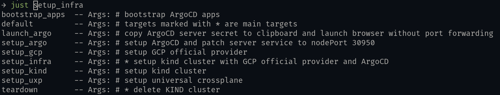
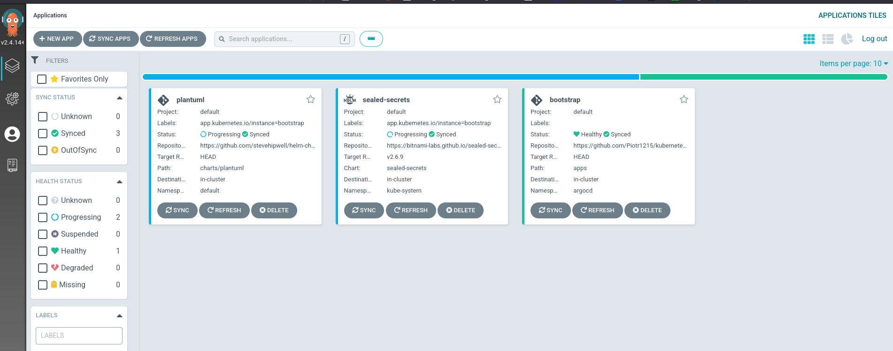

# Kubernetes in a box

<p><small>Photo by <a href="https://unsplash.com/@miagolic?utm_source=unsplash&utm_medium=referral&utm_content=creditCopyText">Mia Golic</a>
on <a href="https://unsplash.com/?utm_source=unsplash&utm_medium=referral&utm_content=creditCopyText">Unsplash</a> </small></p>

This article will be helpful for anyone interested in setting up a local Kubernetes dev/test environment in a reproducible and easy way.
Source code for this blog is available in this [companion repository](https://github.com/Piotr1215/kubernetes-box).

<!--truncate-->

There are several reasons why local Kubernetes environment is useful:

- cloud native apps development including sharing it
- checking out new helm chart before deploying to prod
- testing infrastructure changes and configuration
- testing new Kubernetes versions

but of course the list goes on beyond that.

Given that a local or test Kubernetes environment is so useful, its creation should be fully automated. Let's learn how to do it.

## What setup to choose

There are a lot of choices as it comes to running a local Kubernetes instance, but we are going to focus on KIND.
KIND is very easy to maintain and fast to set up. Second best IMO is `k3s`.

- [Minikube](https://minikube.sigs.k8s.io/docs/)
- [MicroK8s](https://microk8s.io/)
- **→** [Kind](https://kind.sigs.k8s.io/) Kubernetes IN Docker
- [Vagrant](https://www.vagrantup.com/) and [VirtualBox](https://www.virtualbox.org/)
- [Docker Desktop](https://www.docker.com/products/docker-desktop)
- [Rancher Desktop](https://rancherdesktop.io/)
- [k3s](https://github.com/k3s-io/k3s) also with [k3d](https://k3d.io/v5.4.6/) wrapper

## Imperative vs Declarative

Before we dive into the setup, let's talk about _declarative_ vs _imperative_ approach. Anything _imperative_ is usually frowned upon in the DevOps/Cloud-Native world. I'd argue that both approaches makes sense depending on the circumstances.

> Whenever it comes to **something vs something else**, it's really about when it makes more sense to use **something** and when **something else**.

Given this heuristic, we will use both approaches depending on the requirements and what we want to achieve.

## It's like a Makefile _just_ better

Setting up a local or test Kubernetes environment means orchestrating a bunch of commands, including scripts, yaml files, helm charts etc.
In the _imperative_ paradigm, this is typically done via a `Makefile` or `bash scripts`. The problem with `make` is that it is designed as a tool to _build_C source code, it \_can_ run commands but that's not its purpose. This means that when using `Makefile` we take on the whole unnecessary baggage of the build part.

`Bash scripts` are a bit better but after a while they became too verbose and heavy. This is especially true when the setup is created using `defensive coding` practices.

There is a tool that combines best of both worlds; [just](https://github.com/casey/just) is similar to `make`, but focused on commands orchestration.

> You will see a `justfile` in action later the example section.

## Declarative approach is still our friend

`Justfile` contains all imperative logic needed to quickly create and destroy our local cluster. It exposes various knobs and buttons for us to interact with it or change settings.

Now on to the cluster apps. Installing a helm chart, operator or simple yaml file can be done declaratively using a GitOps process.
This can be accomplished with `Flux` or `ArgoCD`. For a quick, local setup [ArgoCD](https://argo-cd.readthedocs.io/en/stable/getting_started/) is a bit more user friendly due to its robust web client.
Here we are utilizing `app of apps` pattern bootstrap additional apps from a single source. [This article](https://kubito.dev/posts/automated-argocd-app-of-apps-installation/) describes the pattern very well.

> We have just scratched the surface of ArgoCD or GitOps. You can read more about GitOps in [here](https://itnext.io/gitops-with-kubernetes-740f37ea015b) and [here](https://itnext.io/gitopsify-cloud-infrastructure-with-crossplane-and-flux-d605d3043452).

## Collaboration

Local setup doesn't exclude collaboration. There are 2 main ways how we can collaborate on demand.

- use ngrok to expose local port on the internet and share our Kubernetes app
- accept PRs to our argoCD repository to let someone else install infra/apps on our cluster

> [Read more here](https://itnext.io/expose-local-kubernetes-service-on-internet-using-ngrok-2888a1118b5b) about using ngrok to share a local Kubernetes service over the internet.

## Example setup

I'm using similar setup to test [Universal Crossplane](https://github.com/upbound/universal-crossplane) (uxp) which is an upstream fork of [Crossplane](https://crossplane.io/).

Typing `just<TAB>` will show all available just targets.



```just
set export
set shell := ["bash", "-uc"]

yaml    := justfile_directory() + "/yaml"
scripts := justfile_directory() + "/scripts"

browse      := if os() == "linux" { "xdg-open "} else { "open" }
copy        := if os() == "linux" { "xsel -ib"} else { "pbcopy" }

argocd_port  := "30950"
cluster_name := "control-plane"

export gcp_provider_version     := "v0.15.0"

# this list of available targets
# targets marked with * are main targets
default:
  @just --list --unsorted

# * setup kind cluster with GCP official provider and ArgoCD
setup_infra: setup_kind setup_uxp setup_gcp setup_argo

# setup kind cluster
setup_kind:
  #!/usr/bin/env bash
  set -euo pipefail

  echo "Creating kind cluster - {{cluster_name}}"
  envsubst < kind-config.yaml | kind create cluster --config - --wait 3m
  kind get kubeconfig --name {{cluster_name}}
  kubectl config use-context kind-{{cluster_name}}

# setup universal crossplane
setup_uxp:
  echo "Installing UXP"
  kubectl create namespace upbound-system
  helm repo add upbound-stable https://charts.upbound.io/stable && helm repo update
  helm install uxp --namespace upbound-system upbound-stable/universal-crossplane --devel
  kubectl wait --for condition=Available=True --timeout=300s deployment/xgql --namespace upbound-system

# setup GCP official provider
setup_gcp:
  @echo "Setting up GCP official provider"
  @kubectl config use-context kind-control-plane
  @envsubst < {{yaml}}/gcp-provider.yaml | kubectl apply -f -
  @kubectl wait --for condition=healthy --timeout=300s provider/provider-gcp

# setup ArgoCD and patch server service to nodePort 30950
setup_argo:
  @echo "Installing ArgoCD"
  @kubectl create namespace argocd
  @kubectl apply -n argocd -f https://raw.githubusercontent.com/argoproj/argo-cd/stable/manifests/install.yaml
  @kubectl wait --for condition=Available=True --timeout=300s deployment/argocd-server --namespace argocd
  @kubectl patch svc argocd-server -n argocd -p '{"spec": {"type": "NodePort"}}'
  @kubectl patch svc argocd-server -n argocd --type merge --type='json' -p='[{"op": "replace", "path": "/spec/ports/0/nodePort", "value": {{argocd_port}}}]'

# copy ArgoCD server secret to clipboard and launch browser without port forwarding
launch_argo:
  @kubectl -n argocd get secret argocd-initial-admin-secret -o jsonpath="{.data.password}" | base64 -d | {{copy}}
  @nohup {{browse}} http://localhost:{{argocd_port}} >/dev/null 2>&1 &

# bootstrap ArgoCD apps
bootstrap_apps:
  @kubectl apply -f bootstrap.yaml

# * delete KIND cluster
teardown:
  @echo "Delete KIND cluster"
  @kind delete clusters control-plane

_create_repo_secret:
  @echo "Creating repo secret"
  @kubectl apply -f ./secrets/repo-deploy-secret.yaml
```

### Substitute variables in YAML files

Sometimes we need to patch YAML files with a custom value.

There are several ways of templating YAML. We can wrap it in a [helm chart](https://helm.sh/docs/topics/charts/), use [ytt](https://carvel.dev/ytt/), [jsonnet](jsonnet), [yq](https://mikefarah.gitbook.io/yq/), [kustomize](https://github.com/kubernetes-sigs/kustomize) or many others. Those are all valid approaches, but for local environment, there is a simpler method.

We will use `envsubst` instead. It is a part of the [GNU gettext utilities](https://www.gnu.org/software/gettext/manual/gettext.html) and should be already installed on your system.
This tool enables us to _patch_ environment variables on the fly.

### Create the cluster

This will create a local kind cluster with ArgoCD and UXP installed.

> This setup should work with linux and mac.

From the `root` folder run

```bash
just setup_infra
```

Once everything is set up, launch argo and login

```bash
just launch_argo
```

> - username: **admin**
> - password: **should be in your clipboard** so just paste it in the `password` text box. In case this didn't work, you can run `@kubectl -n argocd get secret argocd-initial-admin-secret -o jsonpath="{.data.password}" | base64 -d` to get the password.

#### Install more content

ArgoCD's Bootstrap app observes the `apps` directory for any changes once deployed.

There are 2 sample apps in the directory already.

```bash
just bootstrap_apps
```

```yaml
apiVersion: argoproj.io/v1alpha1
kind: Application
metadata:
  name: bootstrap
  namespace: argocd
spec:
  destination:
    namespace: argocd
    server: https://kubernetes.default.svc
  project: default
  source:
    path: apps
    repoURL: https://github.com/Piotr1215/kubernetes-box
    targetRevision: HEAD
  syncPolicy:
    automated:
      selfHeal: true
    syncOptions:
      - CreateNamespace=true
```

This will deploy all the apps from the `apps` folder into the cluster via ArgoCD.



### Destroy the cluster

```bash
just teardown
```

## Summary

Deploying a local/test Kubernetes instance can and should be fully automated.
We've seen how using _declarative_ and _imperative_ techniques helped us to
create a fully functional cluster with ability to expose Kubernetes services as
well as collaborate with anyone willing to contribute content.

This setup can be easily transitioned to a production cluster. In this case
however, the _imperative_ components of the installation should be transitioned
to _declarative_ approach to help with maintenance.

I'm using this setup to test Universal Crossplane and its providers. What will
you use it for? Do you think you would improve, change parts of the setup? Let
me know in the comments below.
