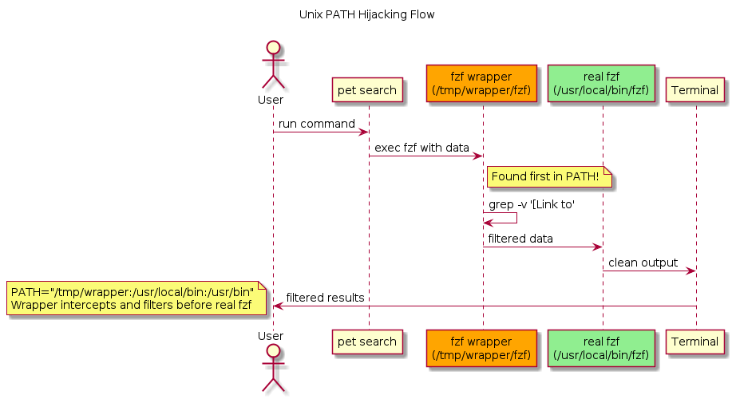

This technique is useful when a program you can't modify calls CLI tools on your machine. For example, `pet search` pipes output directly to `fzf` with no filtering options. PATH hijacking lets you intercept and modify this behavior without changing either program.

<!--truncate-->

## The Problem That Started It All

I love using [pet](https://github.com/knqyf263/pet) for managing command snippets, but every search shows these `[Link to: ...]` entries mixed with actual commands. Since `pet` pipes directly to `fzf`, traditional solutions like aliases or pipes won't work. That's when we discovered we could intercept the entire data flow by hijacking the PATH.

## How PATH Hijacking Works



Unix has a beautifully simple rule for finding commands: it searches directories in PATH from left to right and uses the first match. We can exploit this:

```bash
PATH="/tmp/my-tools:/usr/local/bin:/usr/bin:/bin"
      ↑              ↑
      Our fake fzf   Real fzf
      (found first!) (never reached)
```

The magic happens because programs inherit their parent's environment, including PATH. When `pet` calls `fzf`, it finds our wrapper instead!

## Why Not Just Use a Function or Alias?

You might think: "Why not just create a shell function?"

```bash
# This function works when YOU type 'fzf' in your shell
function fzf() {
    grep -v '^\[Link to' | /usr/local/bin/fzf "$@"
}

# But when 'pet' internally executes 'fzf', it ignores your function!
pet search  # Still shows [Link to] entries - function is ignored
```

**Functions and aliases only work in your shell session.** When programs like `pet` call other programs, they use system calls (like `execve()`) that bypass shell constructs entirely. They search PATH directly for the binary.

PATH hijacking works because:
- Every program inherits environment variables from its parent
- The OS always searches PATH when executing commands
- Your wrapper is found before the real binary

**Use functions for your own commands, PATH hijacking for intercepting other programs' behavior.**

## Solving the Pet Snippets Problem

Here's the complete solution to filter unwanted entries:

```bash
#!/usr/bin/env bash
# pet-search-clean - Filter pet search output

# Create temporary directory for our wrapper
WRAPPER_DIR=$(mktemp -d)

# Create fake fzf that filters input
cat > "$WRAPPER_DIR/fzf" << 'EOF'
#!/usr/bin/env bash
# Remove '[Link to' entries before passing to real fzf
grep -v '^\[Link to' | /usr/local/bin/fzf "$@"
EOF

chmod +x "$WRAPPER_DIR/fzf"

# Hijack PATH temporarily
export PATH="$WRAPPER_DIR:$PATH"

# Run pet search - it'll use our wrapper!
pet search

# Clean up
rm -rf "$WRAPPER_DIR"
```

Save this as `pet-search-clean` and enjoy clutter-free snippet browsing!

## Advanced Techniques

### Conditional Interception

Only intercept under certain conditions:

```bash
cat > "$WRAPPER_DIR/docker" << 'EOF'
#!/usr/bin/env bash
# Add --rm flag to 'docker run' if not present
if [[ "$1" == "run" ]] && ! echo "$@" | grep -q -- --rm; then
    /usr/bin/docker run --rm "${@:2}"
else
    /usr/bin/docker "$@"
fi
EOF
```

### Chaining Multiple Filters

Process data through multiple transformations:

```bash
cat > "$WRAPPER_DIR/fzf" << 'EOF'
#!/usr/bin/env bash
# Multiple filters in sequence
sed 's/old/new/g' |       # Replace text
grep -v '^#' |            # Remove comments  
sort -u |                 # Remove duplicates
/usr/local/bin/fzf "$@"
EOF
```

## Best Practices & Common Pitfalls

| Do | Don't | Why |
|---|---|---|
| Use `mktemp -d` for wrapper directories | Use fixed paths like `/tmp/wrapper` | Avoid conflicts between scripts |
| Specify full paths to real binaries | Call commands without paths | Prevents infinite recursion |
| Clean up with `rm -rf` immediately | Leave wrapper directories around | Security and cleanliness |
| Pass `"$@"` to preserve arguments | Forget command arguments | Maintains original functionality |
| Add `chmod +x` to wrapper scripts | Skip permissions | Scripts won't execute |
| Test with `echo` first | Deploy untested wrappers | Catch errors early |

## Security Note

While incredibly useful, PATH hijacking can be dangerous. Always:
- Use absolute paths for sensitive commands (`/usr/bin/sudo`)
- Check your PATH regularly with `echo $PATH`
- Be cautious with downloaded scripts that modify PATH

## Conclusion

PATH hijacking transforms impossible filtering problems into trivial solutions. It's a perfect example of Unix philosophy: simple mechanisms that compose into powerful tools. This technique provides a way to add missing features to existing command-line tools without modifying their source code.

Try the pet search filter and experiment with your own wrappers. Once you understand this technique, you'll see opportunities everywhere to enhance your command-line workflow.

